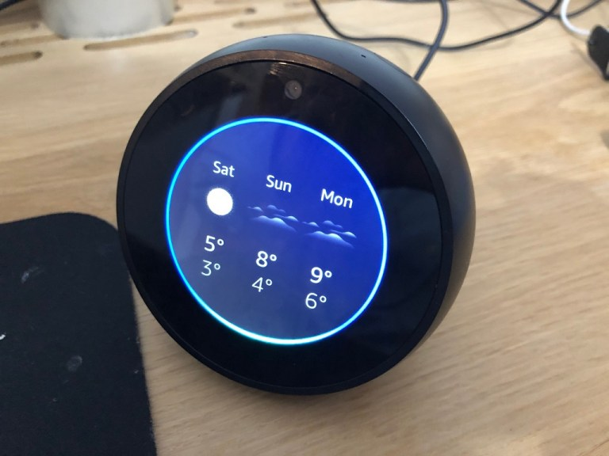
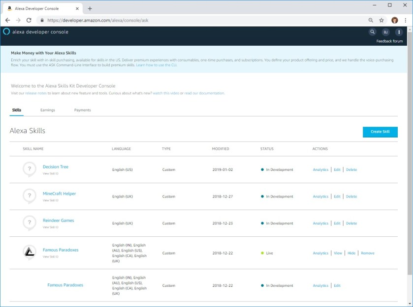
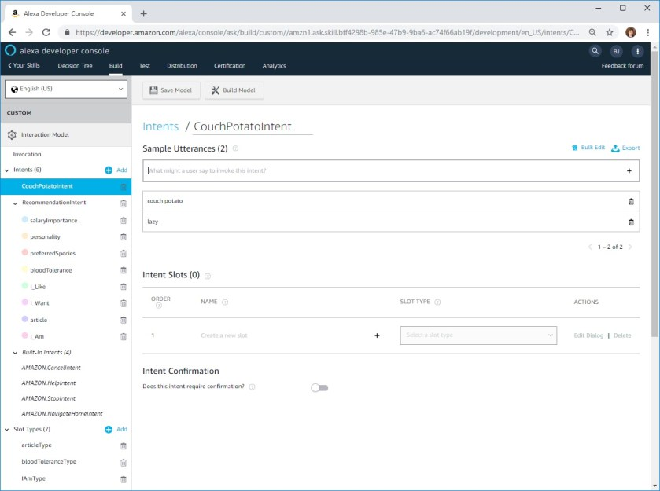

---
title: "Alexa, say a Happy New Year!"
date: 2019-01-04T00:00:00Z
draft: false
description: "Happy New Year to all my readers! I hope you missed these blog posts at least a little bit. I had a good rest during the festive period and feel ready to start writing and hacking again. In this article, I want to tell you about my most recent fascination- programming for Alexa (Echo) enabled devices."
categories: ["Alexa", "AWS", "Personal"]
cover:
  image: "images/alexa-header.jpg"
  alt: "Alexa, say a Happy New Year!"
aliases:
  - /alexa-say-a-happy-new-year/
  - "/2019/01/04/alexa-say-a-happy-new-year/"
ShowToc: true
TocOpen: false
---Happy New Year to all my readers! I hope you missed these blog posts at least a little bit. I had a good rest during the festive period and feel ready to start writing and *hacking* again. In this article, I want to tell you about my most recent fascination- programming for Alexa (Echo) enabled devices.

## What is Alexa

You probably know all about Alexa, but let’s make sure that we are all on the same page. Alexa is a virtual assistant developed by Amazon that can leave in different devices. Most popular of those are probably the Echo series developed by Amazon. Here is my Echo Spot:

Ok, so we have a virtual assistant. We are used to that already- with Siri, Ok Google and Cortana- what’s so cool about Alexa?…

## Why is Alexa interesting for developers

**It is very easy to developer your own** ***Alexa Skills*** (this is how you call programs that run on Alexa).

For a developer like myself, predominantly interested with the backend development… There is not much fronted to worry about here! You just focus on responding to input and… voila! You have yourself a user-facing application.

Another fascinating thing about Alexa development is that it is still in its early stages. That means that there are not that many skills available (yet) and it is relatively easy to stand out- think about the App Store in its infancy.

So it is easy to do, there is not much frontend to worry about and it is wide open for innovation in disruption… How do you get started then?

## Basics of developing Alexa skills

To develop Alexa skills you effectively need three things:

- Amazon Developer Account (get it here <https://developer.amazon.com>)
- AWS Account (you could do without, but that’s much harder – get it here <https://portal.aws.amazon.com/billing/signup>)
- Alexa enabled device (you can do it without, but where is the fun in that?)

Let’s have a quick look at the Amazon Developer Account and how intuitive it looks:

Everything is done with the help of friendly user interfaces. On top of that, there are multiple example skills available for you to try on.

Once you configure your skill in the developer account, you should create an accompanying Lambda function (in AWS) that will service the skill. You don’t need to know much about AWS, as the tutorials explain all that you really need to know, but it can be very helpful. I have written an article about [how to learn AWS]() if you are interested.

## Developing Alexa Skills – a great way of learning serverless computing

So I have mentioned how knowing AWS can help you develop Alexa skills. It also works the other way round- by developing Alexa skills you will learn quite a bit about serverless computing.

When creating Alexa skill, if Amazon decides to promote your skill- you may be getting thousands of users simultaneously on a moment notice. This works very well with AWS Lambda and makes Alexa skills a perfect use case for this architecture.

If you need to store data between user sessions- an autoscaling Dynamo DB (AWS Serverless NoSQL offering) will be perfect for you.

In short- if you want a real world use case for non-trivial serverless computing today- start working on Alexa skills!

## Alexa and me – my plan for 2019

I guess it is pretty clear how excited I am about Alexa and developing for the platform.

In 2018 I focused on writing blog post- I wrote over 100 (between this and my company blog). In 2019 I want to focus on creating customer facing projects. Alexa seems to be a perfect medium for that, where I can build both small proof of concepts/novelty programs as well as more fully-featured experiences.

As to my plans- I will scale down my writing to a blog post a week, but scale up my software producing.

**This year I will aim to release 2 Alexa skills every month** and write about serverless/cloud/microservices technology that makes this possible. I hope you will enjoy reading this and even learn something!
