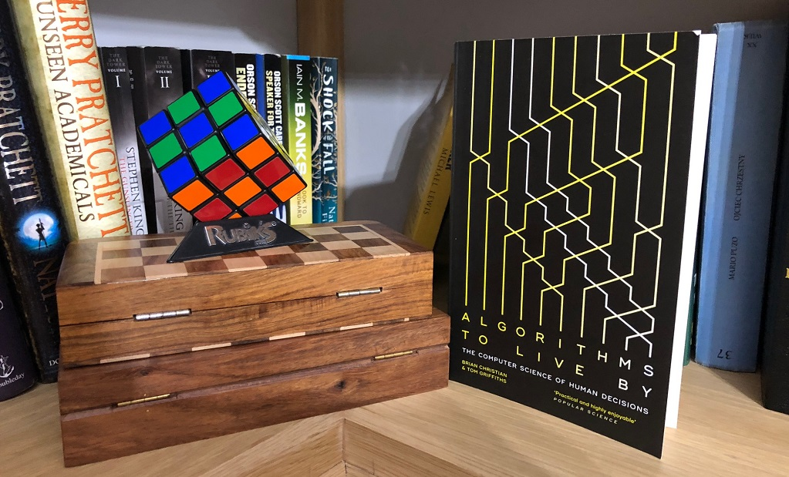

# “Algorithms to Live By” – My Favourite Developer Audiobook

Today I want to share with you a review of the most exciting book I have listened to so far –*“Algorithms to Live By: The Computer Science of Human Decisions”* by Brian Christian and Tom Griffiths*.* I have already mentioned it on this blog [when simulating the secretary problem](). This is just an example of many fascinating problems this book talks about. Continue reading to find out why it makes such an amazing listening experience.

## What makes a good AudioBook for developers

You may be surprised by the title of this article. After all, what is a “Developer Audiobook”? I love listening to audiobooks, I consider them [my secret weapon](). Most audiobooks are not really about code, frameworks or algorithms. They talk about all the other important things. I was looking for something more… computationally stimulating?

Anyway, I was wondering if there are any books that talk about algorithms, mathematics, but do it in such a way that you can listen to that rather than read and follow pseudocode. That search led me to *“Algorithms to Live By”.*

So what makes a good “Developers Audiobook” in my opinion?

- It talks about non-trivial technological problems
- It is engaging to listen to
- Some of its content can be applicable to my (developer’s) work
- Most developers that I know would enjoy it

And here is a question for you- if you know other similar books, please make sure to let me know either in comments or on the [e4developer twitter account](https://twitter.com/e4developer).

## Algorithms to Live By – What is it about?

This is a book that looks at different life situations and how different algorithms apply to them.  Some of the problems tackled are:

- When to accept an offer on a house?
- How to effectively find the best flat?
- Should you sort your bookshelf?
- Should you sort your emails?
- What are the world biggest libraries doing when it comes to sorting their books?
- Which parking space to choose?
- If you don’t know payouts of multiple “one-armed bandits” machines, what are some optimal strategies of playing?
- Why do we forget so much when we are older?
- …and of course- How to hire secretaries?

Granted, many of these problems are really mostly mathematical models, that are far removed from realities… or so may appear at first! The book makes a decent effort at taking these “cleaner” version of problems and seeing how they apply to the reality.

The discussion of sorting and what is the goal of it (making future retrieval faster) made me re-think some of the things I have been doing. Sometimes we tend to just act without thinking… is this really necessary?

This is where the book really succeeds and leaves a lasting impression. You start to see these algorithms play out in real life and you may start questioning yourself- am I really rational here?

## Fascinating problems around us

After I finished listening to the book I felt like this is just the beginning. Thanks to the book and the new perspective, I was very curious to start testing things and see if I can understand human behaviour deeper.

I wrote that article on [simulating the secretary problem]() (which may give you a good taste of what the book is like) as the first experiment inspired by the book. I promised you it won’t be the last you will see on this blog.

The fact that we are developers gives us sort of special power. Many of the problems from the book are very challenging mathematically to prove and reason about… They are also fairly easy to simulate and observe different solutions empirically. As developers, we have the power that many mathematicians who originally looked at these issues would be sure to envy us.

## Summary

*“Algorithms to Live By: The Computer Science of Human Decisions”*made a lasting impression on me. It is the kind of book that fascinates, entertains and changes your perspective on things. I give it my highest recommendation. Enjoy reading or listening!

PS. I enjoyed listening to this book so much that I bought a physical copy for reference!
