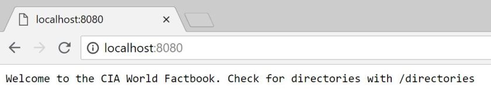
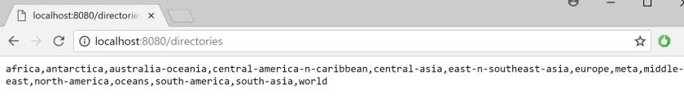
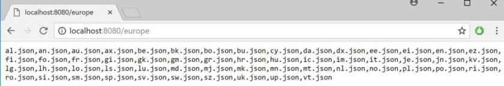
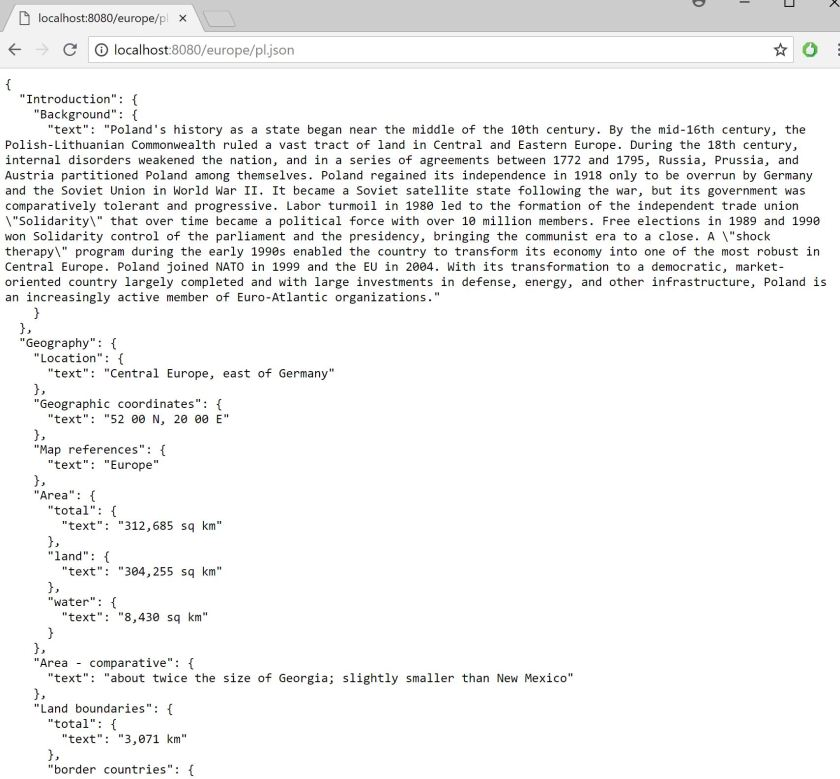

# CIA World Factbook API with Functional Spring


I have recently been very interested in [microframeworks](https://www.e4developer.com/2018/06/02/the-rise-of-java-microframeworks/). One thing notably missing from that article is Spring in the context of a microframework. You may be surprised, but it is possible to write very lightweight APIs with Functional Spring. In this article, I will show you how, by turning [CIA World Factbook](https://www.cia.gov/library/publications/the-world-factbook/) into a REST API.

So what is Functional Spring? [Functional Web Framework](https://spring.io/blog/2016/09/22/new-in-spring-5-functional-web-framework) was introduced in Spring 5 and lets you build a very lightweight REST API without much of the *Spring Magic*. Sounds perfect!

## Setting up Spring Functional Web Framework

To get started with using the Spring Functional Web Framework you can go with our favorite Spring Boot and a WebFlux dependency.

```

<dependency>
    <groupId>org.springframework.boot</groupId>
    <artifactId>spring-boot-starter-webflux</artifactId>
</dependency>

```

You don’t really need to use WebFlux, as you are not required to follow the Reactive style. On the other hand, since we are building a *functional microframework* it seems like a good idea.

There are multiple servers that you can choose here including:

- Netty
- Undertow
- Tomcat
- Jetty

With [examples provided in the official documentation](https://docs.spring.io/spring/docs/5.0.0.RELEASE/spring-framework-reference/web-reactive.html#webflux-httphandler). In this article, we will be using Netty.

## CIA World Factbook

The [CIA World Factbook](https://www.cia.gov/library/publications/the-world-factbook/) is a source of free public domain information about multiple countries around the world. From the official site:

> The World Factbook provides information on the history, people, government, economy, energy, geography, communications, transportation, military, and transnational issues for 267 world entities. Our Reference tab includes: maps of the major world regions, as well as Flags of the World, a Physical Map of the World, a Political Map of the World, a World Oceans map, and a Standard Time Zones of the World map.

There is a lot of fascinating information in there! Another great thing is that this information is available in JSON format in this [public domain GitHub project](https://github.com/factbook/factbook.json). Data here is stored in JSON files in multiple directories.

I want to build a small REST API for retrieving this data.

## Building a simple Netty based functional server

The service that we are building here, will not make use of any Spring Boot autowiring magic. Instead, we will rely on explicitly declaring a *HttpServer* and *HttpHandlers* based on *RouterFunctions*.

```

public static void main(String[] args) throws InterruptedException, FileNotFoundException {
    HttpHandler httpHandler = RouterFunctions.toHttpHandler(createRouterFunction());
    HttpServer
            .create("localhost", 8080)
            .newHandler(new ReactorHttpHandlerAdapter(httpHandler))
            .block();
    Thread.currentThread().join();
}

```

This code is relatively easy to understand, although looks quite alien to many Spring developers. The *HttpServer* object is more similar to what we commonly find in [microframeworks](https://www.e4developer.com/2018/06/02/the-rise-of-java-microframeworks/). Just compare it to a Javalin *HelloWorld*.

```

public class HelloWorld {
    public static void main(String[] args) {
        Javalin app = Javalin.start(7000);
        app.get("/", ctx -> ctx.result("Hello World"));
    }
}

```

It is also quite a bit more verbose. With the flexibility comes verbosity- it is often the trade that we end up making.

I have encapsulated creation of the *HttpHandler* with the *createRouterFunction()*. To do that we will use the statically imported *route*.

```

private static RouterFunction createRouterFunction() throws FileNotFoundException {
    RouterFunction<ServerResponse> routerFunction
            = route(GET("/"),
            request -> createStringResponse("Welcome to the CIA World Factbook. Check for directories with /directories"));
    routerFunction = routeWithDirectories(routerFunction);
    return routerFunction;
}

```

Now when visiting *localhost:8080* we will see *“Welcome to the CIA World Factbook. Check for directories with /directories”* printed out. I have hidden some complexity behind the helper function *createStringResponse.*

```

private static Mono<ServerResponse> createStringResponse(String response){
    return ServerResponse.ok().body(Mono.just(response), String.class);
}

```

## Turning CIA World Factbook into a REST API

With an understanding of how this simple *Spring microframework* works, we can use it to define the remaining endpoints of our API.

I would like to have an option of listing all directories, listing country files in each directory and then requesting the specific files.

I am not claiming that this is the simples way to build such an API. This use case makes for an interesting and a non-trivial example of dynamic routing that may give you an idea how to use it in more sophisticated examples. The code below also contains some Spring specific treatment of *Resource* files that you may find interesting.

```

private static RouterFunction<ServerResponse> routeWithDirectories(RouterFunction<ServerResponse> routerFunction) throws FileNotFoundException {
    File file = ResourceUtils.getFile("classpath:factbook");
    String[] directories = file.list();
    routerFunction = routerFunction.andRoute(GET("/directories"),
            request -> createStringResponse(String.join(",", directories)));
    for(String directory : directories){
        File countriesDir = ResourceUtils.getFile("classpath:factbook/"+directory);
        String[] countries = countriesDir.list();
        routerFunction = routerFunction.andRoute(GET("/"+directory),
                request -> createStringResponse(String.join(",", countries)));
        for(String country : countries){
            File countryFile = ResourceUtils.getFile("classpath:factbook/"+directory+"/"+country);
            Scanner scanner = new Scanner(countryFile, "UTF-8" );
            String fileText = scanner.useDelimiter("\\A").next();
            scanner.close();
            routerFunction = routerFunction.andRoute(GET("/"+directory+"/"+country),
                    request -> createStringResponse(fileText));
        }
    }
    return routerFunction;
}

```

This was a lot of hard work, so let’s look at our newly created endpoints!

When visiting localhost:8080:



When visiting localhost:8080/directories:



When visiting localhost:8080/europe:



When visiting localhost:8080/europe/pl.json:



## Summary

Spring Functional Web Framework is an interesting tool that can be used creatively for building simple and efficient services. The CIA Factbook service that I have presented here takes less than 0.5 seconds to start on my machine. This is a lightness and swiftness we are not that used to with Spring.

The API is quite a low level and it requires some basic understanding of how the server works. On the other hand, it enables us to get closer to the actual server, perhaps squeezing more performance out of it and making use of more server specific options.

CIA World Factbook is a fascinating resource that can be used for many creative purposes. I would like to see how a similar API could be expanded with GraphQL to make a genuinely useful service.

This blog post was partially inspired by <http://blog.alexnesterov.com/post/spring-your-next-microframework/> and <https://spring.io/blog/2016/09/22/new-in-spring-5-functional-web-framework> when looking what Spring has to offer in the [microframeworks](https://www.e4developer.com/2018/06/02/the-rise-of-java-microframeworks/) space.

The code for this article is [available on GitHub](https://github.com/bjedrzejewski/functional-cia-world-factbook). Let me know in the comments if you have some interesting idea for use of either Spring Functional Web Framework or the CIA World Factbook.
