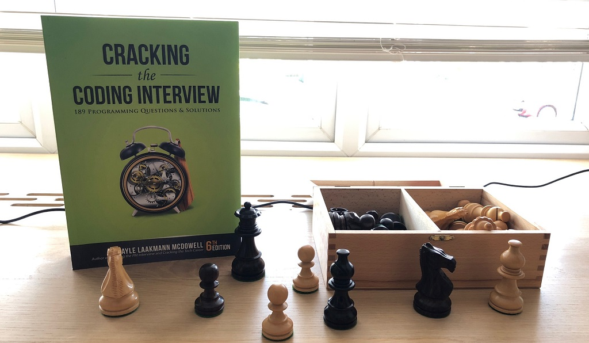

---
title: "“Cracking the Coding Interview” - learn that and much more!"
date: 2018-06-24T00:00:00Z
draft: false
description: "Three years ago I was looking for a new job. I decided that I will pick up a couple of books to help me revised for the interviews. One of those books was…"
categories: ["Books", "Career"]
cover:
  image: "images/cracking-the-coding-interview.jpg"
  alt: "“Cracking the Coding Interview” - learn that and much more!"
aliases:
  - "/2018/06/24/cracking-the-coding-interview-learn-that-and-much-more/"
ShowToc: true
TocOpen: false
---

Three years ago I was looking for a new job. I decided that I will pick up a couple of books to help me revised for the interviews. One of those books was*“Cracking the Coding Interview”*by Gayle Laakmann Mcdowell. I expected a book that will help me revise for the interviews, but I got a lot more from the book!

## Programming interview questions and answers

The main idea behind this book is to give you a list of programming questions that may come up during the interview and teach you how to solve them.

The problem and solutions in the book are grouped intelligently. We have the three broad categories of questions: **Data Structures**, **Concepts and Algorithms** and **Knowledge Based Questions**.

Going through this numerous topics, not only I ended up prepared much better for the interview, but I also greatly improved my general knowledge of a large number of concepts and ideas. Isn’t that the point? Get better at interviewing by understanding the material much better? No tricks here, this is just knowledge!

To really give justice to the really impressive coverage of different topics, here is the chapter listing for the first two categories that I mentioned:

**Data Structures:**

- Arrays and Strings (including HashTables etc.)
- Linked List
- Stacks and Queues
- Trees and Graphs

**Concepts and Algorithms:**

- Bit Manipulation
- Math and Logic Puzzles
- Object-Oriented Design
- Recursion and Dynamic Programming
- System Design and Scalability
- Sorting and Searching
- Testing

Each of these chapters **contains numerous sub-Chapters**. There is enough knowledge in this book to prepare you thoroughly for anything that is likely to come up in a technical interview.

## For the interviewer

If you are doing technical interviews this book also comes as a great help. It discusses the good interviewing technique and gives you a large number of questions that you can use in your interviews.

It is reassuring to know that your recruiting process is similar to that of Google, Microsoft or Apple. The author of the book – Gayle Laakmann Mcdowell interviewed extensively at Google and worked in these other companies. She knows what she is talking about!

## Beyond the technical questions

This book would be worth its price just for the good coverage of the general software development topics. I really liked that it did not stop there and gave general advice on topics such as:

- Preparing for the interview – writing a good resume, making a plan
- Big O notation in more depth that I have seen tackled before
- General strategy on working with technical questions
- Dealing with behavioral questions
- Dealing with the offer and negotiating

The book has about 80 pages dedicated to these topics, so the treatment goes into some depths. Preparing for an interview, this part of the book made for an exciting reading!

## Advanced topics

Last time I was looking for the job was 3 years ago. Despite that, I still occasionally use the book! I enjoy [practicing competitive programming with HackerRank](). Some of the more difficult questions require advanced algorithmic knowledge… Surprise, surprise- in the Additional Review Problems section, *“Cracking the Coding Interview”* has you covered here!

The book does not cover everything and if you really need an in-depth Algorithmic handbook, there is always *Introduction to Algorithms*by MIT Press… The difference is that the *Introduction*is over 1200 pages long and not an easy read.

*“Cracking the Coding Interview”*still covers pretty advanced topics, that are by no means trivial. I have learned about Rabin-Karp Substring Search and Red-Black Trees among other things from this book! It definitely improved my competitive programming and my scores on Hacker Rank (you can see them or [follow me on HackerRank here](https://www.hackerrank.com/jedrus07)).

## Summary

Preparing for a technical interview is a hard work. There is no single book that you can simply buy and pass an interview. What you need to do is get the book and actually work through the examples, study! There are no cheap tricks here.

The goal of a technical interview book is to help you study. *“Cracking the Coding Interview”*helped me study and helped me get a job, I hope it will help you too!
