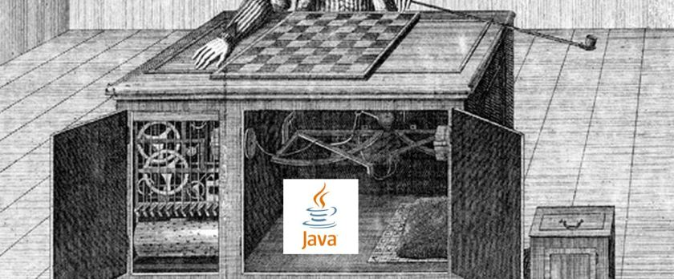
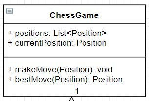
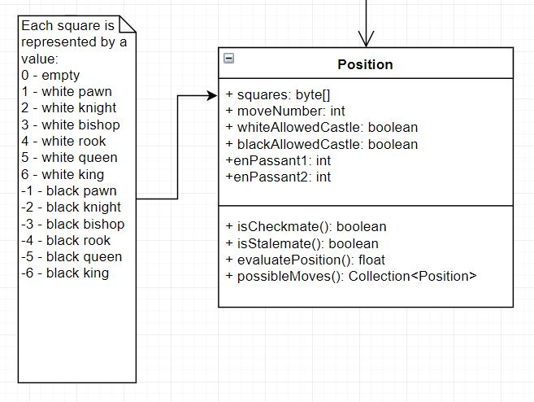
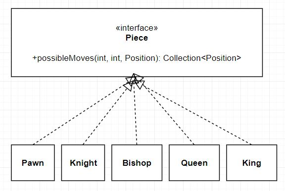
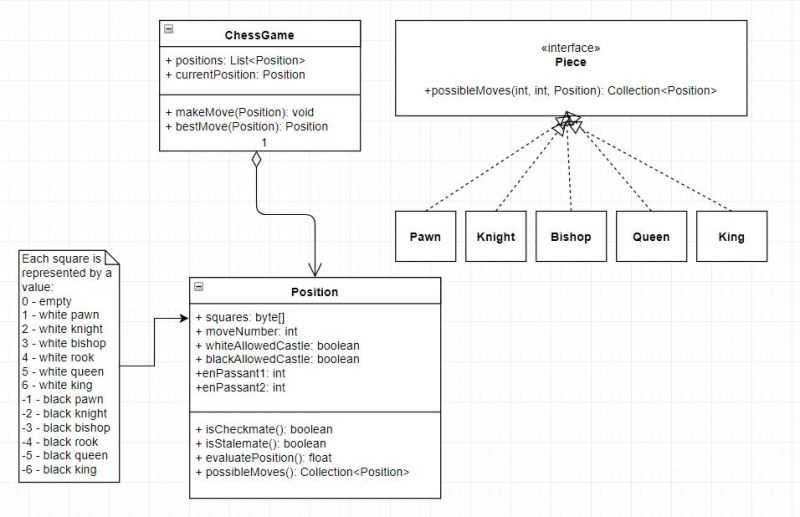

---
title: "Designing an Object Oriented Chess Engine in Java"
date: 2018-08-16T00:00:00Z
draft: false
description: "I love playing chess. I also love programming. How to marry the two? How about playing chess against a chess engine (chess playing program) that I have designed…"
categories: ["Chess", "Java", "Personal"]
cover:
  image: "images/mechanical-turk.jpg"
  alt: "Designing an Object Oriented Chess Engine in Java"
aliases:
  - "/2018/08/16/designing-an-object-oriented-chess-engine-in-java/"
ShowToc: true
TocOpen: false
---I love playing chess. I also love programming. How to marry the two? How about playing chess against a chess engine (chess playing program) that I have designed and wrote? If you are intrigued- read on! This is the first blog post in the series about building my chess engine in Java.

## The rules of chess

I assume that you are more-less familiar with the rules of chess. You have two “armies” facing each other, making a move after a move, until one side is guaranteed to capture the enemy king (the checkmate), or neither side can win- a draw.

If you need to refresh your memory on the exact rules, there are [Rules of chess on Wikipedia](https://en.wikipedia.org/wiki/Rules_of_chess). If you are a less serious player I would point out a few overlooked and misunderstood rules:

- [Castling](https://en.wikipedia.org/wiki/Rules_of_chess#Castling) – different both ways
- [Promoting a pawn](https://en.wikipedia.org/wiki/Rules_of_chess#Pawn_promotion) to any piece once they cross the board
- [En-passant](https://en.wikipedia.org/wiki/Rules_of_chess#En_passant) – special capture with a pawn

There are also a few rules regarding checks – you have to defend. Assuming you have the basics covered, let’s look at designing a clean Object Oriented Java Chess Engine.

## Designing the Java chess engine

What are the key elements of building a chess engine? In fact, it is not that complicated. You need the following parts:

- A way of storing the chess position
- A way of generating all legal positions that could follow from given positions (all legal moves)
- A way of evaluating every position (how good the move is)
- An algorithm to effectively select the move, searching the tree of possibilities

Ideally, you would want all these steps to be done with a reasonable efficiency- looking at millions of possible resulting positions before selecting a move.

In the design phase, I will focus on the approach to the first two parts of the problem.

First, it would be good to have a Class for storing the overall state of the game. This will be the main Class that we are interacting with. Let’s call it the ***ChessGame***.

Let’s have *positions* describe the flow of the game (could have *moves*, but I like the immutability for now). The *currentPosition* will be… well, the current position on the board. We want to be able to *makeMove* – to apply a new position and to find the *bestMove.*

I hope that all makes sense so far. At that point let’s think what are we trying to achieve in this design:

- Simple to understand and read
- Efficient to work with
- Focused on immutability for easy multithreading

Following these guidelines, this is the design for the *Position* that I came up with:

We will have the 64 squares represented as an array of bytes. Each byte corresponding to a piece (white or black) or an empty square. This is done for efficiency, although it is not the most efficient possible implementation. We will look at that later.

There is also a number of flags attached to a *Position*. We need to know if castling happened if there is an en-passant possible and which move we are on. This is to determine if it is white or black move. We are not dealing with the [50 move draw rule](https://en.wikipedia.org/wiki/Fifty-move_rule) here.

Here I would ask for **your ideas**. Can we do much better than an array of bytes while maintaining readability and performance? If you have good ideas, let me know on twitter ([@e4developer](https://twitter.com/e4developer)) or in the comments.

The last part is looking at the pieces. All we need to know are the possible moves, leaving us with a rather simple design:

All we need to get from each Piece is the set of legal transitions possible from a given position. These are going to be simply static methods, as pieces are actually recorded as *bytes* (for now).

This leaves me with the following initial design to implement:

## Java Chess Engine – next steps

So far I have talked about the basic design. This leaves me with the following next steps to carry out:

- Implement the design and share the implementation with you on my blog
- Start working on the evaluatePosition() function – this will be a lot of fun!
- Implement a min-max algorithm using [alpha-beta pruning](https://en.wikipedia.org/wiki/Alpha%E2%80%93beta_pruning). This is mandatory for a decent chess engine.

If you can think of improvements over this plan, I will be keen to listen!

## Summary

The goal of this article was to present the steps required to implement an Object Oriented Java Chess Engine. I also want to take you on the journey towards the implementation. I hope you will enjoy the ride!
