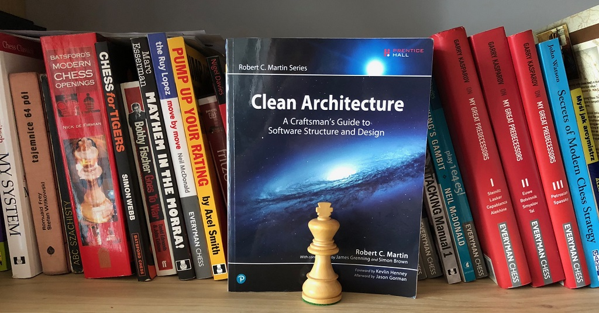
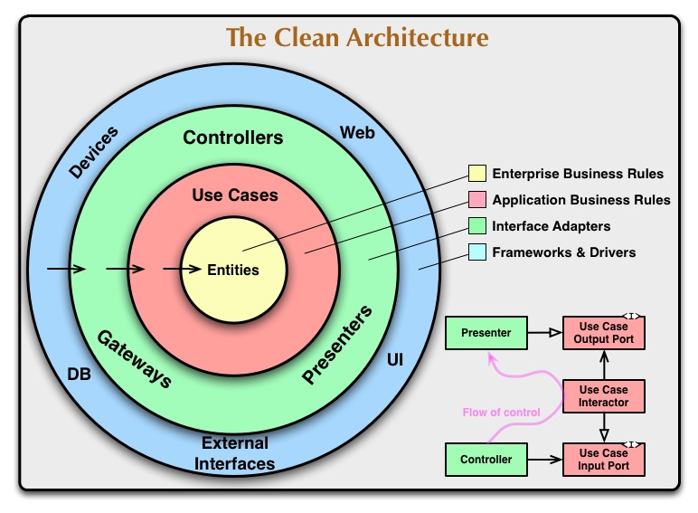

---
title: "Discovering “Clean Architecture” with Uncle Bob"
date: 2018-07-14T00:00:00Z
draft: false
description: "Recently I have been taking a bit of a step back from microservices and trying to look at systems architecture from a more general perspective."
categories: ["Architecture", "Books"]
cover:
  image: "images/the-clean-architecture.jpg"
  alt: "Discovering “Clean Architecture” with Uncle Bob"
aliases:
  - "/2018/07/14/discovering-clean-architecture-with-uncle-bob/"
ShowToc: true
TocOpen: false
---

Recently I have been taking a bit of a step back from microservices and trying to look at systems architecture from a more general perspective. With that mindset, I have picked up [*“Clean Architecture” (Amazon)*](https://www.amazon.com/gp/product/0134494164/ref=as_li_tl?ie=UTF8&camp=1789&creative=9325&creativeASIN=0134494164&linkCode=as2&tag=e4developer01-20&linkId=e4b2982b894b1cb4cabeeab9dd4c783c) by the “*Legendary Craftsman”* (that’s probably the publisher’s enthusiasm!) Robert C. Martin “Uncle Bob”. What follows is my thoughts and overall review of the book.

## SOLID foundations

The book starts quite a bit below the abstract levels of architecture. We are treated to a very entertaining review of the journey from **Structured Programming**, through **Object-Oriented Programming** and ending on **Functional Programming**.

Uncle Bob makes a good argument on why we are unlikely to see any further paradigm change. Each of these styles is characterized by specific restrictions. To paraphrase:

- Structured Programming imposes discipline on direct transfer of control. Think loops.
- Object-Oriented Programming imposes discipline on indirect transfer of control. Think polymorphism
- Functional Programming imposes discipline upon variable assignment. Think immutability and pure functions.

With the paradigms discussed, the book moved towards SOLID principles.

If you have not heard about SOLID, here is the quick break down:

- SRP: **The Single Responsibility Principle**
- OCP: **The Open-Closed Principle**
- LSP: **The Liskov Substitution Principle**
- ISP: **The Interface Segregation Principle**
- DIP: **The Dependency Inversion Principle**

What I did not realise is that Robert C. Martin is the author of the *SOLID* theory, although he did not invent the acronym. That came from Michael Feathers a few years later. This gives Uncle Bob quite an authority to write about these principles. It also provides another surprise…

**The Single Responsibility Principle** is probably not what you think it is! The common misunderstanding is to explain it as *“class should do only one thing and do it well”*… This is only partially correct. In the book, Uncle Bob provides the more refined explanation: *“A module should be responsible to one, and only one, actor”*. This makes this principle much more concrete and applicable at different levels of abstraction.

I really enjoyed this deeper dive into the commonly discussed SOLID principles and deeper insight into their implications. This makes the book not only useful to architects, but also to pretty much any developer. I may be hinting here on the idea, that architecture is also a responsibility of the developers.

## Thinking about Components

Once the foundations are established, the book moves onto discussing components. Some esoteric theory is introduced (measuring stability and abstraction as an actual metric), but this all leads in the good direction. While I doubt most people will benefit from the actual metrics, the ideas introduced here are very valuable:

- The Common Closure Principle
- The Common Reuse Principle
- The Stable Dependencies Principle
- The Stable Abstraction Principle

There are the *theories* on which good design practices lay. It is quite a difficult read, so I recommend taking your time with this section. These chapters contain some universal software design truths.

The theme of building components stays with us throughout the book. It is really successful in teaching two lessons:

- Always depend on abstraction. Lower level components should depend on higher level components, never the opposite.
- Separating components and maintaining boundaries is one of the hallmarks of good architectures

*“Clean Architecture”* is full of good advice on how to reasonably separate components and direct your dependencies. This all culminates in the introduction of what Uncle Bob calls **the Clean Architecture.**

## The Clean Architecture

Clean Architecture is an actual architecture that Uncle Bob described in [The Clean Architecture article](https://8thlight.com/blog/uncle-bob/2012/08/13/the-clean-architecture.html) posted on the [8thlight company website](https://8thlight.com). If you are interested in details, I recommend reading that blog post (or better, read the book!), if you don’t have a time, this is the picture:

This is a simple (in a good way) approach to building software systems. The idea is to be strict about the direction of the dependencies and keep details (such as databases) as far as possible from the actual business rules.

While sharing the title with the book itself, I don’t see it as the most valuable thing in the book! The architecture itself is a process, you need to constantly work to keep it clean. The advice on how to get there seems more valuable than the final picture. The final idea is good, but it is not the difficult part.

One thing that I really enjoyed in the book was the **Chapter 34: The Missing Chapter**was written by Simon Brown, it takes the ideas from the book and demonstrates them against practicalities of implementing a Java system. It really highlights, that while it is important to know the concepts presented by Uncle Bob, you also have to be able to implement them well!

## Do (not) mind the details

Uncle Bob is clear in his writing- the Database is a detail, the Web is a detail, even Frameworks are details. This may sound crazy, as it is both a statement and advice. It is very easy for your framework of choice to define the architecture.

This is something that I have been thinking about a lot recently. I have written about [the rise of Microframeworks]() and [the quest for simplicity in microservices](), as too often I have seen frameworks overshadowing the real architectures. This book makes it very clear (in a very funny way) that you should be very careful when committing to *“marrying”* a framework *“for better or for worse, in sickness and in health…”*.

## What is architecturally significant?

Perhaps the most interesting question that this book opened for me is the architectural significance of different parts of the system. What is architecturally significant? What should be? There is a good argument that even in *micro-service* (Uncle Bob uses the *“-”*convention, so let’s roll with it) architectures, not every service is significant.

This is dangerous and important to remember! Your architecture boundaries are not necessarily where your services boundaries lay. If these are not aligned properly, you may end up with extremely chatty architecture over an expensive boundary. I think we all heard about failed micro-services attempts because of that mistake.

Make sure that your boundaries are correctly enforced, your components separated and details stay details. You should be on your way to achieving a Clear Architecture.

## Summary

This was a very entertaining book. Short chapters make for an easy read. There is a lot of discussions that at first may seem to only apply to monolithic systems or problems of old, but the advice is universal.

I really recommend the book. Read it with an open mind, and see how some of the timeless advice can be applied to even the most modern of systems.
