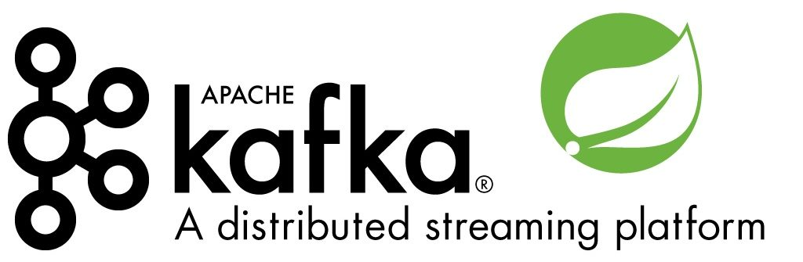

# Getting Started with Kafka in Spring Boot



Kafka seems to only be gaining in popularity. A few years ago you could mostly see it in Big Data engineering context. These days, Kafka is starting to power more common message-oriented architectures. In this article, I want to give you a basic introduction to working with Spring Boot and Kafka.

## Installing Kafka on your machine

One common barrier to entry for people to *hack around* on their machines with Kafka is how tricky the installation can be. For that very reason, I have written [*“How to easily run Kafka with Docker for development”*](https://www.e4developer.com/2018/05/20/how-to-easily-run-kafka-with-docker-for-development/)– I think you will find it especially useful if you are on Windows!

If you are running macOS or Linux, you can still follow the aforementioned tutorial, but you could also run Kafka and Zookeeper without Docker. To do that I recommend [Confluent.io](https://www.confluent.io/) platform and their [Quick Start tutorial](https://docs.confluent.io/current/quickstart/cos-quickstart.html).

## Enabling Kafka in Spring Boot

Assuming that you have Kafka accessible on *kafka:9092*what follows is basic instruction on integrating your Spring Boot application with Kafka.

With Spring Boot, to use Kafka, you need a single dependency added to your POM file (or equivalent if using Gradle):

```

<dependency>
    <groupId>org.springframework.kafka</groupId>
     <artifactId>spring-kafka</artifactId>
</dependency>

```

You will also need to set a couple properties in your *application.properties* file:

```

spring.kafka.consumer.group-id=kafka-intro
spring.kafka.bootstrap-servers=kafka:9092

```

You can customize how to interact with Kafka much further, but this is a topic for another blog post. If you need more in-depth information, check the [official reference documentation](https://docs.spring.io/spring-kafka/docs/2.1.6.RELEASE/reference/html/).

## Connecting Spring Boot with Kafka

In order to send messages, you will need to *@Autowire KafkaTemplate*. Once you have access to an instance of that *KafkaTemplate*, publishing messages to a topic becomes trivial!

```

@Autowired
private KafkaTemplate<String, String> kafkaTemplate;

public void send(String topic, String payload) {
    kafkaTemplate.send(topic, payload);
    System.out.println("Message: "+payload+" sent to topic: "+topic);
}

```

Listening to messages is equally easy. You will need to create *@KafkaListener* and choose a topic that you want to listen to:

```

@KafkaListener(topics = "topic1")
public void receiveTopic1(ConsumerRecord<?, ?> consumerRecord) {
    System.out.println("Receiver on topic1: "+consumerRecord.toString());
}

```

We are doing only very basic operations here, but the simplicity is undeniable. Once you have your local Kafka configured, and you can publish and listen to messages- you can develop it further as necessary.

## Putting it all together

Putting the publisher and a few listeners together I have created an example Spring Boot application that is [available as a GitHub project](https://github.com/bjedrzejewski/kafkaintro).

You can clone the project and if you have Kafka running on your machine- you can try it yourself.

## Spring Cloud Stream and Kafka

In the previous section, we looked at the direct integration between Spring Boot and Kafka. If you wish to abstract your messaging layer from the application logic, you could use the Spring Cloud Stream approach.

This Spring Cloud Stream and Kafka integration is described very well in the [Kafka Streams and Spring Cloud Stream](https://spring.io/blog/2018/04/19/kafka-streams-and-spring-cloud-stream) just recently published on the [spring.io blog](https://spring.io/blog).

Another way that Kafka comes to play with Spring Cloud Stream is with Spring Cloud Data flow. This abstracts the use of Kafka nearly entirely and can be interesting if you want to build an ETL or some batch processing. I wrote an [introduction to Spring Cloud Data Flow](https://www.e4developer.com/2018/02/18/getting-started-with-spring-cloud-data-flow/) and looked at [different use cases for this technology](https://www.e4developer.com/2018/02/28/spring-cloud-data-flow-use-cases/).

## Summary

Kafka can be an intimidating technology. However, with Docker and Spring Boot the barrier to entry is lower than you might have suspected. Just remember- this article should get you started, to really master Kafka, you need to learn much more!
