---
title: "Getting Started with Spring Cloud Data Flow"
date: 2018-02-18T00:00:00Z
draft: false
description: "Set up a Spring Cloud Data Flow Server on your local machine. Build an example Stream that takes HTTP traffic, transforms and saves to a file."
categories: ["Microservices", "Orchestration", "Spring Cloud", "Spring Cloud Data Flow"]
cover:
  image: "images/data-flow-featured.png"
  alt: "Getting Started with Spring Cloud Data Flow"
aliases:
  - "/2018/02/18/getting-started-with-spring-cloud-data-flow/"
ShowToc: true
TocOpen: false
---In this article, I will show you how you can get started with Spring Cloud Data Flow. Spring Cloud Data Flow is an amazing platform for building data integration and processing pipelines. It has a very user-friendly graphical dashboard where you can define your streams, making your work with data an absolute pleasure.

The goal of this article is to have you learn to build some simple data pipelines by the time you are finished reading. Before we get started there are a few **system requirements**:

- You should have **JDK 8 installed**, as at the time of writing Spring Cloud Data Flow is somewhat tricky to get to work with JDK 9 (missing JAXB libraries)
- You should have **Docker installed**. If you are not sure why this is useful, I have written an article [explaining docker use as a development tool](http://e4developer.com/2018/01/18/microservices-toolbox-docker/). If you still don’t want to install docker, you need to be able to get MySql, Redis, and RabbitMQ accessible from your machine.
- You should have **Apache Maven** installed on your machine. The [official installation guide](https://maven.apache.org/install.html) should be easy enough to follow.

Assuming that you have the tools required, we can get started!

### Getting Spring Cloud Data Flow Server up and running

As I have mentioned, in order to get the platform running, you need some middleware. The first is RabbitMQ, you could use Kafka for your stream communication, but for the simplicity of this tutorial we are going to go with RabbitMQ:

`docker run --name dataflow-rabbit -p 15672:15672 -p 5672:5672 -d rabbitmq:3-management`

Running this command will start RabbitMQ Docker container on your machine exposed on the default ports. You will also get a management console that will let you check on the status of your broker.

In order to get analytics from Spring Cloud Data Flow, you will need Redis as well. This is not 100% required, but since it is not much hassle- let’s get it started. If you are running Data Flow in a production deployment you will definitely want it:

`docker run --name dataflow-redis -p 6379:6379 -d redis`

The last pre-requisite is a MySql instance. If you do not have it, you will end up with an in-memory H2 database powering Data Flow. The problem with that is that you will lose all your data on a server restart. This could be actually desirable for testing, but incredibly frustrating if you invest some time in configuring your Streams only to lose them on a server restart. While creating the container, we will set a custom password and create a database for Data Flow:

`docker run --name dataflow-mysql -e MYSQL_ROOT_PASSWORD=dataflow -e MYSQL_DATABASE=scdf -p 3306:3306 -d mysql:5.7`

With these three docker containers up and running you are ready to get the Data Flow server and get it started. You can download it from here: <https://repo.spring.io/libs-release/org/springframework/cloud/spring-cloud-dataflow-server-local/1.3.0.RELEASE/spring-cloud-dataflow-server-local-1.3.0.RELEASE.jar>. This is the latest version at the time of writing, the [official project website](https://cloud.spring.io/spring-cloud-dataflow/) could have a more up-to-date link, but it is not guaranteed to work exactly the same.

We have downloaded the *local*version of the server. That means that the different applications composing our *Streams* will be deployed as local Java processes. There are Cloud Foundry and Kubernetes versions of the server available if you want something more production-ready.

Time to start the server. We will pass MySQL and RabbitMQ parameters in this starting command. Redis default properties are good enough:

`java -jar spring-cloud-dataflow-server-local-1.3.0.RELEASE.jar --spring.datasource.url=jdbc:mysql://localhost:3306/scdf --spring.datasource.username=root --spring.datasource.password=dataflow --spring.datasource.driver-class-name=org.mariadb.jdbc.Driver --spring.rabbitmq.host=127.0.0.1 --spring.rabbitmq.port=5672 --spring.rabbitmq.username=guest --spring.rabbitmq.password=guest`

### Spring Cloud Data Flow – First Look

Hopefully, your server started without a problem and you are seeing something like this in your console:

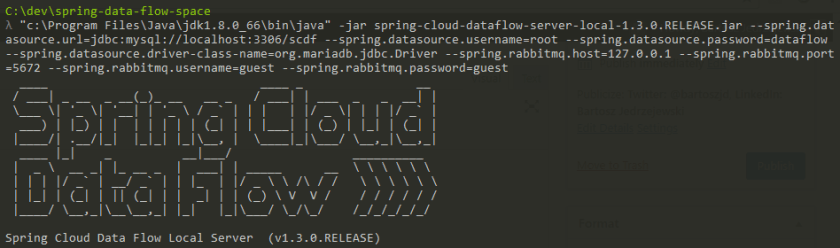
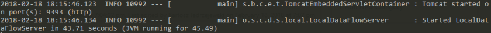

If you want you can look into your MySQL instance where you should see a bunch of tables created:

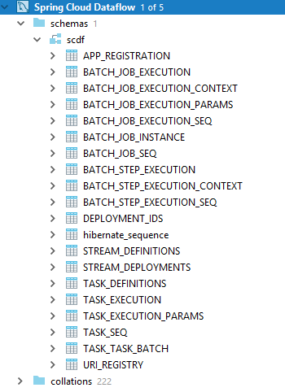

Time to see Spring Cloud Data Flow itself! Go to http://localhost:9393/dashboard to see the dashboard:

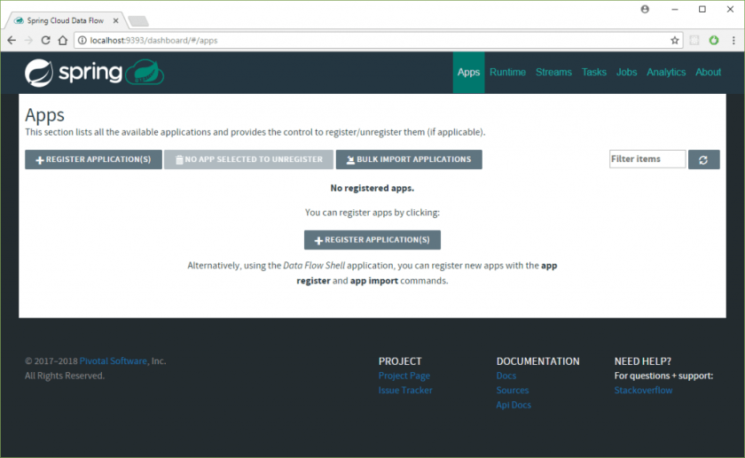

It looks a bit empty! This is because we did not load any starter apps. [Spring Cloud Stream App Starters](https://cloud.spring.io/spring-cloud-stream-app-starters/) is a project that provides a multitude of ready-to-go starter apps for building Streams. You can read from FTP, HTTP, JDBC, twitter and more, process and save to a multitude of sources. There are three main concepts to which each Application can belong:

- **Source** – These are the available sources of data. You start your streaming pipelines from them.
- **Processor** – These take data and send them further in the processing pipeline. They sit in the middle.
- **Sink** – They are the endpoints for the streams. This is where the data ends in the end.

These are being constantly added, and you can see the up-to-date list on the [official project site](https://cloud.spring.io/spring-cloud-stream-app-starters/). Currently we have:

| **Source** | **Processor** | **Sink** |
| --- | --- | --- |
| file | aggregator | aggregate-counter |
| ftp | bridge | cassandra |
| gemfire | filter | counter |
| gemfire-cq | groovy-filter | field-value-counter |
| http | groovy-transform | file |
| jdbc | header-enricher | ftp |
| jms | httpclient | gemfire |
| load-generator | pmml | gpfdist |
| loggregator | python-http | hdfs |
| mail | python-jython | hdfs-dataset |
| mongodb | scriptable-transform | jdbc |
| mqtt | splitter | log |
| rabbit | tasklaunchrequest-transform | mongodb |
| s3 | tcp-client | mqtt |
| sftp | tensorflow | pgcopy |
| syslog | transform | rabbit |
| tcp | twitter-sentiment | redis-pubsub |
| tcp-client |  | router |
| time |  | s3 |
| trigger |  | sftp |
| triggertask |  | task-launcher-cloudfoundry |
| twitterstream |  | task-launcher-local |
|  |  | task-launcher-yarn |
|  |  | tcp |
|  |  | throughput |
|  |  | websocket |

This is an impressive list! So how do we get them into the Spring Cloud Data Server? Could not be easier! First, we are going to use the **RabbitMQ + Maven**flavour for the starters, as this is how we set up the server. From the project website, the URL for the stable release is <http://bit.ly/Celsius-SR1-stream-applications-rabbit-maven>. We can supply this to the Data Flow server. First, click:

And then populate the URI and click the *Import* button:

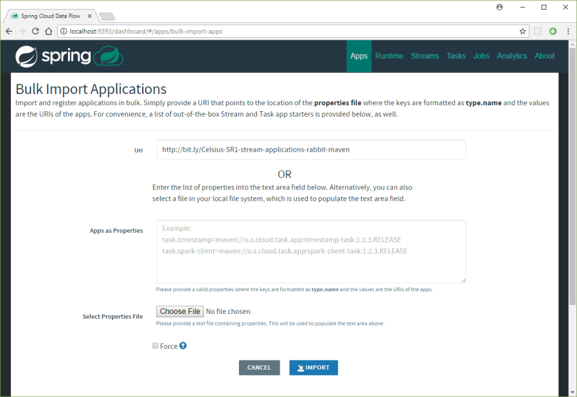

If all went well, then you should see multiple starter apps available.

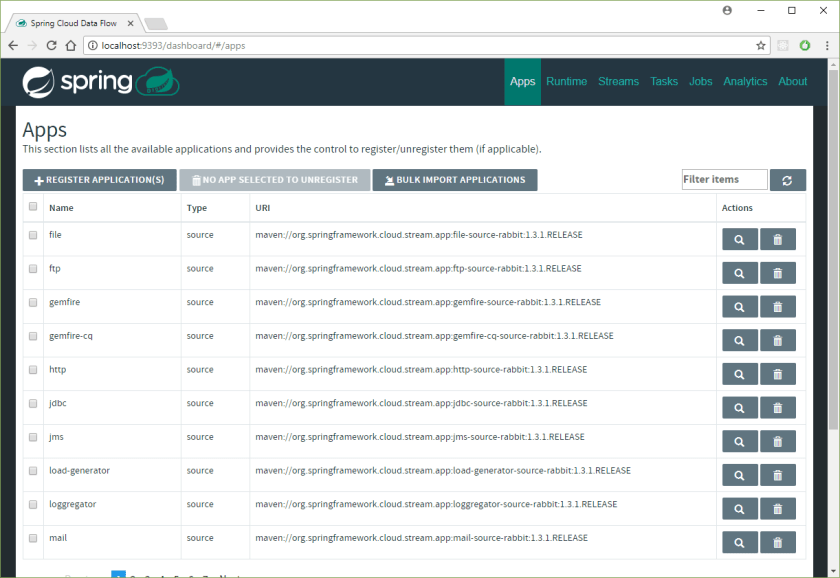

### Building our first Data Flow Stream

We are now ready to build the first Data Flow Stream. To do this we will head to the *Streams* tab on the Dashboard and click the *Create Stream* button:

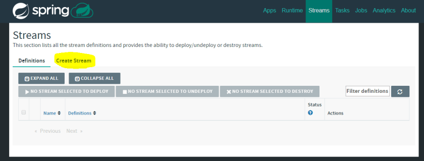

Here, we will create a stream that reads from HTTP endpoint, upper-cases the content and saves it all to a file in c:/dataflow-output (if you are on Windows, otherwise you can choose different directory). The aim of this exercise is to show you how Source, Processor and Sink connect together and how seamless it all is! Let’s drag and drop the following into the workspace:

- **Source – HTTP**
- **Processor – transform**
- **Sink – file**

You should see the following:

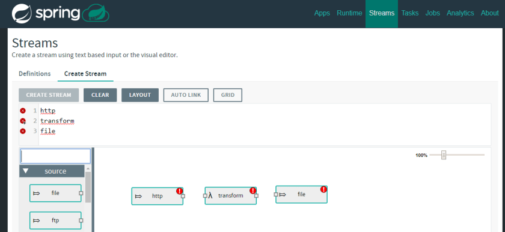

As you can see there are red exclamation marks displayed. That means that the Stream is not healthy. You should click on the tiny squares in the graphical representation to connect the streams, or alternatively, in the text field, you can specify how the Stream should be composed:

`http | transform | file`

With that, we just need to configure our stream accordingly. This can be done by either clicking on the graphical representation cog-wheel icon that appears when selected:

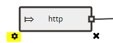

Or by using the text field. One thing that you get from that graphical interface is quite a nice way of inputting the properties. For example to configure that HTTP source we can simply set the port like that:

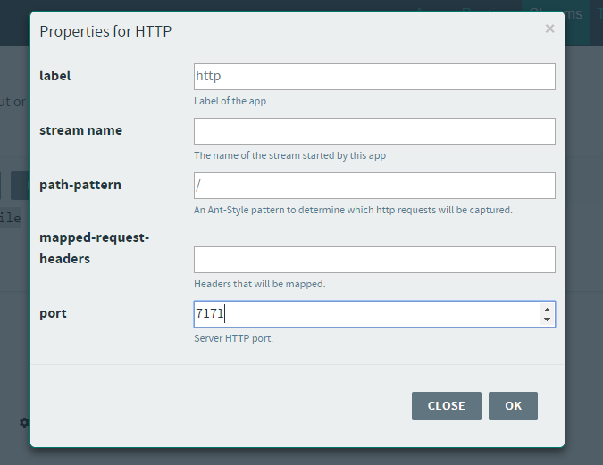

Lets set the remaining properties via the text-field. The final Stream description should look like this:

`http --port=7171 | transform --expression=payload.toUpperCase() | file --directory=c:/dataflow-output`

Great! We have the first stream, now lets click `Create Stream` button visible just above the input text-field and set the stream name to *Upper-Case-Stream:*

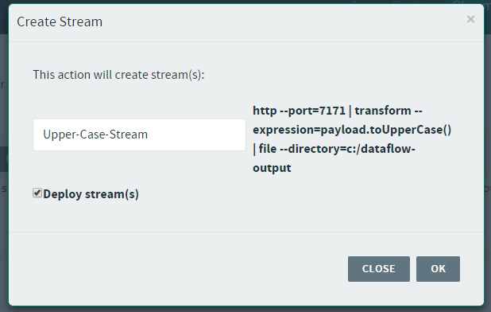

I have ticked the *Deploy stream(s)* box to have the stream automatically deployed. The stream should be deployed shortly:

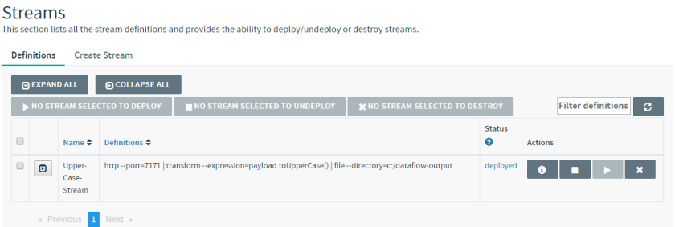

### Trying out the Stream

It would not be much fun to just create the stream and not try it! To do that you can get Postman running to send a few requests to that HTTP endpoint:

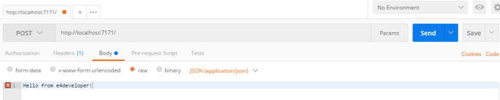

You will quickly see that there are relevant queues and exchanges created in the connected RabbitMQ instance:

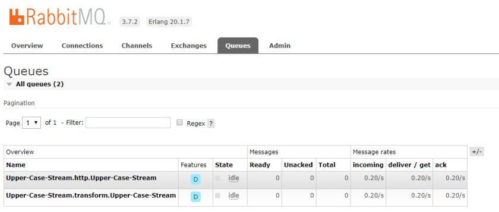

And finally looking into that file and directory that we wanted to save the results of our Stream:

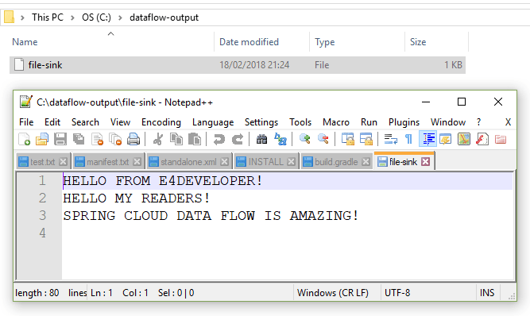

Congratulations! You have made it through the creation of your first Spring Cloud Data Flow Stream!

### Where from here?

I hope that reading this introduction got you excited about using Spring Cloud Data Flow- I certainly enjoyed writing about it! You should be aware that there is also [Spring Cloud Data Flow Shell](https://docs.spring.io/spring-cloud-dataflow/docs/current/reference/htmlsingle/#shell) available if you need to work with the platform in a shell only environment (or if you prefer to!).

There is much more to Spring Cloud Data Flow. You can create your own Sources, Processors, and Sinks. You can create Tasks (run on demand) processes rather than Streams. There are complicated processing workflows that you can design. This all is to be discovered and used- hopefully with the knowledge from this article you are ready to start exploring yourself.
