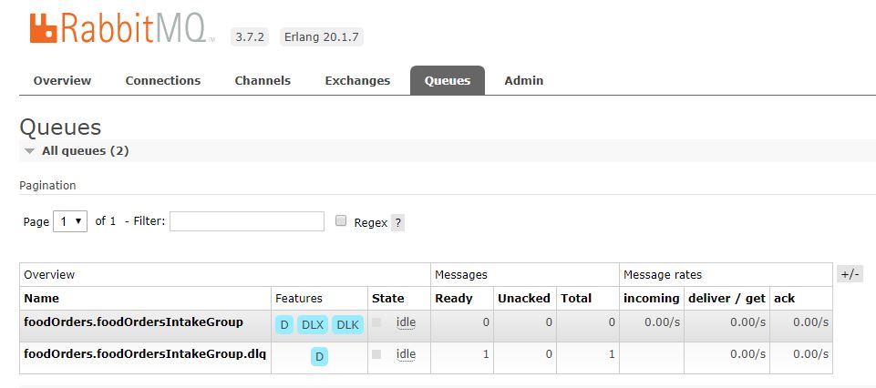

---
title: "Handling bad messages with RabbitMQ and Spring Cloud Stream"
date: 2018-02-05T00:00:00Z
draft: false
description: "Handling Bad Messages using Dead Letter Queues in RabbitMQ. See how Spring Cloud Stream makes it easy and what can you do to repair and replay messages."
categories: ["Choreography", "Microservices", "Spring Cloud"]
cover:
  image: "images/message-in-dlq.jpg"
  alt: "Handling bad messages with RabbitMQ and Spring Cloud Stream"
aliases:
  - "/2018/02/05/handling-bad-messages-with-rabbitmq-and-spring-cloud-stream/"
ShowToc: true
TocOpen: false
---When dealing with messaging in a distributed system, it is crucial to have a good method of handling bad messages. In complicated systems, messages that are either wrong, or general failures when consuming messages are unavoidable. See how you can deal with this problem using Dead Letter Queues, RabbitMQ and Spring Boot Cloud.

When dealing with messages in distributed systems it is important to know when things go wrong. When your services simply call one another it often is quite trivial- if your call failed, you know that you have a problem! With messaging it is often not so clear- as a service, if you successfully published a message on a queue- your responsibility ends. Whose responsibility is it then to ensure that the message published was correct and if not, that something will be done about it? Here, with the spirit of *“smart pipes”*we assume that it is the brokers responsibility to provide this service…

### Introducing Dead Letter Queue

Dead Letter Queue is a queue dedicated to storing messages that went wrong. A list of what is meant by ‘went wrong’ is handily provided by Wikipedia:

- *Message that is sent to a queue that does not exist.*
- *Queue length limit exceeded.*
- *Message length limit exceeded.*
- *Message is rejected by another queue exchange.*
- *Message reaches a threshold read counter number, because it is not consumed. Sometimes this is called a “back out queue”.*

Here we are going to look at the last case. This roughly translates to- if a specified message fails to be consumed by a services specified number of times, this message should be moved to the Dead Letter Queue (often referred as DLQ). The good news is- with RabbitMQ and Spring Cloud Stream it is very easy.

### Dead Letter Queue with RabbitMQ and Spring Cloud Stream

I will assume here that you know basics of Spring Cloud Stream and RabbitMQ. If you want to refresh your memory, you can check my earlier blog post on [integrating RabbitMQ with Spring Cloud Stream](http://e4developer.com/2018/01/28/setting-up-rabbitmq-with-spring-cloud-stream/). The basic idea here is that it is all very easy. Introducing DLQ to your project continues on that same trend. It took me some time to figure that out from the documentation, but all you really have to do is to add `spring.cloud.stream.rabbit.bindings.YOUR_CHANNEL_NAME.consumer.autoBindDlq=true` to your consumer project properties. There is one small catch- if you already have existing queue, you may need to delete it in order for your project to re-create the queue correctly. After adding this property, every time you have an exception in your consumer code (message ends up not being acknowledged) the message will be put on the DLQ. You could also have that scenario when using manual acknowledgements (which are a configuration option). Here, I am using the following code to simulate these exceptions:

```

package com.e4developer.foodorderconsumer;

import org.springframework.boot.SpringApplication;
import org.springframework.boot.autoconfigure.SpringBootApplication;
import org.springframework.cloud.stream.annotation.EnableBinding;
import org.springframework.cloud.stream.annotation.StreamListener;
import org.springframework.cloud.stream.messaging.Sink;

@EnableBinding(Sink.class)
@SpringBootApplication
public class FoodOrderConsumerApplication {

	public static void main(String[] args) {
		SpringApplication.run(FoodOrderConsumerApplication.class, args);
	}

	@StreamListener(target = Sink.INPUT)
	public void processCheapMeals(String meal) throws Exception {
		if(meal.contains("vegetables"))
			throw new Exception("Vegetables! Move to dead letter queue!");
		if(meal.contains("poison"))
			throw new Exception("Poison! Move to dead letter queue!");
		System.out.println("Meal consumed: "+meal);
	}
}

```

This consuming code is available in the [food-order-consumer github repo](https://github.com/bjedrzejewski/food-order-consumer/tree/dlq-example). There is also accompanying [food-order-publisher github repo](https://github.com/bjedrzejewski/food-order-publisher/tree/dlq-example) if you want to run the whole example.

Now, after sending the following JSON payload to the publisher:

```

{
    "restaurant": "Fancy Feast",
    "customerAddress": "Buckingham",
    "orderDescription": "Tasty vegetables and coffee"
}

```

I get to see an Exception Stack trace in the consumer and the message appear in the automatically created DLQ:



There is much more configuration available when working with the DLQ messages. You can change names, add custom routing, specify number of re-tries etc. To find more about it, the [official API](https://docs.spring.io/spring-cloud-stream/docs/current/reference/htmlsingle/#_configuration_options_3) is the best place to look.

### Processing Messages from the Dead Letter Queue

You know how to put messages on the DLQ, now it will be good to understand how to get out of there. Well, even though Spring Cloud is quite opinionated on how to deal with most things it can’t really tell you what to do with your bad messages. DLQ is just a queue after all and that’s how it should be treated. You can take the messages manually from the queue, make a consumer that pushes it to a database or attempt to reprocess/repair the messages with another service. What follows is an example code that takes the messages from DLQ and simulates repair or storage for further examination:

```

package com.e4developer.foodorderdlqprocessor;

import org.springframework.amqp.core.Message;
import org.springframework.amqp.core.MessageBuilder;
import org.springframework.amqp.rabbit.annotation.RabbitListener;
import org.springframework.amqp.rabbit.core.RabbitTemplate;
import org.springframework.beans.factory.annotation.Autowired;
import org.springframework.boot.SpringApplication;
import org.springframework.boot.autoconfigure.SpringBootApplication;

@SpringBootApplication
public class FoodOrderDlqProcessorApplication {

	private static final String ORIGINAL_QUEUE = "foodOrders.foodOrdersIntakeGroup";

	private static final String DLQ = ORIGINAL_QUEUE + ".dlq";

	private static final String X_RETRIES_HEADER = "x-retries";

	public static void main(String[] args) {
		SpringApplication.run(FoodOrderDlqProcessorApplication.class, args);
	}

	@Autowired
	private RabbitTemplate rabbitTemplate;

	@RabbitListener(queues = DLQ)
	public void rePublish(Message failedMessage) {

		failedMessage = attemptToRepair(failedMessage);

		Integer retriesHeader = (Integer) failedMessage.getMessageProperties().getHeaders().get(X_RETRIES_HEADER);
		if (retriesHeader == null) {
			retriesHeader = Integer.valueOf(0);
		}
		if (retriesHeader < 3) {
			failedMessage.getMessageProperties().getHeaders().put(X_RETRIES_HEADER, retriesHeader + 1);
			this.rabbitTemplate.send(ORIGINAL_QUEUE, failedMessage);
		}
		else {
			System.out.println("Writing to databse: "+failedMessage.toString());
			//we can write to a database or move to a parking lot queue
		}
	}

	private Message attemptToRepair(Message failedMessage) {
		String messageBody = new String(failedMessage.getBody());

		if(messageBody.contains("vegetables")) {
			System.out.println("Repairing message: "+failedMessage.toString());
			messageBody = messageBody.replace("vegetables", "cakes");
			return MessageBuilder.withBody(messageBody.getBytes()).copyHeaders(failedMessage.getMessageProperties().getHeaders()).build();
		}
		return failedMessage;
	}

}

```

What I think is most interesting here is the code that attempts to repair the message. If it is possible to repair the message, then the message can be requeued and processed successfully by the original, intended consumer. By looking at the headers, the custom re-try logic is added. What you can also see is the break out from the standard Spring Cloud Stream processing, as more bespoke handling of the message is required.

This service code is also [shared on github](https://github.com/bjedrzejewski/food-order-dlq-processor/tree/dlq-example). It is heavily inspired by the approach from the [official documentation](https://docs.spring.io/spring-cloud-stream/docs/current/reference/htmlsingle/#rabbit-dlq-processing) that is worth checking out.

### Conclusion

Dead Letter Queue is an important pattern that you should be familiar with. Spring Cloud Stream together with RabbitMQ make it rather easy to get started, but if you want to start repairing messages- a tailored approach needs to be taken. With these techniques you should be in a good position to deal with *bad messages*.
