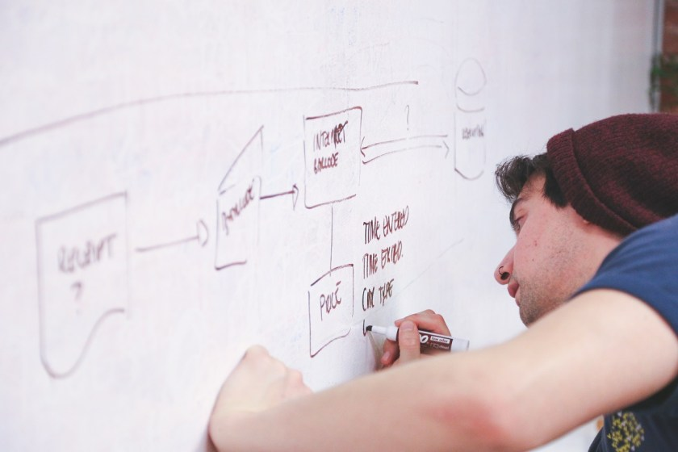

---
title: "Helping your team - Draw together!"
date: 2018-01-13T00:00:00Z
draft: false
description: "Drawing together is a powerful tool that may improve any software team capability. Practical advice on getting started. Learn how and why!"
categories: ["Building teams"]
cover:
  image: "images/cropped-whiteboard-drawing.jpg"
  alt: "Helping your team - Draw together!"
aliases:
  - "/2018/01/13/helping-your-team-draw-together/"
  - "/helping-your-team-draw-together/"
ShowToc: true
TocOpen: false
---I love working as a part of a great software development team. Thanks to my job, I also have a chance to lead such teams. In this series of blog posts titled *Helping your team*I would like to explore different ideas and techniques to make sure that the team you are part of is performing at its best!

Before going into specific topic, it is important to realize that you do not have to be a team lead or a senior member of the team to incite change! Introducing good ideas and championing best practices can be done by anyone. As a lead, this is your responsibility.

## Drawing Together

This is a very simple, but powerful technique. Number of times I have been debating a difficult design decision or trying to understand legacy code, where the people involved just could not see the same picture. In this case, there is nothing better than drawing an actual picture (with some pseudo UML) that gets everyone to understand what is being discussed. To help you see where drawing can be useful technique let me present you with a few situations:

### Discussing/discovering your domain

Good understanding of your domain is crucial to making good design decisions. If the domain model is anything but trivial, it is near impossible to envision it together without an actual picture. How do you draw it? Preferably not alone- you can work with someone who knows is an expert in the domain (business analyst/subject matter expert/developer who knows the domain) and do it either on paper or whiteboard if there are more people involved. If you want to use some software to document this work, do it after the drawing is done as not to unnecessarily slow down and confuse others.

### Designing features, modeling your domain

Before you commit to coding you should have a good idea how your solution should look like. There is nothing better here than a conceptual model that can quickly show you any logical inconsistencies. If you do it alone in your head, you may overlook important elements and make mistakes. The key here is having a medium that you can easily modify on the fly, so once again actual drawing is much better than a software application. I can’t stress enough how valuable this is. I had occasions where I would discuss designs with my friend Cesar (find him on [twitter](https://twitter.com/cesarTronLozai)) and even after both coming with a pretty good ideas into the discussion, we would leave with something much better that we did not suspect was possible!

### Understanding legacy code

This is always a challenge, especially common if you are software consultant and you are constantly seeing new (old) systems. Faced with a huge code base and scarce documentation, pen and paper are your best friends! Draw any main modules and interactions and as you start to understand better, zoom in more, add details and understanding. Often, once you built that map, a lot of decision start to make more sense (hopefully…). This again can be later documented if necessary to make the process easier for others.

## General advice on what to draw

Do not stress to much on drawing very precise UML. What you want is to convey message, so as long as you are understood, you are doing it right. I find a few kind of diagrams especially useful:

- **Class diagrams**– basically arrows and boxes. Showing the general connections between different modules/classes/domain objects. These give a general overview of what the thing that you are trying to represent looks like
- **Sequence diagrams** – showing specific system in motion. What calls what and what information is returned. They are usually more precise than class diagrams and used more often when discussing specific use cases
- **Component diagrams**– these are often higher level than class diagrams. Can include things such as hardware, physical objects, other systems etc. You can represent different system boundaries here as well.

I am not very precise in my classification here (not UML precise at least), but hopefully, you get the idea. With these three basic types, you can get most of the information across. If something else works for your team- let me know in the comments!

## Summary

Drawing together is a powerful activity. It works on many levels. Not only it can help you when faced with a difficult problem, but it can help the whole team as well. Do not underestimate the value from interactions that occur when people gather around a whiteboard (or whatever you have available). Share your experience with drawing with your team int he comments!
