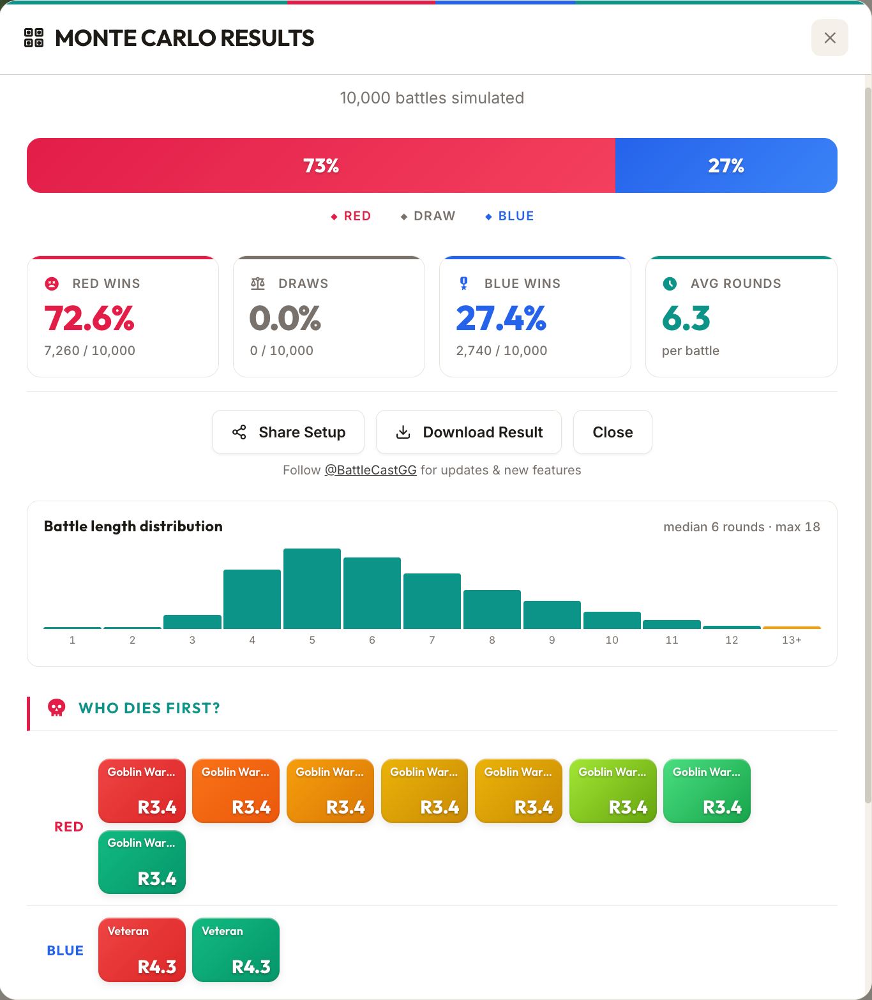
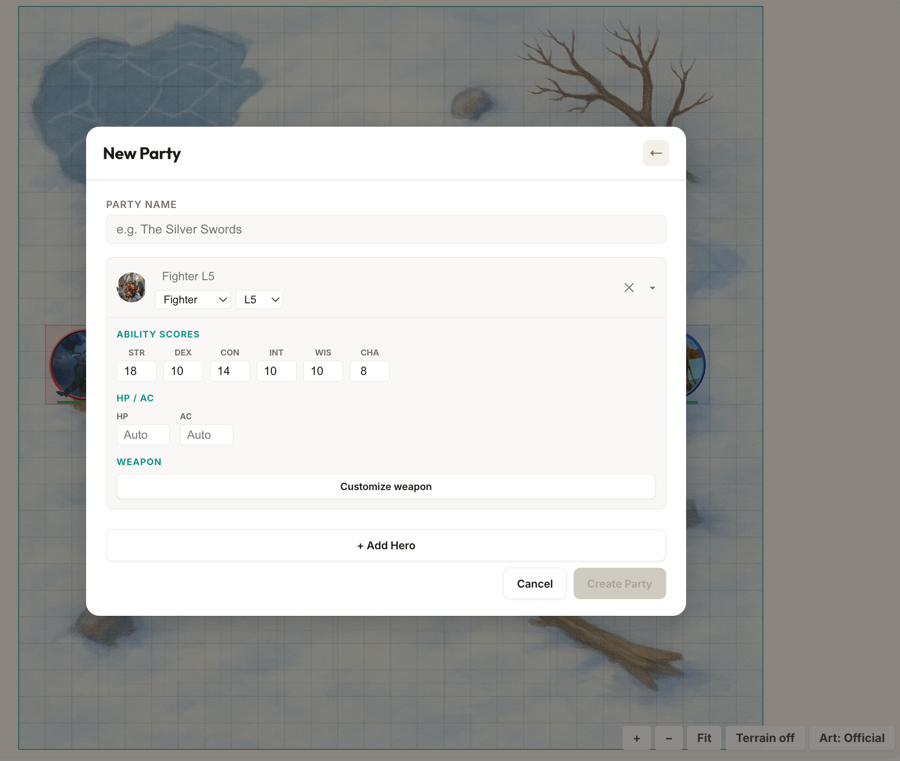

It started the way a lot of side projects start - with a question I couldn't let go of. I'd been pasting D&D encounter setups into Claude and ChatGPT for weeks, asking *"who wins this fight?"* The answers were fun to read but not very useful - different models gave different outcomes, and the same model would change its mind if you asked again. No real dice rolls, no positioning, no tactics. LLMs don't simulate combat. They narrate what they think combat might look like.

So I figured: if I keep asking AI to do this and it keeps getting it wrong, maybe I should just build the thing myself.

The tools that already exist aren't much better. Kobold Fight Club and the D&D Beyond encounter builder are just doing XP threshold math from the DMG tables. They tell you "this is Deadly" but not what actually happens when the dice start rolling. The CR system is famously unreliable - "medium" encounters that TPK parties, "deadly" encounters the party steamrolls because the Wizard cast Hypnotic Pattern on round one.

So I built [BattleCast](https://battlecast.gg) - a D&D 5e combat simulator that actually simulates combat. On a grid. With real rules. That you can watch.

## What It Does

You drop creatures onto a tactical grid - pick from 317 monsters from the SRD (the System Reference Document - the subset of D&D rules Wizards of the Coast released for free under Creative Commons) or build custom heroes from any of the 12 core classes (levels 1-10). Assign them to teams. Hit Start Battle.

Then you watch it play out. Initiative rolls, step-by-step movement across the grid, multi-attacks, opportunity attacks, AoE spells with real geometry (cones, lines, spheres), conditions, legendary actions and resistances, retreat AI, the works. Or skip the animation and run 10,000 Monte Carlo simulations to get actual win probability statistics.

It runs entirely in the browser. No backend, no accounts, no login. Vite + React + TypeScript + Canvas 2D, hosted on Cloudflare Pages. Free, no ads.



## The Gap in the Market

When I started researching what already existed, I was genuinely surprised. The space is massively underserved. Every existing combat simulator was either:

- **Gridless** - assuming all creatures border all other creatures, which throws away half the tactical depth of 5e
- **Spell-less** - because implementing even a subset of the rules is genuinely hard
- **Abandoned** - the most-praised one (DnDBattle.com) doesn't even exist anymore. Its DNS doesn't resolve. That's how underserved this space is.

The closest real competitor is ManticoreMontecarlo.com - grid-based, 2024 rules, but early and incomplete. A comment on the D&D Beyond forums captures the challenge perfectly: *"You'd have to implement a fairly complete rules engine, which is outright hard, even before trying to get the combat logic."*

They're right. The 5e rules are a fractal of edge cases. Opportunity attacks interact with creature size footprints. AoE saves interact with damage resistances, which interact with conditions, which interact with saving throw advantage, which interacts with legendary resistance. Every feature you add touches three others.

## The Rules Engine

The core is a pure TypeScript combat engine - no React, no side effects, no UI concerns. It takes a state object and mutates it round by round. This separation means the same engine serves animated playback, instant resolution, and Monte Carlo simulation without any branching.

The engine handles initiative rolling, multi-attack sequencing, saving throws, conditions (prone, stunned, frightened, restrained, paralyzed, invisible, blinded, poisoned, petrified, unconscious), damage types with resistances/immunities/vulnerabilities, opportunity attacks, AoE targeting with real cone/line/sphere geometry, legendary actions and resistances, recharge abilities, concentration tracking, and a bunch more.

Movement is step-by-step, one square at a time, with per-square collision checks against every creature's footprint bounding box (Large creatures are 2x2, Huge 3x3, Gargantuan 4x4). All movement - approach, retreat, disengage - routes through a single `moveToward` function. This was a lesson learned after the second collision bug: have one authority for "how things move on the grid" and route everything through it.

## The Tactical AI

The AI is about 2,700 lines of heuristic logic. No LLM in the loop - every decision needs to execute in microseconds for Monte Carlo to work at 10,000 trials.

Each creature evaluates its situation each turn:

- **Target selection** scales with Intelligence. Smart creatures focus wounded enemies. Dumb creatures just charge the nearest thing.
- **Ability usage** is context-dependent. A dragon only uses its breath weapon if it can hit 2+ enemies in the cone. Spellcasters evaluate AoE geometry before casting Fireball. The AI tracks spell slots, concentration, recharge abilities, and bonus actions.
- **Positioning** is footprint-aware. Rogues kite to stay at range after Cunning Action disengage. Ranged creatures maintain distance. Barbarians never retreat (because of course they don't).
- **Retreat** kicks in for intelligent creatures at low HP. They disengage, move away, and take a parting ranged shot if they have one.

Here's the actual target selection from the engine. The key insight is that intelligence determines strategy - smart creatures focus fire on wounded enemies, average-intelligence creatures mix proximity and weakness, and dumb creatures just attack whoever is closest:

```typescript
function selectTarget(
  state: BattleState,
  creature: Creature,
  strategy: 'nearest' | 'weakest' | 'strongest' | 'smart'
): Creature | null {
  let enemies = getEnemies(state, creature);
  if (enemies.length === 0) return null;

  // Ranged creatures prefer targets they can actually see
  const hasRanged = creature.monsterData.actions.some(a =>
    a.type === 'ranged' && a.attackBonus !== undefined
  );
  if (hasRanged) {
    const visible = enemies.filter(e => canSee(state, creature, e));
    if (visible.length > 0) enemies = visible;
  }

  case 'smart': {
    const intMod = abilityModifier(creature.monsterData.abilities.int);

    if (intMod >= 2) {
      // Smart: target lowest HP% enemy that's reasonably close
      return enemies.reduce((best, e) => {
        const eHpPct = e.currentHp / e.maxHp;
        const bestHpPct = best.currentHp / best.maxHp;
        const eDist = creatureDistance(creature, e);
        const bestDist = creatureDistance(creature, best);

        // If enemy is much closer, prefer it (unless other is nearly dead)
        if (eDist < bestDist * 0.5 && eHpPct > 0.1) return e;
        if (eHpPct < bestHpPct) return e;
        return best;
      });
    }

    if (intMod >= 0) {
      // Average intelligence: mix of nearest and weakest
      const nearest = enemies.reduce((n, e) =>
        creatureDistance(creature, e) < creatureDistance(creature, n) ? e : n
      );
      const weakest = enemies.reduce((w, e) =>
        e.currentHp < w.currentHp ? e : w
      );

      // If weakest is reachable this turn, go for it
      if (creatureDistance(creature, weakest) <= creature.movementRemaining + 10) {
        return weakest;
      }
      return nearest;
    }

    // Dumb creatures (Int < 10): just attack nearest
    return enemies.reduce((n, e) =>
      creatureDistance(creature, e) < creatureDistance(creature, n) ? e : n
    );
  }
}
```

And here's the retreat logic - only intelligent creatures know when to run:

```typescript
function shouldRetreat(creature: Creature): boolean {
  const hpPct = creature.currentHp / creature.maxHp;
  const intMod = abilityModifier(creature.monsterData.abilities.int);

  // Only intelligent creatures retreat
  if (intMod < 0) return false;

  // Low CR creatures retreat at lower HP thresholds
  if (hpPct <= 0.15 && intMod >= 1) return true;
  if (hpPct <= 0.1) return true;

  return false;
}
```

## It Blew Up on Reddit

I posted BattleCast to [r/dndnext](https://www.reddit.com/r/dndnext/comments/1sp9igx/i_built_a_free_dd_5e_combat_simulator_run_10000/) on April 19th. I was nervous - the D&D subreddits can be harsh on self-promotion, and some are openly hostile to anything AI-adjacent. I braced for the worst.

Instead, it hit #1 on the subreddit within hours. 429 upvotes, 142 comments, 94% upvote ratio.

The response ranged from the measured:

> "Honestly, I was pretty wary of the pitch, but gave it a couple of tries and it's not bad. Unclear how reliable, and there is always the Player Bullshit factor, but it's much more powerful than expected." - u/xVenlarsSx

To the enthusiastic:

> "I FUCKING LOVE THIS." - u/Stormbow

To the practical:

> "I'd love to have an option to detail out my players' party as in give as much information about the characters including spells etc as possible and save that party for future usage." - u/tooSAVERAGE (top comment, 111 upvotes)

But the most valuable thing wasn't the upvotes. It was the bug reports.

## 48 PRs in 4 Days - All Thanks to Reddit

Within hours of posting, people were stress-testing BattleCast harder than I ever could alone. Between April 19th and April 23rd, I merged 48 pull requests - almost all of them driven by Reddit feedback. Here are some highlights:

- **The Lich couldn't cast spells.** u/END3R97 noticed that creatures with "reach 5 ft. or range 120 ft." (like the Lich and Mage) couldn't figure out they had ranged attacks. They'd walk 30 feet closer each turn and then do nothing because the engine only saw the 5 ft. melee reach. Turned out I'd messed up data importing for a bunch of spells. Fixed in PR #104.
- **Spirit Guardians was a ranged AoE.** u/LittleLocal7728 caught the Cleric launching Spirit Guardians across the map like a Fireball, instead of it being a self-centred emanation. Fixed the AoE origin logic.
- **Remorhaz immune to Scorching Ray but not Fireball.** u/Havain found fire immunity was inconsistently applied - a data validation bug across several monsters. This led to building a 17-check automated validation suite (PR #124) that caught 15 more data bugs I hadn't noticed.
- **Barbarian provoking unnecessary opportunity attacks.** u/EntropySpark spotted the Barbarian charging through enemy threat ranges to reach a target that hadn't acted yet, eating three opportunity attacks for no reason.
- **Ranger casting Hunter's Mark on the wrong target.** Same user - the Ranger was marking one enemy and then attacking a different one. Classic AI priority bug.
- **Wizards Fireballing through allies.** u/DatOneGuyYT noticed casters throwing AoE damage through their own front line. This led to adding a friendly fire toggle (default: off) in PR #78.
- **Bard opening with Bane in 1v1.** u/mongoose700 pointed out the Bard was casting Bane against a single Barbarian - a waste of a spell slot when you have so little time to capitalise on it. Fixed the AI to skip single-target debuffs in 1v1.
- **Sleep wakes on damage, Second Wind timing, Roper missing everything.** A whole batch of AI behaviour bugs from users running creative matchups nobody would think to test in development.

Beyond bug fixes, Reddit also shaped major features. The custom party builder - where you can create heroes with custom ability scores, weapons, spells, and HP overrides, then save and export them as JSON - shipped four days after the post because u/tooSAVERAGE's top comment made it clear this was the #1 thing people wanted. Hero levels got extended from 6 to 10 in the same window.



Users also started running creative experiments. u/x86_1001010 established that a Level 1 Barbarian can defeat exactly 17 badgers before succumbing to the horde. *"May he live in the hall of heroes as the champion he is."*

## The SRD, Fan Content Policy, and What You Can Actually Use

If you're building anything with D&D content, you need to understand the IP landscape. I knew about the SRD and Creative Commons, but I didn't know about Wizards of the Coast's Fan Content Policy until someone on Reddit pointed it out.

There are three overlapping frameworks for using D&D content:

- **The SRD (System Reference Document) 5.2.1** - released under Creative Commons Attribution 4.0 (CC-BY-4.0). This is the foundation BattleCast is built on. It includes the core rules, 317 monsters, spells, and class features. Crucially, once published under CC-BY-4.0, it can never be revoked - Wizards of the Coast explicitly confirmed this.
- **The Fan Content Policy** - covers fan art, videos, websites, and other fan creations. It requires that content be free, clearly unofficial, and not use Wizards' logos or trademarks. BattleCast qualifies here too.
- **Product Identity** - certain monsters (Beholders with that exact name, Mind Flayers, etc.) and settings (Forgotten Realms) are Wizards' proprietary IP and can't be used outside the DMs Guild.

This is why BattleCast has 317 SRD creatures but not every monster from the Monster Manual. Creatures like the Beholder are SRD-legal (it's included in the SRD 5.2), but many popular monsters from sourcebooks aren't. The Artificer class isn't in the SRD either (it's from Eberron/Tasha's), which is why I had to drop it from the roadmap.

The practical rule I follow: if it's in the SRD 5.2.1, it's fair game under CC-BY-4.0. If it's not, I don't use it. This keeps things clean and future-proof. The 2023 OGL controversy - where Wizards tried to revoke the Open Game License and the community revolted - makes this even more important. Creative Commons can't be taken back. That matters.

## Building With AI

BattleCast was built with heavy use of AI coding assistants. Claude Code did the bulk of the implementation - writing engine logic, implementing monster stat blocks, building the replay system, fixing the countless edge cases in AoE geometry. Thanks to the Fan Content Policy, BattleCast uses the official Wizards of the Coast artwork for its monster portraits.

Every architectural decision was mine. Keeping the engine pure, the step-by-step movement system, the single-authority `moveToward` function - these came from engineering judgment, not prompting. But once the direction was set, AI tools are genuinely excellent at implementing well-specified rules (D&D has *very* well-specified rules), writing test coverage, and the kind of precise-but-repetitive work that 317 monster stat blocks require.

The development loop was heavily TDD-driven. Write a failing test for the behaviour you want - "Barbarian should never retreat", "Sleep should break on damage", "Bard should not cast Bane in 1v1" - then implement until it passes. This worked incredibly well with AI coding assistants. The test is the spec. You hand it to Claude Code, it writes the implementation, you run the suite. If something else breaks, you see it immediately. That loop is how BattleCast ended up with over 711 tests - every Reddit bug report became a test case before it became a fix.

That's how I think about the division - AI as a very fast pair programmer who needs clear direction. The architecture, product decisions, and prioritisation are entirely human. The implementation gets a massive speed boost.

The throughput was unlike anything I've experienced in 15 years of engineering. The entire project - from first commit to Reddit launch with 317 monsters, 12 hero classes, Monte Carlo, animated replay, terrain, maps, and share links - took about three weeks of evenings and weekends. At 12,000+ lines of engine code with 711 tests, that's a timeline that would have been impossible solo a year ago.

## What's Next

The community feedback shaped the roadmap clearly:

- **Death saves** - heroes at 0 HP should fall unconscious and make death saving throws, not just die. This changes encounter balance significantly since a party with a healer can recover from seemingly lost fights.
- **Homebrew monsters** - a full stat block editor so users can create custom creatures and test if their homebrew is balanced. The ultimate "is my homebrew broken?" tool when combined with Monte Carlo.
- **Levels 11-20** - currently heroes cap at level 10. Extending to 20 means 6th-level spells, triple Extra Attack for Fighters, and subclass capstones.
- **Multi-encounter simulation** - as u/tikallisti put it: *"I would love to be able to simulate a series of encounters, so that we can see wizards having to conserve their spell slots."*
- **Mobile UX** - over half of traffic is mobile and the current experience is functional but cramped.

## Try It

[battlecast.gg](https://battlecast.gg) - drop a Tarrasque onto the grid, throw 50 goblins at it, and see what happens. It's free, runs in your browser, and the Tarrasque will win. Probably.

If you find bugs - and you will - I'd love to hear about them. The edge cases in D&D 5e are genuinely infinite.

---

*BattleCast is built with TypeScript, React, Canvas 2D, and an unreasonable number of SRD cross-references. All monster data uses the SRD 5.2.1 under CC-BY-4.0.*
