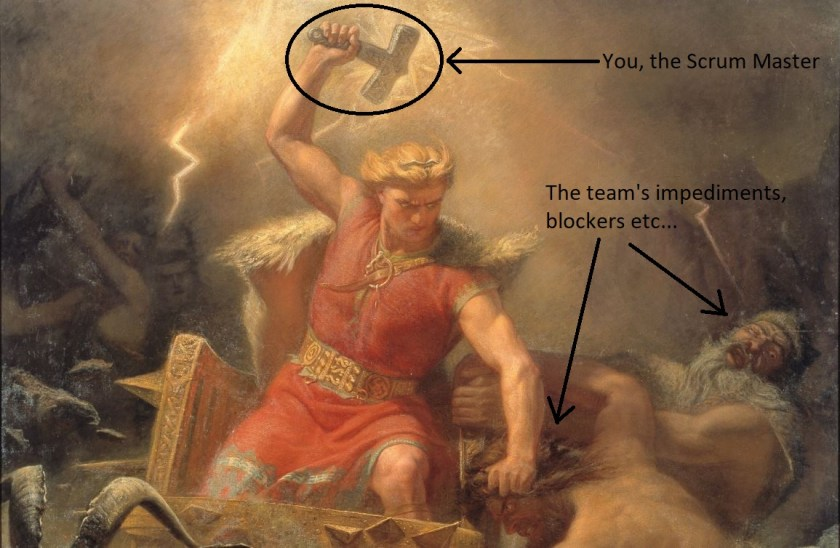

---
title: "How to be a good Scrum Master? Start with this book!"
date: 2018-08-24T00:00:00Z
draft: false
description: "“Scrum Mastery: From Good To Great Servant-Leadership” – a book that I picked up recently based on it being the number one selling book about Agile…"
categories: ["Books", "Building teams", "Career"]
cover:
  image: "images/scrum-mastery.jpg"
  alt: "How to be a good Scrum Master? Start with this book!"
aliases:
  - /how-to-be-a-good-scrum-master-start-with-this-book/
  - "/2018/08/24/how-to-be-a-good-scrum-master-start-with-this-book/"
ShowToc: true
TocOpen: false
---*“Scrum Mastery: From Good To Great Servant-Leadership” –*a book that I picked up recently based on it being the number one selling book about Agile Methodologies (from Amazon). I also wanted a fresh view on that role, given that I work in a Scrum team myself. Was it worth my time? Definitely!

I did not really know what to expect from this book. There are plenty of *“Scrum manuals”* out there, which more often than not, describe some idealised realities.

This book is real. Reading it, I could relate my own experience to examples from the book. Especially when you start questioning yourself- can Scrum really work for us? The book shows how Scrum Master can make it work in these, less than ideal, circumstances.

Easy to read, full of practical advice- is that enough? In case you still can’t decide if it is for you (or you are just interested in the key message) I will explain the major themes of the book.

## It is not all about You!

To be blunt, being Scrum Master is not about you! It is about the team that you are going to work *for.*

> As a Scrum Master, you work FOR the team.
>
> Me

The key metric of your success is not how *by the book* you run your ceremonies, or how nice is your JIRA dashboard. The key metric of success is how well the team is delivering value.

This is quite humbling, but also very rewarding perspective. Your main role is to make others shine. Don’t worry about yourself. If you do this job right, the team will notice.

This is not to say that you need to please the team all the time, or simply do exactly what they ask you every time. You want to help your team, but that may involve sometimes asking questions or challenging their opinions.

The role of the Scrum Master is also about leadership. It is, however the *servant leadership* kind, rather than the more direct/managing type.

## Diplomacy at work

The second theme that runs through the book is the importance of diplomacy (although it is rarely called that).

As a Scrum Master, you are likely changing the status quo. You could be challenging the way things work in your organisation, or challenging some internal team processes. To do that effectively, you need to be respected and trusted.

The book gives numerous techniques by which you can tactfully challenge the team and inspire them to improve. It is important to not forget that this is about the team success, not implementing your pet ideas, so a healthy balance and staying open-minded can help a lot.

On the topic of challenging the company culture and policies- this may be especially difficult, but also especially useful. How do you change processes, while, in theory, not having any authority to do that? The role of Scrum Master rarely grants such authority. Well, the book gives some advice on how to approach that without getting fired.

## Power to the team

All that diplomacy and servant leadership have a common goal – empowering the team! This is really what this book is all about, how to manoeuvre a challenging environment to end up with a well working, empowered team.

Askin questions, listening, inspiring, being creative, you are full-time team’s secret weapon. You want to be the team’s [Mjölnir](https://en.wikipedia.org/wiki/Mj%C3%B6lnir) (Thor’s, mythical hammer, giving him powers).

Another measure of your long-term success is how well the team does without their secret weapon? Are they going to fall akin to Gollum losing the One Ring, or prevail like Thor (the Marvel one) realising that they can prevail without their precious hammer? The Lord of the Rings or Marvel Cinematic Universe knowledge is not necessary to enjoy the book.

## Summary

If you work as a Scrum Master, or even if you only work in a Scrum team *“Scrum Mastery: From Good To Great Servant-Leadership”*makes for a very interesting read. It is the book that I wish every Scrum Master was familiar with!
