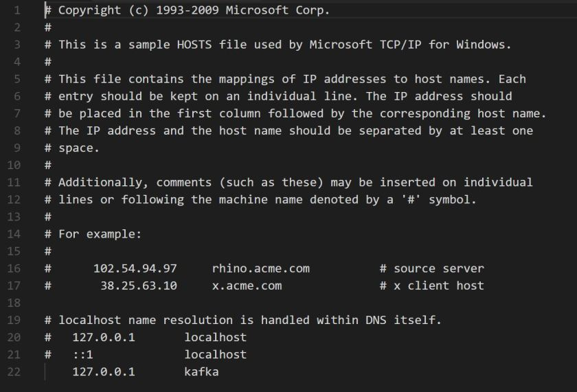

---
title: "How to easily run Kafka with Docker for Development"
date: 2018-05-20T00:00:00Z
draft: false
description: "Kafka is becoming a popular addition to microservice oriented architectures. Despite its popularity, it may be tricky to run it on your development machine…"
categories: ["Choreography", "DevOps", "Microservices"]
cover:
  image: "images/docker-kafka.jpg"
  alt: "How to easily run Kafka with Docker for Development"
aliases:
  - "/2018/05/20/how-to-easily-run-kafka-with-docker-for-development/"
ShowToc: true
TocOpen: false
---Kafka is becoming a popular addition to microservice oriented architectures. Despite its popularity, it may be tricky to run it on your development machine- especially if you run Windows. In this short article, I will show you a simple way to run Kafka locally with Docker.

In order to run Kafka, you need a Zookeeper instance and Kafka instance. You also need these two instances to be able to talk to each other.

## Setting up *kafka*net

Docker provides us with a concept of *docker net*. We can create a dedicated *net* on which the containers will be able to talk to each other:

*docker network create kafka*

With the network *kafka* created, we can create the containers. I will use the images provided by [confluent.io](https://www.confluent.io/), as they are up to date and well documented.

## Configuring the Zookeeper container

First, we create a Zookeeper image, using port 2181 and our *kafka* net. I use fixed version rather than latest, to guarantee that the example will work for you. If you want to use a different version of the image, feel free to experiment:

*docker run –net=kafka -d –name=zookeeper -e ZOOKEEPER\_CLIENT\_PORT=2181* confluentinc*/cp-zookeeper:4.1.0*

## Configuring the Kafka container

With the Zookeeper container up and running, you can create the Kafka container. We will place it on the *kafka* net, expose port 9092 as this will be the port for communicating and set a few extra parameters to work correctly with Zookeeper:

*docker run –net=kafka -d -p 9092:9092 –name=kafka -e KAFKA\_ZOOKEEPER\_CONNECT=zookeeper:2181 -e KAFKA\_ADVERTISED\_LISTENERS=PLAINTEXT://kafka:9092 -e KAFKA\_OFFSETS\_TOPIC\_REPLICATION\_FACTOR=1* confluentinc*/cp-*kafka*:4.1.0*

## Connecting to Kafka – DNS editing

One last catch here is that Kafka may not respond correctly when contacted on *localhost:9092*– the Docker communication happens via *kafka:9092*.

You can do that easily on Windows by editing the hostfile located in *C:\Windows\System32\drivers\etc\hosts.*You want to add the line pointing kafka to 127.0.0.1. Your hostfile should look something like this:

If you are using OS other than Windows, you need to do an equivalent trick- pointing your *kafka* to 127.0.0.1.

With that all setup you can connect to your Kafka locally at kafka:9092! Congratulations!

## Summary

This is not a production setup, rather a simple setup aimed at local development and experimenting. Once you understand how Kafka works you can customize it as you please. Hopefully, this article will save you a large amount of time I spent trying to get Dockerized Kafka to work on Windows!
