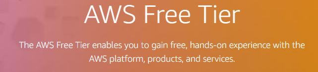
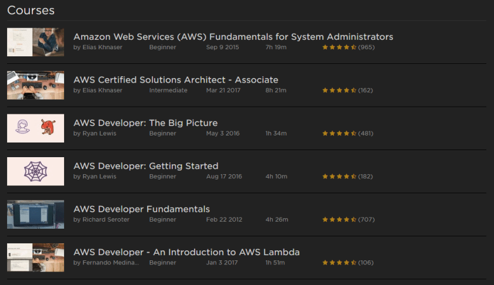
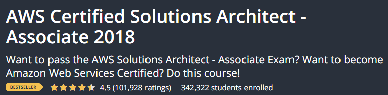

---
title: "How to learn AWS"
date: 2018-10-20T00:00:00Z
draft: false
description: "Amazon Web Services (AWS) is the most popular Cloud solution out there. More and more companies are using it every day. It makes development easier, safer…"
categories: ["AWS", "Career", "DevOps"]
cover:
  image: "images/how-to-learn-aws.jpg"
  alt: "How to learn AWS"
aliases:
  - "/2018/10/20/how-to-learn-aws/"
  - "/how-to-learn-aws/"
ShowToc: true
TocOpen: false
---Amazon Web Services (AWS) is the most popular Cloud solution out there. More and more companies are using it every day. It makes development easier, safer, cheaper and better. Since it is becoming an expectation for backend developers to be familiar with AWS (or other Cloud solutions) I compiled here some of the best resources and ideas for learning it.

## What does it mean to learn AWS?

Before learning AWS, it is worth thinking what you want to get out of that learning. Are you more interested in designing solutions or actually working with some of the cloud services provided? AWS recognizes three key ways of learning AWS:

- **Solution Architect perspective** – focused around understanding cloud-based system design and architecture
- **Developer perspective** – focused around developing services that live in the cloud
- **SysOps perspective** – focused around maintaining, securing and deploying cloud solutions

I recommend taking the Solution Architect view first, as it will give you a broader understanding of what AWS has to offer. Once you know what you have at your disposal, you can go deeper in areas that interest you.

Ok, so how do you get started?

## Get a free AWS account

AWS offers a very generous free tier account that you can use for a year! On top of that, you get plenty of services that will always stay free. Just visit the link: <https://aws.amazon.com/free/> and register!

## Start playing with AWS

Once you get that free account, you don’t have to wait for anything, you can jump right in and start experimenting. AWS offers plenty of quick tutorials and guides that will start you up with:

- Hosting your website
- Deploying your application
- Dipping your feet into the serverless world
- Starting with machine learning
- Much more

Just check all the guides that they have compiled here: <https://aws.amazon.com/getting-started/>

## Sign up for Online Courses

It is important to get hands on quickly, but with the overwhelming amount of resources, how do you make sure that you are actually getting a comprehensive understanding of what is important?

It is no secret that I am a big fan of online video courses and that I have learned a ton from them. When it comes to AWS there are two (or three, depending on how you count) quality resources that I would like to recommend you:

### AWS with Pluralsight

Pluralsight is an amazing resource that I use for just about everything. You can find multiple highly rated AWS courses there (over 100 if you have eternity to spend):

Of course, I did not have time to check them all out, but the one I would recommend is:

It gives a good overview of the whole platform and will help you prepare for the AWS Solution Architect Associate exam if you want to take it.

### AWS with ACloudGuru

An absolutely amazing resource if you want to learn cloud-related technologies is [ACloud.Guru](https://acloud.guru/). It is similar to [PluralSight](https://www.e4developer.com/pluralsight), but with laser focus on cloud technologies.

What is great about ACloudGuru is that their offer [some of their courses on Udemy](https://www.e4developer.com/udemy-aws) and if you are interested in taking only a single course, it may end up much cheaper for you! Here is the course that I took preparing for AWS Solution Architect Associate certification:

It has over 20 hours of top quality material that gets regularly updated.

## Get AWS Certification

I have always been skeptical of getting certifications. I have never bothered with Java or anything like that since I did not see the point. With AWS it is a little bit different, as learning for certification gives you a clear idea of what you should be learning.

If you do not wish to get certified it is still very useful to take courses oriented towards passing the certification as these will give you a good theme and a well-rounded understanding.

After thinking about the advantages and disadvantages of the certification I ultimately decided to go for it and I will be sitting my exam in November. After all the learning, why not get something to show for it? While most certification carries little value, employers and prospective clients seem to highly value the certificates that AWS issues!

## Summary

I hope this article gave you a clear idea of how to start towards learning that amazing platform that is AWS. To recap:

- Get a free tier account
- Start playing around
- Check out some online courses if you are hungry for more
- Get certified if you got hooked!

I consider cloud a perfect match for microservices and modern development, so this is not the last time you will read about AWS on this blog. Till next time!
