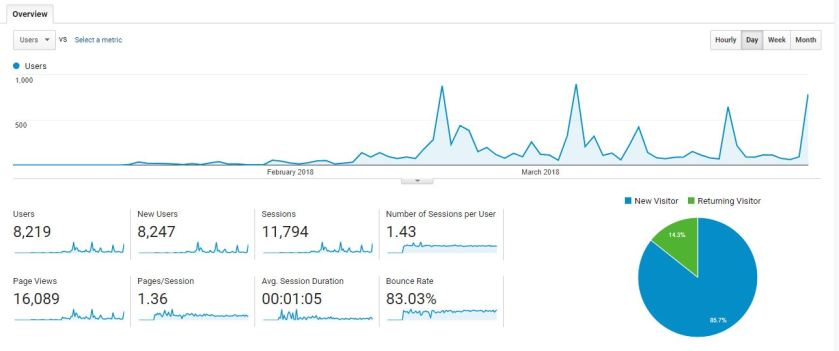
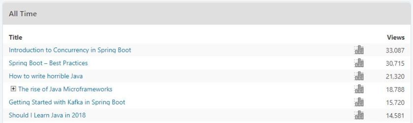
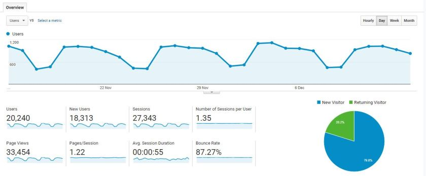
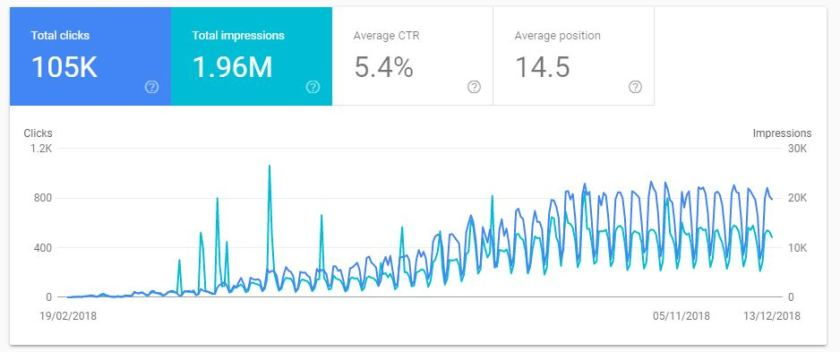

---
title: "I wrote 100 blog posts in 2018 - how it went and what’s next?"
date: 2018-12-15T00:00:00Z
draft: false
description: "I wanted to write 2 blog posts a week in 2018, which would result in at least 100 blog posts in a year… This is the number 100! I could not be happier! In this centenary blog post, I look back at the journey that took me here. I will also share with you some of the ideas for this blog in 2019."
categories: ["Personal"]
cover:
  image: "images/100-blog-posts.jpg"
  alt: "I wrote 100 blog posts in 2018 - how it went and what’s next?"
aliases:
  - "/2018/12/15/i-wrote-100-blog-posts-in-2018-how-it-went-and-whats-next/"
ShowToc: true
TocOpen: false
---I wanted to write 2 blog posts a week in 2018, which would result in at least 100 blog posts in a year… This is the number 100! I could not be happier! In this centenary blog post, I look back at the journey that took me here. I will also share with you some of the ideas for this blog in 2019.

## Beginning of the blog

I have started this blog in January with a short, a bit vague [explanation of why](). After publishing that first blog post, I quickly came up with an idea of writing at least twice a week- I had plenty to say!

My first blog posts were not very good. The first article that I was really happy with was [Setting up RabbitMQ with Spring Cloud Stream](). Highly technical, but also informative. From that moment I started to feel like I know what I am doing…

Since everyone loves a stat, here are the first three months of my blogs traffic:

## The most popular blog posts

Some of my blog posts turned out to be very popular. You can see an automatically updated “most popular of last week” highlighted on this blog widgets. The most popular of all time are as follows:

And here are the clickable links:

- [Introduction to Concurrency in Spring Boot]() – something I like to talk about and that I always wanted to write. Turns out that plenty of people are interested as well!
- [Spring Boot – Best Practices]() – one of my personal favorites! I am very glad that the authors of the Spring framework contributed as well!
- [How to write horrible Java]() – kind of a joke blog posts. Mostly popular because of social sharing. Read it for a laugh!
- [The rise of Java Microframeworks]() – if you never heard of them, check it out!
- [Getting Started with Kafka in Spring Boot]() – I am a bit surprised that this one is so popular! I guess Kafka is difficult and popular!
- [Should I Learn Java in 2018]() – spoiler- yes you should!

## Highlights of my favourite blog posts

Some of the blog posts that I wrote did not become so popular, but I still really like them. Here is a short list of a few other articles that I am really happy with:

- [Java surprises – Unexpected behaviours and features]() – I love that article. If you think you know everything about Java, check this out! Quite a few extra trivias and fun features!
- [HATEOAS – a simple explanation]() – the first article that I wrote that got any sort of notice! What a great feeling, and not a bad article!
- [Spring’s WebFlux / Reactor Parallelism and Backpressure]() – difficult topic explained well I believe.
- [The Quest for Simplicity in Java Microservices]() – Simplicity is a virtue

There are many more articles that I really enjoyed writing, but these are somehow very memorable. I wonder what kind of titles I will be listing in December 2019!

## How much did I actually write?

100 blog posts, counting this one. I also wrote some [blog posts for Scott Logic](https://blog.scottlogic.com/bjedrzejewski/), but we are talking about e4developer here!

How much is 100 blog posts? This is about **92,000 words** counting this blog post! This is apparently an average for a novel! Here are stats for some books:

- The Master and Margarita (one of my favourite books) – 117,120 words
- The Color of Magic (Discworld, go read it!) – 60,900 words
- The Godfather – 136,640 words

How long does it take to read 92,000 words? Apparently something like 6,5 hours. This is a good news- you can read it in a work day with a lang lunch (if for some crazy reason, you would want to do so!).

How long did it take me to write? Unfortunately I did not collect detailed statistics, but quite a lot! Of course some blog posts required quite a lot of programming and these took much longer, then say, book reviews… On the other hand to write a book review, I would read the book first so… Hard to say.

All that I can say is that I would spend 2-4 hours, 2-4 nights a week. Taking a very conservative estimates here, I think that **I must have worked at least 300 hours this year on my blog**… I am glad that so many of you like the content!

## What about the newsletter and the videos?

As you might recall (if you are my frequent reader), at some point I was trying to maintain a newsletter and produce some YouTube videos. Let’s look back at these efforts.

**Newsletter** – It sounds fun to be able to send monthly emails with links and short description of the blog posts. In reality it took a bit too much time in my already super busy life. I have about 300 subscribers and preparing a monthly update takes about 30 minutes. With more than 1000 daily visitors, it is just a bit much in terms of effort-outreach. I may come back to this in the future.

**Videos** – I really enjoyed making the couple videos that I did! ([my YouTube channel](https://www.youtube.com/channel/UCct_XHqdxXSYLZl7MfiDAAA)) The reality is that it takes a lot of time for someone like me (a video beginner). With two blog posts a week I did not want to slip on these deadlines in favour of videos. It seems I bite off more than I could chew. I definitely want to come back to making videos next year!

## Monetizing the blog

Most bloggers at some point would like to make some pocket money from their blogs. I am no different with that. I have tried mainly three approaches and this is how it went:

**Google AdSense** – This is quite simple to start- display some ads on your website! Sounds like easy money? Wrong! Developers simply do not click on ads… Well, what a surprise! Anyway, I prefer to have a bit more control of what I am endorsing on my website, so at the moment there are no AdSense ads on this blog.

**Amazon Affiliate** – Here, I can promote things that I actually bought myself and I feel good about recommending them to others. You can find links to books under book reviews. At the moment this generates minimal amount of money (you can imagine the scale of commission on a few books a month…)

**PluralSight Affiliate** – I am a huge fan of PluralSight (I wrote an [article about learning with PluralSight]()) and a long-term subscriber, so it seemed like a perfect thing to promote on my blog. I think I must have hit on something here, as this is the only method here that actually sort of works. £20-40 a month is not a fortune, but it’s a nice tip!

## Current readership

This was my last month in terms of readership:

I am very happy with my views. It feels like I am actually writing for an audience!

This is how my year looked in terms of gaining visibility in Google:

## The future direction

I am extremely pleased with how this year played out for my blog. I did not expect to be getting about a thousand visitors a day towards the end of the year! With that in mind what are my plans for the next year? Here is a short list:

- Write at least once a week. This will reduce the number of post, but the focus has to be quality!
- Write more about AWS and the Cloud Infrastructure. I will write a whole blog post explaining why this is so natural and important when thinking about microservices… Oh, wait! I already did for Scott Logic – [DevOps as a key to success with the microservices approach](https://blog.scottlogic.com/2018/04/30/devops-as-a-key-to-success-with-microservices-approach.html)
- Make some more videos for my YouTube channel
- Focus on interesting projects. I would like to build something remarkable.

There you go! Four simple goals. If I manage to get all of them done I will be very happy!

## Thank you so very much!

Big thank you to everyone who reads this blog! Thank you for all the nice feedback, comments, messages on Twitter and Reddit! You have no idea how nice it is to know that people enjoy my work!

With that, I would like to close the 2018, spend the remaining two weeks re-charging my batteries and back to blogging in 2019!

Merry Christmas and a Happy New Year!

Bartosz
