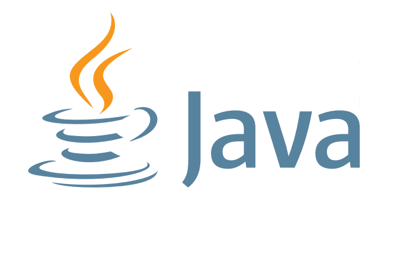

# Java vs Groovy for Microservices

In the past three years, I was involved in developing microservices architectures. In Java, with Spring Boot and in Groovy with Grails. Perhaps risking some outrage, I will compare my experience in Java and Groovy, Spring Boot and Grails and give my opinion on what works best.

I will start looking purely at languages, as Spring Boot will work happily with Groovy and Java alike.

## What I like in Java-based microservices

### Java is extremely popular

Java is a commonly used language. If you trust the [TIOBE Index](https://www.tiobe.com/tiobe-index/), it is as common as it gets:

With such popularity, it is (relatively) easy to find Java experts and experts’ advice on the Internet. This really matters when trying to assemble a team that will succeed. It makes it easier.

### Java and its annotation syntax are easy to read

I am a huge fan of Java annotations. They make writing microservices much easier, especially when powered by a framework like Spring Boot.

I find annotations syntax a great way of making a convention explicit. When looking at Spring code, even if you don’t know Spring well, a presence of an annotation alerts you to something special going on.

There is a lot of value in readability, especially when working on more complicated systems.

### JVM is a great platform

This sounds a bit paradoxical, but another great advantage of Java is that… you are not only stuck with Java!

Using Java for your main application does not mean that you can’t use a different language elsewhere. One interesting application is to use Groovy for your build- with Gradle, or testing- with Spock.

One of my colleagues was even on the project where the team used Scala for writing tests code. With JVM- you have options.

## What I don’t like in Java-based microservices

### Semicolons

It does not sound like a big deal, but after writing software with JavaScript, Swift, Groovy, Kotlin… you start to forget those. Of course, there is the IDE, but it gets annoying.

### Java is on the verbose side

This is improving with the addition of *var,*but still- Java feels like a rather verbose language for microservices development. This is again, rather minor.

### After testing with Groovy and Spock, Java feels lacking

I have already mentioned using different language for testing than for the application itself. After writing tests with Spock, JUnit feels clunky. I really recommend you check out the project if you find parametrized testing in JUnit not as good as they could be!

## What I like in Groovy-based microservices

### Groovy lets you write less code

It’s great that something that takes many lines in Java can often be expressed in about half the amount in Groovy. It makes development feel quick and pleasant.

Groovy improves on the verbosity of Java and after using it for a while, you miss these features in Java.

### Testing and build tools in Groovy are great

Spock made on me such an impression that it bears repeating for the third time- great framework check it out.

I have used Maven for most of my career and Grails came as a pleasant surprise. While I still use Maven by default, if you need more complicated builds- Grails feels cleaner.

## What I don’t like in Groovy-based microservices

### Groovy is not a popular language

I know this is not a popularity contest, but it matters. It is quite difficult to find experience Groovy developers. The mitigating factor is the similarity to Java- most Java developers learn Groovy very quickly.

### Groovy lets you write less code

With Groovy it is possible to start writing too little code. You can omit the return *keyword* in many cases. Things like that, while sometimes useful, can lead to some very unreadable code.

If you take the magic that Groovy lets you perform and mix it with developers who are using the language for the first time… you can find yourself quickly in troubles!

### Weak typing is a trap

Weak typing can be useful, but I find it brings mostly problems when working with REST-based microservices.

To find a more elaborate critique of weak typing I invite you to read the excellent [answer by Bartosz Milewski](http://qr.ae/TUNsje) to the question *“Why were weakly-typed programming languages created?”*that was posted on Quora.

To avoid misuse, I would prefer Groovy not to allow weak-typing. The mitigating factor- in a well-disciplined team, you can work around this.

## Is Spring Boot a good choice for microservices architecture?

Half of this blog is around that topic, so I will just say yes- Spring Boot is great. If you want to see multiple more nuanced opinions, check the [Spring Boot section](https://www.e4developer.com/category/spring-boot/) of this blog.

## Is Grails a good choice for microservices architecture?

I don’t like to criticize frameworks, especially ones that have been around as long as Grails was. It has its place and numerous world-class systems were delivered using it.

However, I don’t consider Grails a good choice for microservices architecture. Why? Because it is too complex. Spring Boot is an already complex framework and Grails builds on top of it.

I wrote about [“The Quest for Simplicity in Java Microservices”](https://www.e4developer.com/2018/07/08/the-quest-for-simplicity-in-java-microservices/) and I don’t think Grails really makes the cut here. If you want something simple, well suited for microservices, I would either go with a *“naked”* Spring Boot (possibly even using Groovy) or go with Micronaut if you like the Grails style of development.

I am not saying that it is impossible to develop microservices with Grails- I have done it myself! I am merely suggesting, that there are frameworks that provide a better experience. Micronaut is being developed by people involved in Grails, so to some extent- I am not alone in that opinion.

## Summary

Both Java and Groovy are good choices for developing microservices. If you decide to give Groovy a go- make sure that you know what you are signing for. Going with Groovy you can still choose Spring Boot as your framework. I would recommend doing that rather than going with Grails.

As with any such discussion- your circumstances may differ, so make sure you chose what works in your case.
