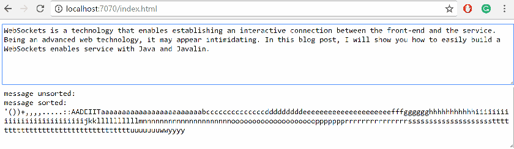

---
title: "Java WebSockets made simple with Javalin"
date: 2018-04-26T00:00:00Z
draft: false
description: "WebSockets is a technology that enables establishing an interactive connection between the front-end and the service. Being an advanced web technology…"
categories: ["Microservices"]
cover:
  image: "images/websockets.jpg"
  alt: "Java WebSockets made simple with Javalin"
aliases:
  - "/2018/04/26/java-websockets-made-simple-with-javalin/"
  - "/java-websockets-made-simple-with-javalin/"
ShowToc: true
TocOpen: false
---WebSockets is a technology that enables establishing an interactive connection between the front-end and the service. Being an advanced web technology, it may appear intimidating. In this blog post, I will show you how to easily build a WebSockets enabled service with Java and Javalin.

### A quick intro to WebSockets

WebSockets are a relatively new (2011), but a well-supported communication protocol. At the time of writing every major browser supports them.

What is so great about them? If you are looking to build a very interactive application (think Google Docs, chats or games) they are the protocol to choose. You get an open channel of communication, rather than having to rely on the request-response model.

How do you initiate a WebSocket connection in JavaScript? It is simple:

```

const ws = new WebSocket(`ws://localhost:7070/some-endpoint/session-id`);

```

And with that connection, you can simply hook to the following events:

```

ws.onopen event => {}
ws.onmessage = messageEvent => {}
ws.onerror = event => {}
ws.onclose = closeEvent => {}

```

I will later show you an example of a simple JavaScript frontend that can be built with these events.

### Why Javalin… What is Javalin anyway?

Javalin is an amazing micro-framework for writing microservices. I have chosen it here as it makes writing WebSockets as easy as it gets. If you want to learn more about the framework check out the [official site](https://javalin.io) and mine [Lightweight Kotlin Microservices with Javalin blog post]().

### WebSockets basics with Javalin

Working with Javalin and WebSockets is nearly identical to working with JavaScript and WebSockets. The API looks as follows:

```

app.ws("/websocket/:path", ws -> {
    ws.onConnect(session -> {});
    ws.onMessage((session, message) -> {});
    ws.onClose((session, statusCode, reason) -> {});
    ws.onError((session, throwable) -> {});
});

```

With the `WsSession` object wrapping Jetty’s `Session` object and adding convenience methods. The most useful one being  session.send(“message”). The full list can be found with the official documentation: <https://javalin.io/documentation#websockets>

### Making a simple service that receives and sorts a message

I wanted to build something very simple but fun to see as an example. I decided for a service that will receive the message from the frontend and then send back progressively more sorted version of the message. You can see the gif below illustrating the idea:



Writing this with request-response would be quite unpleasant as there would have to be quite a lot of polling involved. Imagine if we were dealing here with a similar blocking request with a chunked response. Real-time analytics streaming perhaps?

The service code is very simple with the most difficult part being the actual sorting:

```

package websockets;

import io.javalin.Javalin;
import io.javalin.embeddedserver.jetty.websocket.WsSession;
import java.util.Arrays;
import java.util.Map;
import java.util.concurrent.ConcurrentHashMap;

public class Main {

    private static Map<String, WsSession> sessions = new ConcurrentHashMap<>();
    public static void main(String[] args) {

        Javalin.create()
                .port(7070)
                .enableStaticFiles("/public")
                .ws("/demo/:session-id", ws -> {
                    ws.onConnect(session -> {
                        session.send("Hello Session: "+session.param("session-id"));
                    });
                    ws.onMessage((session, message) -> {
                        String sortedMessage = "";
                        while(message.length() > 0){
                            Thread.sleep(50);
                            sortedMessage = sortedMessage 
                                    + message.substring(0,1);
                            message = message.substring(1);

                            //sorting
                            char[] chars = sortedMessage.toCharArray();
                            Arrays.sort(chars);
                            sortedMessage = new String(chars).trim();

                            String response = "message unsorted: " +
                                    ""+message+"\n"+"message sorted: "+sortedMessage;
                            session.send(response);
                        }
                    });
                    ws.onError(((wsSession, throwable) ->
                            System.out.println("Something went wrong")
                    ));
                    ws.onClose((session, status, message) -> {
                        //clean-up
                    });
                })
                .start();
    }
}

```

You also need to add the relevant Javalin dependencies:

```

<dependencies>
    <dependency>
        <groupId>io.javalin</groupId>
        <artifactId>javalin</artifactId>
        <version>1.6.0</version>
    </dependency>
    <dependency>
        <groupId>org.slf4j</groupId>
        <artifactId>slf4j-simple</artifactId>
        <version>1.7.25</version>
    </dependency>
</dependencies>

```

On the frontend, we have to deal with the WebSocket appropriately:

```

<!DOCTYPE html>
<html lang="en">
<head>
    <meta charset="UTF-8">
    <title>Javalin WebSockets demo</title>
</head>
<body>

<textarea style="width: 100%; height: 100px" id="query" placeholder="Type something ..."></textarea>
<br>
<textarea style="width: 100%; height: 100px" readonly id="webanswer"></textarea>
<script>
    window.onload = setupWebSocket;
    function setupWebSocket() {
        const textQuery = document.querySelector("#query");
        const textAnswer = document.querySelector("#webanswer");
        const ws = new WebSocket(`ws://localhost:7070/demo/session1`);
        ws.onopen = event => {
            console.log('connection established');
        }
        ws.onmessage = messageEvent => {
            textAnswer.value = messageEvent.data;
        }
        ws.onerror = event => {
            textAnswer.value = 'error';
        }
        ws.onclose = closeEvent => {
            console.log('connection closed');
            setupWebSocket();
        }

        //Send message on pressing return
        textQuery.onkeydown = key =>
        {
            if(key.keyCode === 13) {
                ws.send(textQuery.value);
                textQuery.value = '';
            }
        }
    }
</script>
</body>
</html>

```

As you can see, you can make use of WebSockets easily and productively when you chose the right tools. I have shared this code on my GitHub account: <https://github.com/bjedrzejewski/javalinwebsockets>

### More examples

When writing this blog post I was heavily inspired by two great examples available on the Javalin website:

[Creating a simple chat-app with WebSockets](https://javalin.io/tutorials/websocket-example)

[Creating a Google Docs clone with WebSockets](https://javalin.io/tutorials/realtime-collaboration-example-java)

Make sure to check them out for more details and inspiration. Also do not forget, that **Javalin fully supports Kotlin**.

### Do I need to use Javalin when working with WebSockets?

You don’t have to use Javalin. You can use Spring, (with [this good article](http://www.baeldung.com/websockets-spring) by baeldung explaining how to) or multiple other frameworks.

I have used Javalin here as it provides a very good development experience. Once you understand how to work with WebSockets, you can use them in a less trivial frameworks with confidence.

### Conclusion

WebSockets are an exciting technology that I think is not used enough. I believe this is partly because many developers are afraid of potential difficulties when developing with WebSockets. I hope this article gave you some more confidence to give WebSockets a try.
