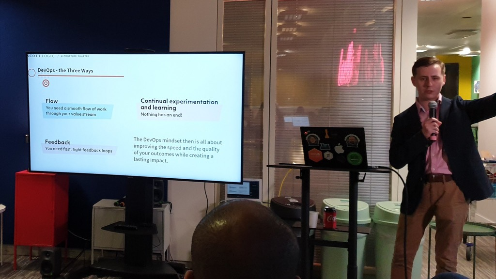

---
title: "Journey to DevOps - Talk at the DevOps Roundabout"
date: 2019-10-03T00:00:00Z
draft: false
description: "On the 24th of September 2019, I had an opportunity to speak at the very first DevOps Roundabout meetup in London. You can watch my talk on YouTube."
categories: ["Building teams", "DevOps", "Public speaking", "Videos"]
cover:
  image: "images/devopsroundabout.jpg"
  alt: "Journey to DevOps - Talk at the DevOps Roundabout"
aliases:
  - "/2019/10/03/journey-to-devops-talk-at-the-devops-roundabout/"
ShowToc: true
TocOpen: false
---

On the 24th of September 2019, I had an opportunity to speak at the very first [DevOps Roundabout](https://www.meetup.com/The-DevOps-Roundabout/) meetup in London. You can [watch my talk on YouTube](https://www.youtube.com/watch?v=EGTMkZkPhF8).

The idea behind this talk is the same as the one behind [my whitepaper]() (with the identical title). First, explaining to the wider audience what the DevOps movement is really all about and then helping people to embark on that journey.

The difference in the talk is that I do not focus specifically on the public sector and think in broader terms- how everyone can embark on this journey.

Another reason to watch the talk (rather than simply read the newspaper) is that I offer a more conversational coverage of these topics and discuss things that I did not touch on in the whitepaper, such as the difference between DEVops and devOPS engineers.

If you are intrigued, check out the talk on YouTube and let me know what you think:


