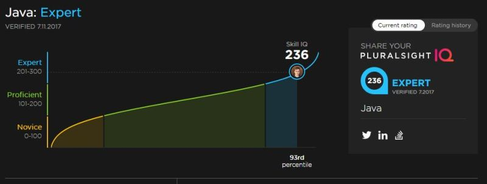
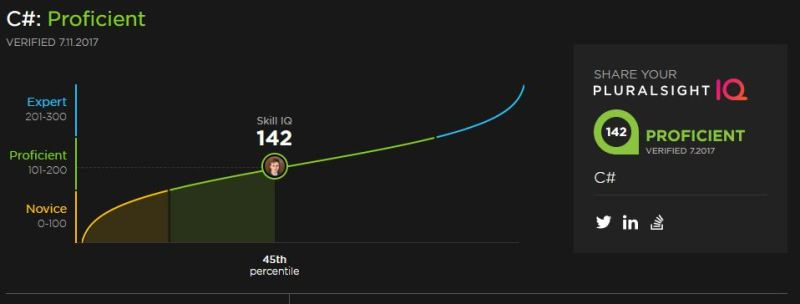

---
title: "Learning Java / Spring / Microservices with Pluralsight"
date: 2018-08-12T00:00:00Z
draft: false
description: "You might have seen recently some Pluralsight promotion on my page. There are two reasons for this. Reason number one- I became a Pluralsight Affiliate and I…"
categories: ["Career", "Java"]
cover:
  image: "images/pluralsight-logo.jpg"
  alt: "Learning Java / Spring / Microservices with Pluralsight"
aliases:
  - /learning-java-spring-microservices-with-pluralsight/
  - "/2018/08/12/learning-java-spring-microservices-with-pluralsight/"
ShowToc: true
TocOpen: false
---You might have seen recently some Pluralsight promotion on my page. There are two reasons for this. Reason number one- I became a Pluralsight Affiliate and I earn by promoting [their website](https://www.e4developer.com/ps-a-free-trial). Reason number two- I use Pluralsight myself and I think it is a great place to level up your skills. In this article, I will explain why you should consider it too!

## What is Pluralsight?

Pluralsight is an online training platform… Ok, come on, I am not going to bore you to death here!

If you want to learn something new like Kotlin, Spring Cloud, Docker etc. Pluralsight is one of the best places to do that! They offer great online videos that you can watch either on their website or a pretty good App.

Another great thing that they offer is the “Skill IQ”. These are online tests that you can take to get a reality check of how good you are with different tech. You can see my Java level here.

Well, my Java is pretty solid, but C# is a different story (as expected):

I really like these”Skill IQ” tests, as they give you a bit of a reality check of where you stand and what you have to work on. They have probably around 100 of them.

## How is it different from other online courses?

You don’t buy individual courses on Pluralsight. Once you are enrolled, you can watch any video you please, making it especially useful during periods of intense learning. I recommend [trying it out for free](https://www.e4developer.com/ps-a-free-trial), possibly signing up for a month and seeing how it goes!

To make the most value out of it, make sure to use it while you pay for it. I find it unlikely that I would be watch videos for 12 months in a row, but you don’t have to! You can cancel your subscription and come back a few months later when you are ready to learn again.

When you go beyond the [free trial](https://www.e4developer.com/ps-a-free-trial) it costs around ~$35 per month. This sounds like a lot, but I regularly spend more on books. The idea is to make the most of that month. I feel that if I watch 2 or 3 courses, then these $35 are well worth it!

## What are my favourite courses and content on Pluralsight?

As they say, the proof is in the pudding, so let me give you some of my favourite courses from Pluralsight:

[**Java Microservices with Spring Cloud: Developing Services**](https://www.e4developer.com/ps-a-spring-developing) – an Outstanding course that will teach you everything you need to know to make use of Spring Cloud for developing services. It is the first part of two course series on Spring Cloud. I really enjoyed it.

[**Java Microservices with Spring Cloud: Coordinating Services**](https://www.e4developer.com/ps-a-spring-coordinating) – the second part of the two-part series on Spring Cloud microservices. Especially useful, as it is with the microservices coordination where the problems usually start.

[**Spring Boot: Efficient Development, Configuration, and Deployment**](https://www.e4developer.com/ps-a-spring-boot) – if you are using Spring Boot and would like to get to know it better- this is the course for you. It is not an introduction to Spring Boot, but rather a review of its slightly more advanced features. Short enough to watch it within [the free trial](https://www.e4developer.com/ps-a-free-trial).

[**Docker Deep Dive**](https://www.e4developer.com/ps-a-docker) – do you really want to understand Docker. Nigel Poulton is the man! He takes you on a deep and fascinating dive into the Docker world. Containers and DevOps are the future (and the present for many of us), so this one comes highly recommended.

[**Kotlin Fundamentals**](https://www.e4developer.com/ps-a-kotlin) – Kotlin is all the rage on the JVM these days. If you don’t know the language already, this is one of the ways to get you started.

[**Applying Concurrency and Multi-threading to Common Java Patterns**](https://www.e4developer.com/ps-a-java-concurrency) – Pluralsight has a staggering amount of content related to core Java. Concurrency has always been one of the more difficult topics in Java. This course explains it well in a really short amount of time.

## Summary

There are many ways to keep up to date with tech. I have written about [Twitter]() and [Reddit]() before. If you think you may enjoy high-quality video content with the ability to test your progress, [give Pluralsight a (free) try](https://www.e4developer.com/ps-a-free-trial)!

I am confident sharing this with you as I a Pluralsight user myself and can vouch for the quality of the courses out there!
