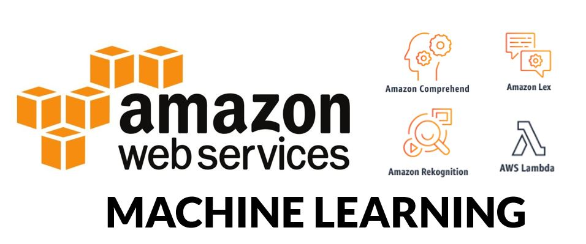
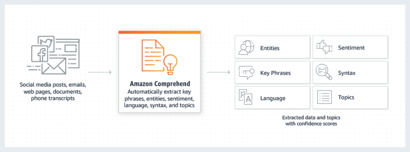

# Making your machine learning idea real with AWS

Machine Learning and its applications are getting more popular every day. For many developers, building a machine learning powered application seems like a daunting task- all this learning, data collection, and computing power needed! In reality, it is not as difficult as it sounds- as long as you harness *“the power of the Cloud”…*

In this article, I want to tell you about different machine learning services provided by AWS and give some ideas about how you could use them! Ready to get inspired? Let’s go!

## Amazon Comprehend

[Amazon Comprehend](https://aws.amazon.com/comprehend/) is a natural language processing and text analytics service. It allows you to send text and receive information about:

- What is the sentiment – positive, negative or neutral?
- What is this text (or who) talking about?
- What language is it written in?
- Analyze the syntax
- And a few extra other tricks

I wrote my master thesis about sentiment analysis in text and this tool basically gives you the best in class capability for a really cheap price! It is unbelievable how much this field advanced in just 7 years.

I mentioned the price- at the time of writing, you get 50,000 queries for free (a month) and after that, it is $0.0001 per unit of text!

There are many fascinating uses of this service and I am planning on using it with Reddit (hence my [Reddit API authorization article]()) and after that, to look at this blog sentiment. Who knows- maybe we discover something interesting!

## Amazon Rekognition

If text analysis is not impressive enough for you- meet [Amazon Rekognition](https://aws.amazon.com/rekognition/). With Amazon Rekognition, you can process videos and images looking for:

- Facial recognition
- Facial analysis (different elements of the face, smiling or not etc.)
- Different objects and activities recognition
- Text in image
- and more

This is again available for you for a reasonable price and some free level of usage.

This is something that I think will be used more and more by developers around the world. Complex image analysis until recently was out of reach for most independent developers and hobbyists.

Some of the ideas for using this service are:

- Searchable video library
- Searchable photo library
- Sentiment analysis (maybe even mixing it with Comprehend?)
- Image moderation
- Other machine learning usages

Definitely check out the [Rekognition AWS page](https://aws.amazon.com/rekognition/) for more ideas.

## Amazon Transcribe

[Amazon Transcribe](https://aws.amazon.com/transcribe/) is all about recognizing speech in recorded audio files. Perhaps it sounds simpler than working with text sentiment and video/image analysis, but it may be even more practical!

You have the following features when working with audio files:

- Using custom vocabulary to improve the accuracy
- Speaker identification
- Generating timestamps for each word
- Works even with lower quality audio

There is an ocean of data there, that is not being explored since the data is “spoken word”. Imagine if you had all that speech in text form? Amazon Transcribe gives you the power to do just that.

## Other interesting services

For me, Comprehend, Rekognition and Transcribe are the most interesting *“Machine Learning powered”* services that AWS has to offer. This does not mean that there isn’t anything else available! Here is the short list of the remaining services:

- [Amazon SageMaker](https://aws.amazon.com/sagemaker/) – *“Build, train, and deploy machine learning models at scale”*
- [Amazon Lex](https://aws.amazon.com/lex/) – *“Conversational interfaces for your applications powered by the same deep learning technologies as Alexa”*
- [Machine Learning](https://aws.amazon.com/machine-learning/) – *“Machine learning in the hands of every developer and data scientist”*
- [Amazon Polly](https://aws.amazon.com/polly/) – *“Turn text into lifelike speech using deep learning”*
- [Amazon Translate](https://aws.amazon.com/translate/) – *“Natural and accurate language translation”*

## Summary

The power is in your hands. Developers can’t claim that the “true machine learning” is outside of their reach as individuals. I am very excited with the power that AWS gives developers (as well as Azure and Google offer in their respective clouds).

You can use these services without the need to go fully on the cloud. However, if you want to get some advice on [How to learn AWS](), you can read my other [article]().
