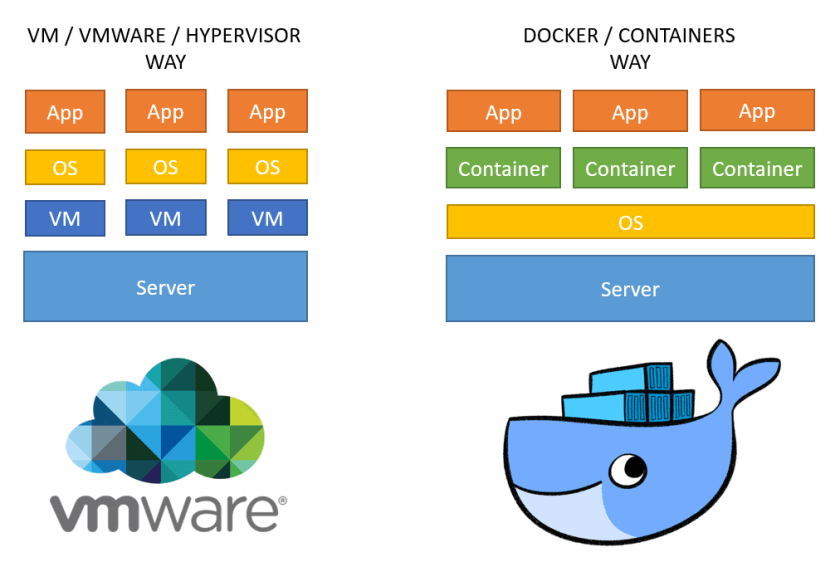
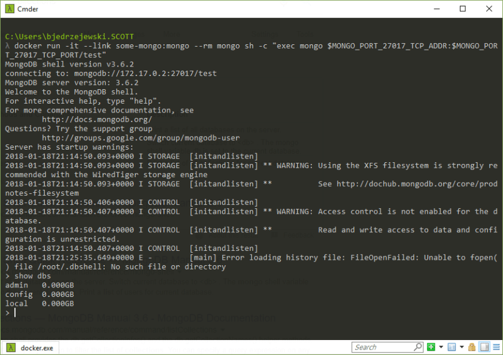

---
title: "Microservices Toolbox - Docker"
date: 2018-01-18T00:00:00Z
draft: false
description: "Introduction to Docker for microservices developer. How to use it as a development tool and how it is used for deploying microservices architecture."
categories: ["Microservices"]
cover:
  image: "images/docker.png"
  alt: "Microservices Toolbox - Docker"
aliases:
  - /microservices-toolbox-docker/
  - "/2018/01/18/microservices-toolbox-docker/"
ShowToc: true
TocOpen: false
---If you want to get into microservices development, you will want to run multiple things on your machine. Having services, databases, message brokers etc. all working on your machine without conflicts may be very difficult. Docker solves this problem beautifully.

### Docker and Containers

So, what is docker and why is it such a big deal? Docker enables you to run different software on your own machine… But wait- can’t you already do that? Yes, you can, but not quite the same way like you do with Docker.

You might have come across Virtual Machines, the idea of having another operating system executed on your machine that is completely separated from your one. Containers are very similar, and for most cases better! You have similar level of separation (we know how hard is to delete stuff or deal with ports clashing etc.), but the operating system layer is not replicated as a whole for every container (as it is for a virtual machine). Have a look at the diagram that hopefully makes this clear:

Once you get Docker installed, you will be able to run different software on your machine with a very low overhead. So, why wait? Get Docker now!

### Getting Docker

So, how do you get Docker? Are there any major prerequisites? These days Docker will run fine on Windows, Mac and Linux. Installation notes may be a bit different, but you can find mostly all you need [on: https://www.docker.com/community-edition](https://www.docker.com/community-edition). Community Edition of Docker will serve you just fine for your development needs. There are Enterprise versions available, but these are much more expensive and not necessary for your local development.

### How can docker help with your development

This is the fun part! I am assuming that you have your Docker installed (it does not matter on which operating system, the following will work anyway!). Imagine you want to run MongoDB on your machine. You no longer have to install it yourself. You can get it from <https://hub.docker.com/_/mongo/> – this is the official image repository for MongoDB. You can follow the instruction provided there, which boil down to running:  
`$ docker run --name some-mongo -d mongo`  
This will download the docker image of MongoDB to your machine and automatically expose port 27017 for you to connect. To do just that you can see from the documentation that what you need is:  
`$ docker run -it --link some-mongo:mongo --rm mongo sh -c "exec mongo $MONGO_PORT_27017_TCP_ADDR:$MONGO_PORT_27017_TCP_PORT/test"`  
Don’t worry if this looks too arcane! Once you start using Docker a bit it will make much more sense.

If you want to connect application and use this as your MongoDB- no problem! However, I would recommend reading the documentation first on any configuration you may need. So running Mongo is nice, but what else can it do?

- **Kafka** – <https://hub.docker.com/r/wurstmeister/kafka/>
- Distribution of **Ubuntu** – <https://hub.docker.com/_/ubuntu/>
- **Jenkins** – <https://hub.docker.com/_/jenkins/>
- **PostgreSQL** – <https://hub.docker.com/_/postgres/>
- Apache **Flink** – <https://hub.docker.com/_/flink/>
- Pretty much **any technology** you ever wanted to try
- Run your **microservices**
- Whatever you want, as you can **create your own docker images**!

### Docker and Microservices – the big picture

You have seen that Docker is incredibly useful as a development tool, but that’s not all! Docker is also great for deploying your application. One of the most Docker friendly clouds I came across is [Digital Ocean](https://www.digitalocean.com/). This space changes rapidly so if you are interested in deploying your Docker containers, do some googling around and see which company has the best offering. You can use AWS and Azure without any issue as well.

In reality, for a production system you probably don’t want naked Docker containers. For a real microservices deployment you may need replication and easy scaling of your containers. At the time of writing I am aware of two mainstream solutions to this problem:

- [Kubernetes](https://kubernetes.io/) – absolutely amazing system for containers orchestration, born out of Google’s Borg project
- [Docker Swarm](https://docs.docker.com/engine/swarm/) – Docker native answer to the orchestration problem, bit less mature than Kubernetes

There is much more to Docker and containers. Docker is not an open-source project, but there is a large effort in the open source community based on Docker. Project [Moby](http://mobyproject.org/) and [Containerd](https://containerd.io/) are your go-to open source ideas if you are interested in this space. These may become the go-to containers solution in the future…

This is a very active space at the moment, so I recommend learning it to some depth and keeping an eye open for any changes. If you want to be a microservices developer (or maybe any server side developer soon) you will have to get familiar with these concepts and technologies.

### Summary

Docker is a great tool to have on your development workstation. It enables you to easily try and test technologies and solutions that may have been difficult to handle in the past. Beyond that, Docker and Containers are core things to understand and use when dealing with microservices. Tools such as Kubernetes and Docker Swarm are becoming common place. If you want to be involved in modern development, you need to familiarize yourself with these concepts and technologies. The best way to learn is to try so enjoy playing with Docker and containers!
