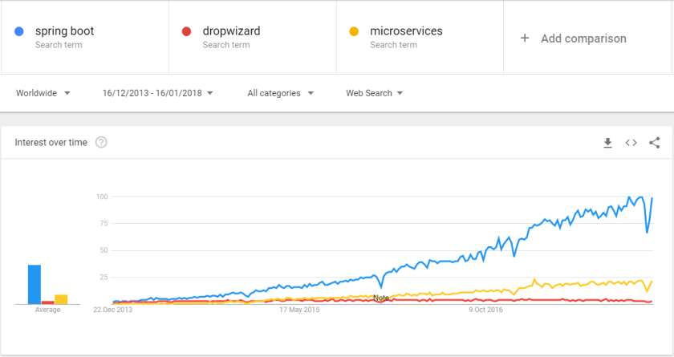

# Microservices Toolbox: Spring Boot

This is beginning of the series of blog posts where I will introduce and explain different tools and frameworks that are useful in microservices development. It is difficult to start such a series without introducing Spring Boot!


Meet Spring Boot- framework which released its 1.0 version in 2014 and by now it is nearly synonymous with microservices in the Java world. Just look at these google trends statistics! Dropwizard (one of the initial competitors) and even the general microservices term are far less popular:



With its undeniable popularity, this is the one framework that you absolutely have to be aware of when talking about the microservices in the JVM ecosystem.

### Spring Boot – The Basics

Spring Boot is effectively very light weight version of Spring that you can run as an executable .jar as it bundles its own Tomcat runtime. It also heavily favors convention over configuration. In the words of the library maintainers:

> (Spring Boot) Takes an opinionated view of building production-ready Spring applications. Spring Boot favors convention over configuration and is designed to get you up and running as quickly as possible.

What does that mean for the users? It means that writing a very basic Spring Boot application- the Hello World; is incredibly simple. Your whole application can consist of just a few files. All you need is a *.pom* file:

```

<?xml version="1.0" encoding="UTF-8"?>
<project xmlns="http://maven.apache.org/POM/4.0.0" xmlns:xsi="http://www.w3.org/2001/XMLSchema-instance"
	xsi:schemaLocation="http://maven.apache.org/POM/4.0.0 http://maven.apache.org/xsd/maven-4.0.0.xsd">
	<modelVersion>4.0.0</modelVersion>

	<groupId>com.e4developer</groupId>
	<artifactId>spring-boot-hello-world</artifactId>
	<version>0.0.1-SNAPSHOT</version>
	<packaging>jar</packaging>

	<name>spring-boot-hello-world</name>
	<description>Demo project for Spring Boot</description>

	<parent>
		<groupId>org.springframework.boot</groupId>
		<artifactId>spring-boot-starter-parent</artifactId>
		<version>1.5.9.RELEASE</version>
		<relativePath/> 
	</parent>

	<dependencies>
		<dependency>
			<groupId>org.springframework.boot</groupId>
			<artifactId>spring-boot-starter-web</artifactId>
		</dependency>

		<dependency>
			<groupId>org.springframework.boot</groupId>
			<artifactId>spring-boot-starter-test</artifactId>
			<scope>test</scope>
		</dependency>
	</dependencies>

</project>

```

And a very simple Java class:

```

package com.e4developer;

import org.springframework.boot.SpringApplication;
import org.springframework.boot.autoconfigure.SpringBootApplication;
import org.springframework.stereotype.Controller;
import org.springframework.web.bind.annotation.RequestMapping;
import org.springframework.web.bind.annotation.ResponseBody;

@Controller
@SpringBootApplication
public class SpringBootHelloWorldApplication {

	@RequestMapping("/")
	@ResponseBody
	String hello() {
		return "Hello World from e4developer!";
	}

	public static void main(String[] args) {
		SpringApplication.run(SpringBootHelloWorldApplication.class, args);
	}
}

```

If you want you can check out the code from my github repository and run it yourself you can find it here: <https://github.com/bjedrzejewski/spring-boot-hello-world> You can run it by building in your favorite IDE and either running from the IDE or with the command: `mvn spring-boot:run`

### Spring Boot – Rapid High Level Overview

So what features do we have in Spring Boot and why is it so popular? Let’s go through the items one by one:

- **Embedded Tomcat** – you don’t have to worry about application server, Spring Boot by default includes Tomcat in its jar. You can use different embedded server, such as Jetty for example.
- **Autoconfiguration** – this is a very opinionated framework, if you are happy with the default setups, Spring Boot mostly configures itself. It dramatically cuts down on the boiler plate. Basically, if you include Spring Boot Started dependency, like for example mongodb- just add *spring-boot-starter-data-mongodb* to your dependencies. I wrote another blog post on that topic if you want to learn more: <http://blog.scottlogic.com/2016/11/22/spring-boot-and-mongodb.html> . This is one of the core concepts and ideas behind Spring Boot
- **Initializr** – getting started is super simple! Just visit <https://start.spring.io/> and pick what you need. IntelliJ includes Initializr which makes it even more convenients. This is how I created this [hello-world-project](https://github.com/bjedrzejewski/spring-boot-hello-world) mentioned before
- **Actuator** – Health checks and other monitoring utilities for building production quality microservices
- **Property files with yml support** – The default Spring Boot configuration is an empty *application.properties* file, which is a nice contrast to most of the frameworks our there
- **Spring Boot CLI** – Optional command line interface used for quick prototyping with Groovy
- **Spring** – Spring Boot is fully Spring compatible. In fact, it is Spring, just with extra features and configuration added for convenience
- **Customization** – The fact that it is all opinionated and automatic does not stop you from overriding how it all works or is configured

### Summary

Spring Boot is an extremely popular framework. If you want to work with microservices in the JVM eco-system, you should be aware of it. It is a key component of [Spring Cloud](http://projects.spring.io/spring-cloud/) which is one of the most mature ways of getting your microservices setup with Java. There is much more to learn about both Spring Cloud and Spring Boot, but before you dive in- I really recommend to setting up a Hello World project and playing with it a little. There is no learning substitute for experience!
