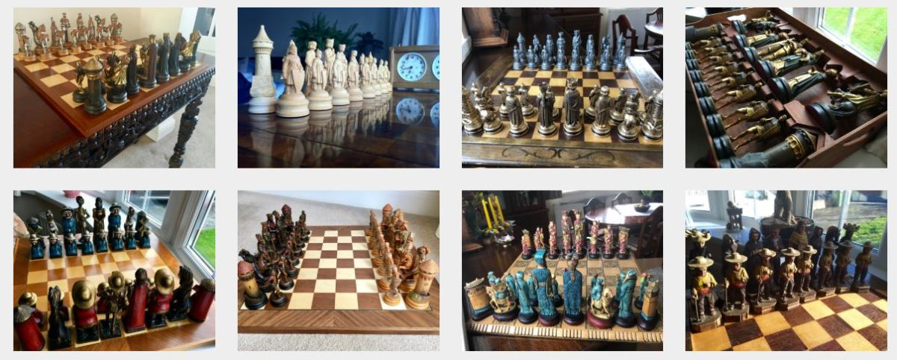
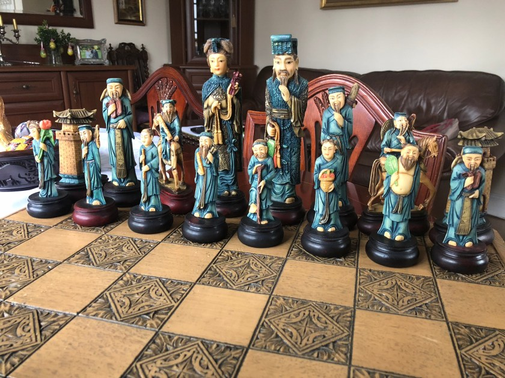
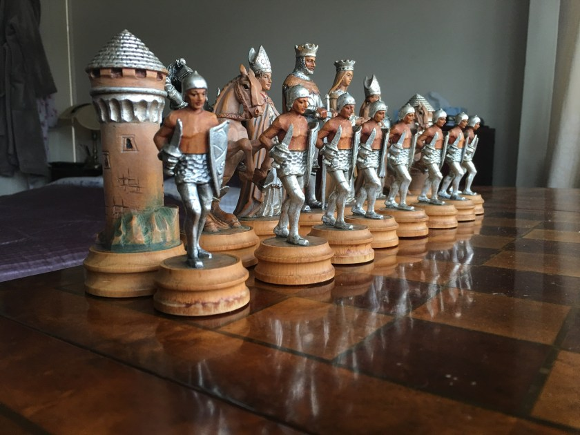
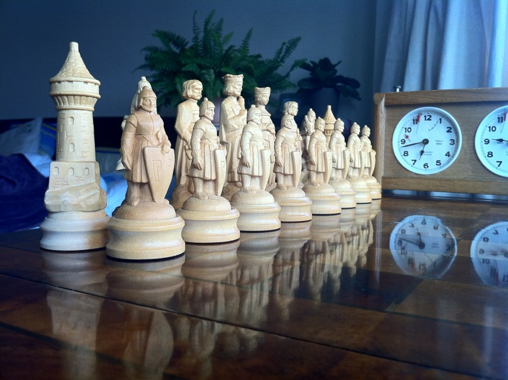
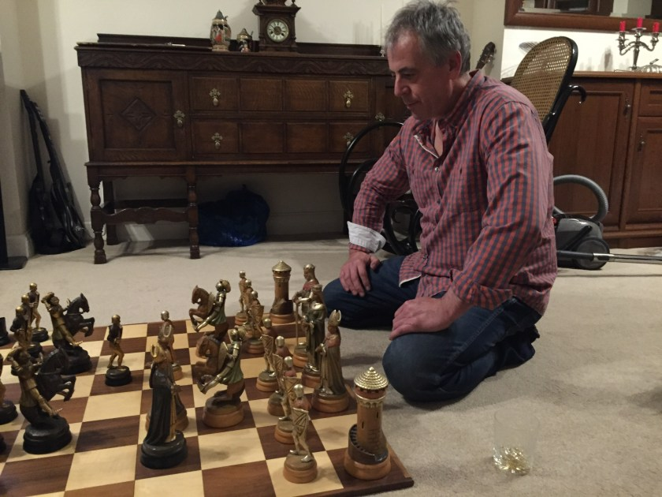

# My Family Chess Collection

You may know that playing chess is my passion. The name of this website- *E4developer* comes from the chess move I start my games with – e4.

There is another passion that runs in my family – chess collecting. I have spent quite a lot of time in the past few weeks documenting that collection and putting it up online. Check it out yourself – [www.chesscollecting.com](https://www.chesscollecting.com/collection/)

Don’t worry- I will not write less here! I am just excited to share this with you, as it may inspire you to do that personal project that you always wanted. Creating [www.chesscollecting.com](https://www.chesscollecting.com/collection/) was an immensely satisfying experience.

Here are some of my favourite photos from the collection:

If you would like to see more beautiful sets and photos, check [www.chesscollecting.com](https://www.chesscollecting.com/collection/). If you know of other beautiful chess sets worth tracking down- let me know!
