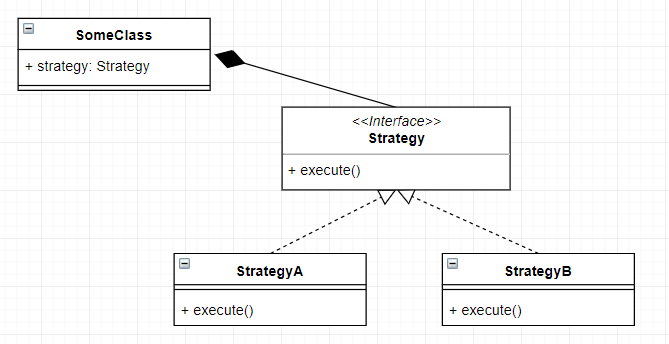

---
title: "My favourite Design Pattern - Strategy"
date: 2018-10-14T00:00:00Z
draft: false
description: "Among many OOP design patterns described, the one that influenced my development the most is the Strategy Pattern. In this article, I will briefly explain what…"
categories: ["Architecture", "Java"]
cover:
  image: "images/strategy-pattern.png"
  alt: "My favourite Design Pattern - Strategy"
aliases:
  - "/2018/10/14/my-favourite-design-pattern-strategy/"
ShowToc: true
TocOpen: false
---Among many OOP design patterns described, the one that influenced my development the most is the Strategy Pattern. In this article, I will briefly explain what the Strategy Pattern is and why it is so important.

## Strategy Pattern Defined

The idea behind the Strategy Pattern is as follows:

Imagine that you have *SomeClass* that needs to implement varying behaviour depending on a situation. You will implement it via a composition, creating a *Strategy* interface that would encapsulate this varying behaviour. The interface will have only one method (ie. *execute*) that runs when the strategy is used. It will look something like this:



## Using Strategy Pattern – Examples

Ok, so where can you use the Strategy Pattern? Nearly everywhere it turns out! I like it so much since it is the main way of following the Composition over Inheritance principle.

Let’s look at some scenarios:

- Your class writes output. You can provide a different *Writers* in order to write to a file or standard output. This *Writer* interface becomes your Strategy.
- I have used it in the past to provide different *Algorithms* in a financial optimisation scenario.
- This pattern is also being used whenever you use something like a *Comparator* for sorting lists in Java.

The pattern works equally well for trivial and more complex tasks.

## Strategy Pattern Java Example

To make it even clearer I will show you a simple example of the pattern in Java. I will implement a *Parrot* class that can repeat your text either very loud or quiet, depending on the strategy.

```

public class Parrot {
    private final ParrotStrategy parrotStrategy;

    public Parrot(ParrotStrategy parrotStrategy) {
        this.parrotStrategy = parrotStrategy;
    }

    void repeat(String text){
        parrotStrategy.repeat(text);
    }
}

```

```

public interface ParrotStrategy {
    void repeat(String text);
}

```

```

public class LoudParrotStrategy implements ParrotStrategy {
    @Override
    public void repeat(String text) {
        System.out.println
                (text.toUpperCase()+"!!!!!!");
    }
}

```

```

public class QuietParrotStrategy implements ParrotStrategy{
    @Override
    public void repeat(String text) {
        System.out.println
                (text.toLowerCase().replace("!", ""));
    }
}

```

This can be used like that:

```

public class Main {
    public static void main(String[] args){
        Parrot loudParrot 
                = new Parrot(new LoudParrotStrategy());
        Parrot quietParrot
                = new Parrot(new QuietParrotStrategy());

        loudParrot.repeat("Wake up!");
        quietParrot.repeat("Good Morning!");
    }
}

```

With the output:

```

WAKE UP!!!!!!!
good morning

```

## Is Strategy pattern the same as using lambdas in Java?

When you think about Strategy Pattern on the conceptual level, it is pretty much exactly the same as using lambdas! The only real difference is that the Strategies can be later easier reused in different classes.

You can also see the Strategy Pattern when you look at Java 8 with its *@FunctionalInterface*. It provides a sort-of generalised Strategy pattern for Lambdas. I really recommend the interesting article on Baeldung titled[Functional Interfaces in Java 8](https://www.baeldung.com/java-8-functional-interfaces) that talks more about them.

## Why is Strategy Pattern so important?

Strategy Pattern is simple and widely used, that already makes it important. There is more to it though. It helps you achieve the Open Close Principle:

> “software entities (classes, modules, functions, etc.) should be open for extension, but closed for modification”
>
> Meyer, Bertrand (1988). Object-Oriented Software Construction.

This is one of the most important of the SOLID principles (according to Uncle Bob at least). With the Strategy Pattern, you can easily separate the bit of your class that is subject to change and encapsulate it.

Whenever you are tempted to start building inheritance hierarchies stop and think if the Strategy Pattern would not have solved the problem better.

## Summary

I am sure that we all have seen the Strategy Pattern in action in the past. You might have even been using it without knowing the name. I found that learning about it explicitly helped me spot chances to use it quickly and ultimately write cleaner and better code.
