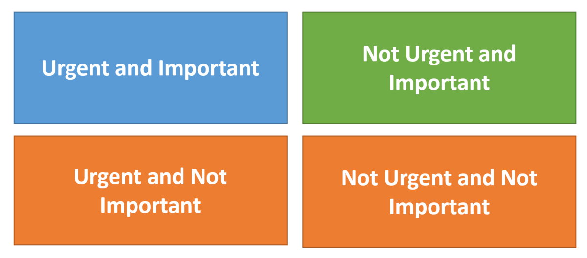
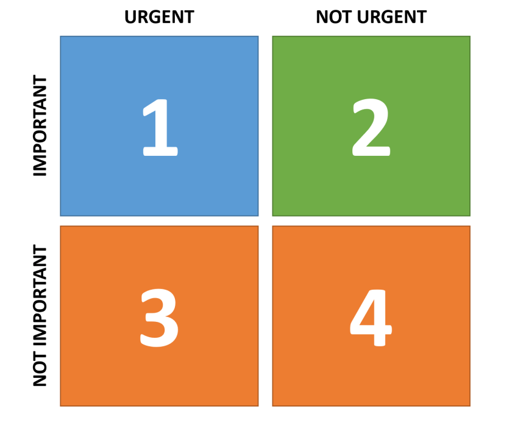
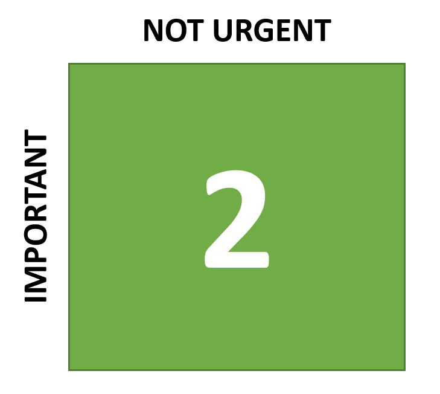

---
title: "Productivity advice for developers and development teams"
date: 2018-04-08T00:00:00Z
draft: false
description: "Getting work done effectively and efficiently is a goal of most software development teams. On a personal level, being able to get a productive day at work can…"
categories: ["Building teams", "Career"]
cover:
  image: "images/management-matrix.png"
  alt: "Productivity advice for developers and development teams"
aliases:
  - "/2018/04/08/productivity-advice-for-developers-and-development-teams/"
ShowToc: true
TocOpen: false
---

Getting work done effectively and efficiently is a goal of most software development teams. On a personal level, being able to get a productive day at work can also be immensely satisfying. In this article, I will share with you my advice on how to be much more productive. This advice is inspired by “The 7 Habits of Highly Effective People” – a book that made a big impact on me.

I believe one of the keys to increased productivity is to concentrate on doing the right things at work. How do you know what are the right things? To answer that question, I will use *The Management Matrix* as described in “The 7 Habits of Highly Effective People”.

### The Management Matrix

We can classify tasks that you do in the following ways:

- **Important Work**– This brings us closer to achieving our goals
- **Not Important Work**–  This does not bring us closer to achieving our goals
- **Urgent Work**– There is a pressure to do it right now
- **Not Urgent Work**– There is no pressure to do it right now

We can arrange these categories into four squares that create *The Management Matrix*:

Each task we do will belong to one of these four quadrants.

### The Four Quadrants for Software Developers

Looking at software development, let’s see which activities belong to which quadrant:

##### Quadrant 1 – Urgent and Important

These are the things that are important and require our immediate attention:

- **Problems in production** – we need to fix them right now. These can include bugs, security issues, infrastructure problems.
- **Important deadlines** – they take priorities. These are the things that we have obligation to deliver. Especially as the deadlines get closer and we are not finished yet.
- **C****rises**– of different nature. These are the things that happen and need our immediate response. Important management meetings to which we may be called etc.

##### Quadrant 2 – Not Urgent and Important

These are the things that are important and do not require our immediate attention:

- **Adding quality tests**– unit tests, integration tests, anything really.
- **Servicing our technical debt** – as identified by the team or architecture.
- **Building relations with other teams** – getting to know better testers, operations etc.
- **Improving and creating documentation** – making it easier for developers and others to work with the code and software that is created.
- **Learning new technologies and upskilling the team**
- **Other non-pressing, improvement related work**

##### Quadrant 3 – Urgent and Not Important

These are the things that are not important and require our immediate attention:

- **Interruptions to development work that is trivia related**
- **Dealing with reports that do not get read or used**
- **Unproductive meetings that we are asked to attend**
- **Solving crises unrelated to our goals**
- **Visible, popular activities that do not bring us closer to our goal**

##### Quadrant 4 – Non Urgent and Not Important

These are the things that are not important and do not require our immediate attention:

- **Gold-plating code, looking for busy work to keep occupied**
- **Attending unimportant optional meetings**
- **General time wasting**
- **Pleasant, but important activities**

### What to work on then?

**Quadrant 1 – Urgent and Important** will always take the priority. There is no escaping from the fact that you have to deal with the urgent and important matters. Sometimes it may feel like this is all that we do!

How do you get more productive then? As you might have figured, most of the helpful activities are in the **Quadrant 2 – Not Urgent and Important**. Clearly, these are the things that are worth doing.  Often these activities (better testing, documentation, higher quality) dramatically reduce the number of Quadrant 1 activities required.

The key to unlocking productivity and effectiveness can be summed up in two rules:

> 1. Quadrant 2 activities are the key to gaining control, reducing crises and increasing productivity.
> 2. You can only get time for Quadrant 2 activities by reducing time wasted on Quadrand 3 and 4 activiteis.

### Things you can start doing now

The good news is that you don’t have to wait for anything to start getting the control of your work-life back. I suggest that you start doing the following:

1. Identify to which quadrant different task that you or your team performs belong.
2. For tasks that belong to the quadrants 3 and 4- stop doing them. Learn *how to say no* and cut the unimportant things as effectively as you can.
3. The time that you and your team saved by cutting the quadrants 3 and 4 work can be invested in quadrant 2 activities.
4. As time progresses you will see that there is less and less quadrant 1 items as you are gaining back control. Make sure to re-invest this time in quadrant 2 activities.

### Summary

Being effective at work is as much about not doing the wasteful tasks as it is about doing the right ones. People often overemphasize being busy at work, without spending enough time wondering if they are busy with the right things. I hope this framework will help you get better at this important activity. If you enjoyed this article, I recommend reading “The 7 Habits of Highly Effective People”, it is one of these books that has a potential of leaving a mark on the rest of your life.
