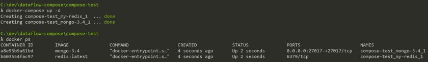
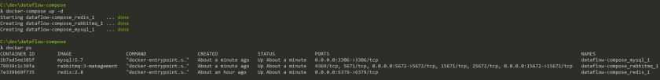
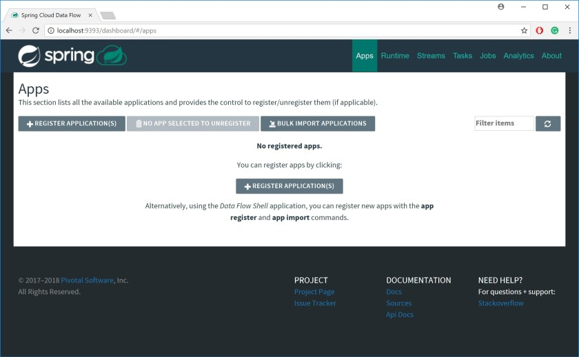

# Quick setup for Spring Cloud Data Flow with Docker Compose


Spring Cloud Data Flow requires quite a few dependencies in order to run it. In this blog post, I will show you Docker Compose tool and how it can be used to make that setup easy.

I have written an [introduction to Spring Cloud Data Flow]() where in order to run the Data Flow server, you need to have 3 other Docker containers running.

This is not that bad, but imagine if you had to have more dependencies? Or if you want to have that process easily replicable? Sharing that setup with other developers on the team? You can see that it would be good to have a better way of doing this…

## Introducing Docker Compose

If you are looking for the detailed documentation of Docker Compose, you can find it [here on the official site](https://docs.docker.com/compose/overview/). What I want to give you here is a quick and practical introduction that will get you using the tool in no time!

Docker Compose is perfectly summarised by the authors of the tool themselves:

> Compose is a tool for defining and running multi-container Docker applications. With Compose, you use a YAML file to configure your application’s services. Then, with a single command, you create and start all the services from your configuration.

We basically have three steps to use a Docker Compose:

**1. Decide which containers you want to run:**

Let’s say that we want to run the [redis:latest image](https://hub.docker.com/_/redis/) and [mongodb version 3.4](https://hub.docker.com/_/mongo/). Imagine that this is exactly what is required to get our development environment working.

**2. Define the docker-compose.yml that describes the containers to be created:**

In this case, `docker-compose.yml` would look like that:

```

version: '3'

services:
  my-redis:
    image: redis:latest
  mongo-3.4:
    image: mongo:3.4
    ports:
      - "27017:27017"

```

**3. Run the docker.compose.yml with the command `docker-compose up`:**

**In order to start the containers in the background add -d to your command**. Now run `docker-compose up -d` and voila!



## Setting up Spring Cloud Data Flow with Docker Compose

The idea to do that came from a company presentation done by my colleague [Jan Akerman](https://twitter.com/JanAkerman) that later published his code example as a [GitHub project](https://github.com/janakerman/data-flow-demo).

Instead of having to set-up every docker container separately, let’s see what is needed: Redis, MySQL, and RabbitMQ. With that knowledge, we can write the `docker-compose.yml`:

```

version: '3'

services:
  rabbitmq:
    image: rabbitmq:3-management
    ports:
      - "15672:15672"
      - "5672:5672"
    expose:
      - "15672"
      - "5672"
  mysql:
    image: mysql:5.7
    environment:
      MYSQL_DATABASE: scdf
      MYSQL_USER: root
      MYSQL_ROOT_PASSWORD: dataflow
    ports:
      - "3306:3306"
    expose:
      - 3306
  redis:
    image: redis:2.8
    ports:
      - "6379:6379"
    expose:
      - "6379"

```

Now, in the same directory that you have that `docker-compose.yml` run the `docker-compose up -d` command. You should see something like that after listing containers with `docker ps`:



With that running, download the Local Spring Cloud Data Flow server from [this link](https://repo.spring.io/release/org/springframework/cloud/spring-cloud-dataflow-server-local/1.3.0.RELEASE/spring-cloud-dataflow-server-local-1.3.0.RELEASE.jar). You can start the Spring Cloud Data Flow with:

`java -jar spring-cloud-dataflow-server-local-1.3.0.RELEASE.jar --spring.datasource.url=jdbc:mysql://localhost:3306/scdf --spring.datasource.username=root --spring.datasource.password=dataflow --spring.datasource.driver-class-name=org.mariadb.jdbc.Driver --spring.rabbitmq.host=127.0.0.1 --spring.rabbitmq.port=5672 --spring.rabbitmq.username=guest --spring.rabbitmq.password=guest`

**Just make sure that you are using Java 8** as this version of Spring Cloud Data Flow does not work well with newer versions!

You should be able to visit now: http://localhost:9393/dashboard/#/apps and see the Spring Cloud Data Flow running:



## Summary

Docker Compose is a very useful tool when you need to spin multiple Docker containers in order to get your project running. It can help you share your more complicated setups like the one for Spring Cloud Data Flow here.

Going forward I will start using it for my blog posts, to make it easier for others to follow the examples.

One thing that could be improved here is to use Spring Cloud Data Flow server as a Docker container itself, but this one is for another time!
