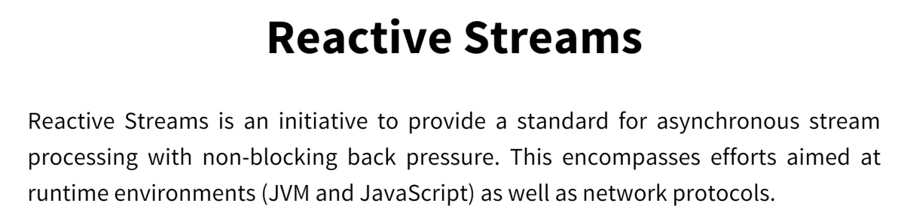

---
title: "Reactive Streams in Java - introducing the new SPI"
date: 2018-04-04T00:00:00Z
draft: false
description: "One of the new features of Java 9 is the introduction of the Reactive Streams SPI to the JDK. Reactive programming keeps gaining in popularity…"
categories: ["Choreography", "Java", "Reactive"]
cover:
  image: "images/reactive-streams.png"
  alt: "Reactive Streams in Java - introducing the new SPI"
aliases:
  - "/2018/04/04/reactive-streams-in-java-introducing-the-new-spi/"
ShowToc: true
TocOpen: false
---

One of the new features of Java 9 is the introduction of the Reactive Streams SPI to the JDK. Reactive programming keeps gaining in popularity, mainly because it works well. If you are not familiar with the principles, I recommend checking out [The Reactive Manifesto](https://www.reactivemanifesto.org/) to which I subscribe. To learn more about Reactive Streams in Java, read on.

Reactive Streams got introduced to Java as `java.util.concurrent.Flow`. Before looking into that, let’s see what are Reactive Streams and how can we make use of them.

### Introducing the idea of Reactive Streams

The original initiative for the introduction of Reactive Streams can be found at <http://www.reactive-streams.org/>. To quote from their [GitHub project page](https://github.com/reactive-streams/reactive-streams-jvm):

> The purpose of Reactive Streams is to provide a standard for asynchronous stream processing with non-blocking backpressure.

To fully understand that quote, let’s look at these two concepts here:

- **asynchronous stream processing** – This means processing data streams with parallel use of computing resources on a single machine. Streams can consist of live data of non-predetermined size and this is where the difficulty lays.
- **non-blocking backpressure** – When exchanging data across an asynchronous boundary, you force the other side to deal with the data. This is called backpressure. Think of it as a flow-control. Care needs to be taken for this part of the stream management to be asynchronous as well (non-blocking).

With these ideas discussed, we can describe Reactive Streams as a **specification for** **Stream oriented JVM libraries that:**

- **sequentially process a potentially unbounded number of elements**
- **asynchronously pass elements between components**
- **include mandatory non-blocking backpressure**

### Reactive Streams Specification

The actual Reactive Streams specification can be found here: <https://github.com/reactive-streams/reactive-streams-jvm#specification>

It consists of four main components:

1. **Publisher**
2. **Subscriber**
3. **Subscription**
4. **Processor**

And a list of rules for each of the components.

### Java 9 Reactive Streams

Where does Java come in here? With the introduction of `java.util.concurrent.Flow` JDK now includes an SPI (Service Provider Interface) that will guide implementations of the Reactive Streams.

It is important to note that **this is not meant to be the client API**. **Developers are not expected to be directly using the**`java.util.concurrent.Flow`, implementing its different interfaces. The goal here is to guide other implementations of Reactive Streams that will be able to seamlessly interpolate in Java.

### Java 9 Reactive Streams SPI

Let’s have a closer look at the different Interfacesces that make up the Reactive Streams SPI in Java:

##### Flow.Publisher<T>

```

public interface Publisher<T> {
    public void subscribe(Subscriber<? super T> s);
}

```

##### Flow.Subscriber<T>

```

public interface Subscriber<T> {
    public void onSubscribe(Subscription s);
    public void onNext(T t);
    public void onError(Throwable t);
    public void onComplete();
}

```

##### Flow.Subscription

```

public interface Subscription {
    public void request(long n);
    public void cancel();
}

```

##### Flow.Processor<T,R>

```

public interface Processor<T, R> extends Subscriber<T>, Publisher<R> {
}

```

### Reactive Streams Technology Compatibility Kit

**Implementing these Interfaces is not enough to create a correct Reactive Streams implementation**. As mentioned before there are the components and rules that make up the specification. The components are defined by the Interfaces while the rules are defined by Reactive Streams Technology Compatibility Kit (TCK).

TCK is a set of tests designed to cover all the rules mentioned in the specification. In order to correctly implement reactive streams, you have to implement the interfaces and make sure that your implementation passes the TCK tests.

To find out more about TCK, check out the [project README file](https://github.com/reactive-streams/reactive-streams-jvm/blob/master/tck-flow/README.md).

### What are some of the implementation of Reactive Streams in Java?

As mentioned, this SPI is not meant to be used by end users. It is a tool for correctly implementing Reactive Streams. If you want to actually start using them, you have quite a few implementations to choose from:

- [Project Reactor](https://projectreactor.io/) – *“Reactor is a fourth-generation Reactive library for building non-blocking applications on*  
  *the JVM based on the Reactive Streams Specification”*
- [RxJava](https://github.com/ReactiveX/RxJava) – *“RxJava is a Java VM implementation of Reactive Extensions: a library for composing asynchronous and event-based programs by using observable sequences.”*
- [Vert.x Reactive Streams Integration](https://vertx.io/docs/vertx-reactive-streams/java/) – a reactive microservices library
- [Akka Streams](https://doc.akka.io/docs/akka/2.5/stream/) – Reactive Streams implementation in Akka Framework
- Spring Boot 2 uses Reactor to provide Reactive Streams.

**Some of** **these frameworks do not use the Java 9 streams yet**, rather they rely on the original reactive-streams project. Since there is a nearly 1-1 mapping between the two, most of them are in the process of moving to `java.util.concurrent.Flow`.

### Summary

Reactive Streams is not a new idea. It has already gained enough popularity to be included in the JDK as an SPI. With that, we can expect only further grow of reactive libraries and reactive programming on the JVM. If you have not done that already, read the [Reactive Manifesto](https://www.reactivemanifesto.org/) and get for the Reactive future- it has already begun.
