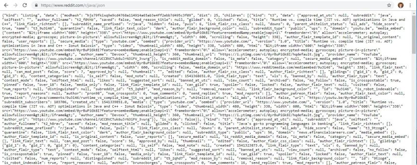
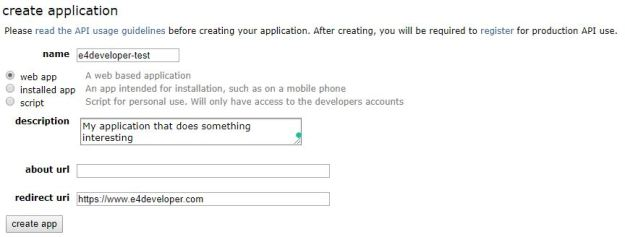
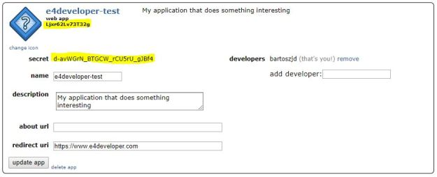

# Reddit API Authentication with Java/Spring


I am a [big fan of Reddit](). The platform is great for learning and sharing programming knowledge… In fact, it contains so much knowledge and opinion, that there is no chance for any single person to analyze it all. Sounds like a job for a machine? Before we get started, we need to learn how to authenticate with the Reddit API.

## Public read-only API with JSON

Reddit has a very friendly API, with multiple endpoints being simply accessible in a JSON format after adding *.json* to the request. For example to get a list of Java topics discussed on the /r/Java subreddit, as a human you would go to <https://www.reddit.com/r/java> and you would see something like that:


And by simply adding .json, we can transform the URL into <https://www.reddit.com/r/java/.json> and see the following:



This is great! If the only thing you want to do with your script/program is to read some article headers and comments- Reddit makes it incredibly easy.

But what if you want to be accessing parts of the API that are not publicly viewable, or if you want to actually login “as a user” and interact with Reddit programmatically?

## OAuth with Reddit, Java, and Spring

Before showing you my code, I want to point you to a few official resources that you are likely to find very helpful when working with Reddit API:

<https://github.com/reddit-archive/reddit/wiki/OAuth2> – OAuth2 explanation of different flows and setting up your application up. This was the main resource I used for figuring it out.

<https://www.reddit.com/dev/api> – Reddit API documentation

### Step 1 – Creating a Reddit Application

This is already explained in <https://github.com/reddit-archive/reddit/wiki/OAuth2>, but to give you an express version:

- Go to<https://www.reddit.com/prefs/apps>
- Click on the: “are you a developer? create an app…”
- Fill in the form: 
- You should end up with something like:Don’t worry, I have deleted this app already, so the highlighted confidential parts will no longer work. These are your *id* and *secret* though and we will use them later.

### Step 2 – getting an Access Token

There are two main ways that I want to authenticate with Reddit OAuth:

- Based on the *client\_credentials* – for making mostly read-only calls that do not require my username and password
- Based on my *username* and *password* – for using the API with write as a user capabilities

The main difference is how you get the Access Token in each case. Let’s start with the client\_credentials only. To get that token, you will need to provide:

- Your app-id *(“Ljxr62Lv73T32g” in this example)* and secret *(“d-avWGrN\_BTGCW\_rCU5rU\_gJBf4” in this example)*.
- *User-Agent*header to identify your application. This is extremely important as without this the application simply won’t work!

**Here is an example code for getting an Access Code with the *client\_credentials* grant.** I am using Spring Boot 2.0 and Jackson dependencies for JSON:

```

private String getAuthToken(){
    RestTemplate restTemplate = new RestTemplate();
    HttpHeaders headers = new HttpHeaders();
    headers.setBasicAuth("Ljxr62Lv73T32g", "d-avWGrN_BTGCW_rCU5rU_gJBf4");
    headers.setContentType(MediaType.APPLICATION_FORM_URLENCODED);
    headers.put("User-Agent",
            Collections.singletonList("tomcat:com.e4developer.e4reddit-test:v1.0 (by /u/bartoszjd)"));
    String body = "grant_type=client_credentials";
    HttpEntity<String> request
            = new HttpEntity<>(body, headers);
    String authUrl = "https://www.reddit.com/api/v1/access_token";
    ResponseEntity<String> response = restTemplate.postForEntity(
            authUrl, request, String.class);
    ObjectMapper mapper = new ObjectMapper();
    Map<String, Object> map = new HashMap<>();
    try {
        map.putAll(mapper
                .readValue(response.getBody(), new TypeReference<Map<String,Object>>(){}));
    } catch (IOException e) {
        e.printStackTrace();
    }
    System.out.println(response.getBody());
    return String.valueOf(map.get("access_token"));
}

```

The second way of getting authentication is with the *password* grant. It works the same way, you just need to also submit your username, password and change the grant type. **You also have to create your application as a Script:**


With all that prepared **here is an example code for getting an Access Code with the *password* grant.** I am using Spring Boot 2.0 and Jackson dependencies for JSON:

```

private String getAuthToken(){
    RestTemplate restTemplate = new RestTemplate();
    HttpHeaders headers = new HttpHeaders();
    //Different login details as I had to re-create the app
    headers.setBasicAuth("RvXWoa0lPAYaQw", "s0DWeNK6-61UMOJ-KG3QQ0N-GWQ");
    headers.setContentType(MediaType.APPLICATION_FORM_URLENCODED);
    headers.put("User-Agent",
            Collections.singletonList("tomcat:com.e4developer.e4reddit-test:v1.0 (by /u/bartoszjd)"));
    String body = "grant_type=password&username=bartoszjd&password=thisissecret";
    HttpEntity<String> request
            = new HttpEntity<>(body, headers);
    String authUrl = "https://www.reddit.com/api/v1/access_token";
    ResponseEntity<String> response = restTemplate.postForEntity(
            authUrl, request, String.class);
    ObjectMapper mapper = new ObjectMapper();
    Map<String, Object> map = new HashMap<>();
    try {
        map.putAll(mapper
                .readValue(response.getBody(), new TypeReference<Map<String,Object>>(){}));
    } catch (IOException e) {
        e.printStackTrace();
    }
    System.out.println(response.getBody());
    return String.valueOf(map.get("access_token"));
}

```

### Step 3 -using the API

Once you have the Access Token, using the API is very simple. Before doing that, please make sure that you familiarise yourself with the [Reddit API rules](https://github.com/reddit-archive/reddit/wiki/API).

Making the call to the API requires you to set up the User-Agent and use the Bearer token authentication is Spring. Here is an example code that will retrieve the hot-topics in a specified subreddit:

```

public String readArticles(String subReddit) {
    RestTemplate restTemplate = new RestTemplate();
    HttpHeaders headers = new HttpHeaders();
    String authToken = getAuthToken();
    headers.setBearerAuth(authToken);
    headers.put("User-Agent",
            Collections.singletonList("tomcat:com.e4developer.e4reddit-test:v1.0 (by /u/bartoszjd)"));
    HttpEntity<String> entity = new HttpEntity<String>("parameters", headers);
    String url = "https://oauth.reddit.com/r/"+subReddit+"/hot";
    ResponseEntity<String> response
            = restTemplate.exchange(url, HttpMethod.GET, entity, String.class);
    return response.getBody();
}

```

And here is the outcome in the browser:


## What is next?

This is the first step in my exploration of the Reddit API. I have been recently [learning a lot about AWS]() and I discovered a service called [Amazon Comprehend](https://aws.amazon.com/comprehend/). It is a fascinating Sentiment Analysis API that I am planning to use with Reddit! Stay tuned for more!
