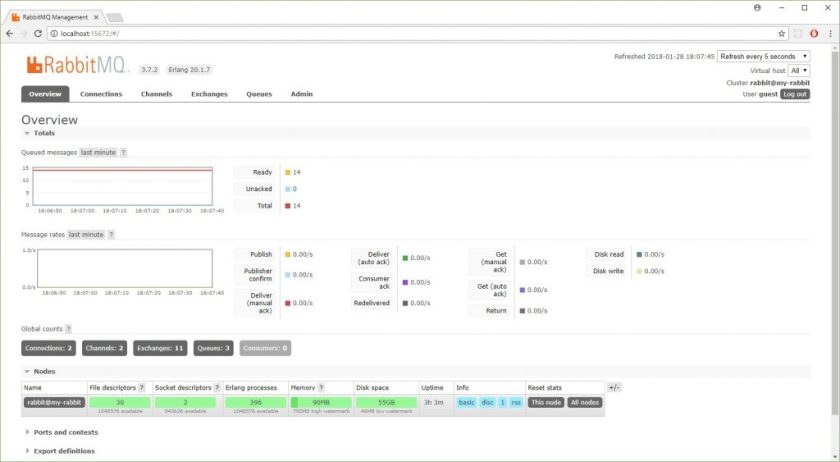
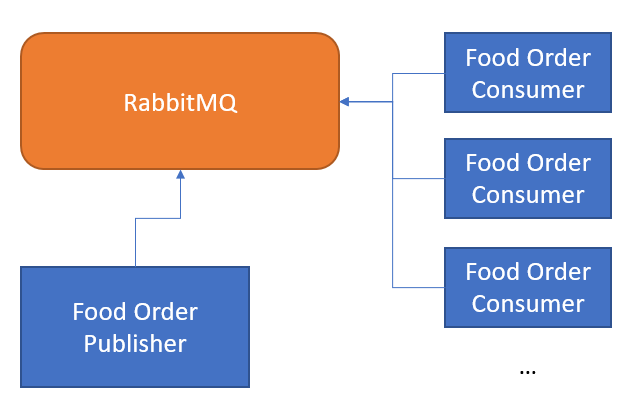
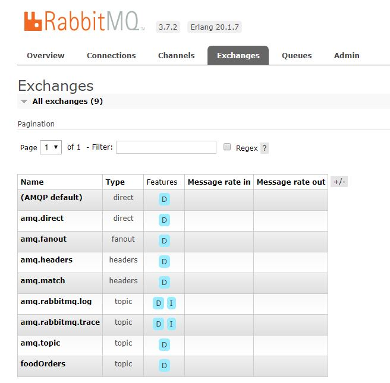
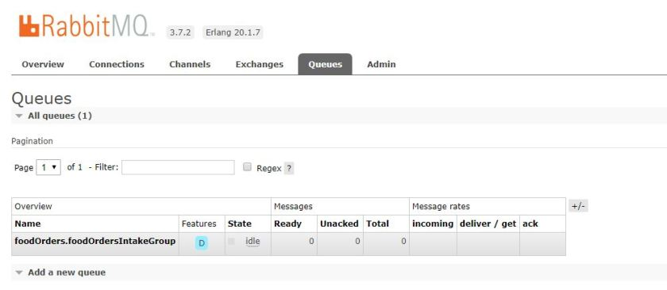
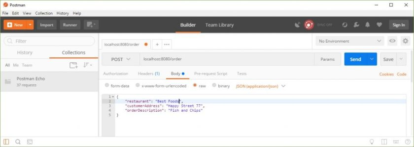
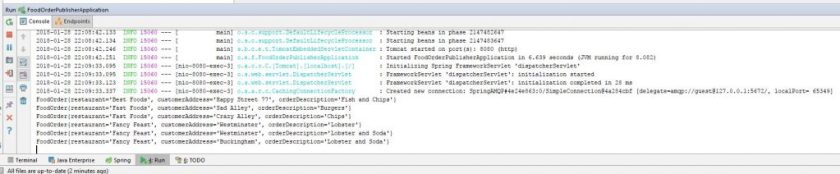
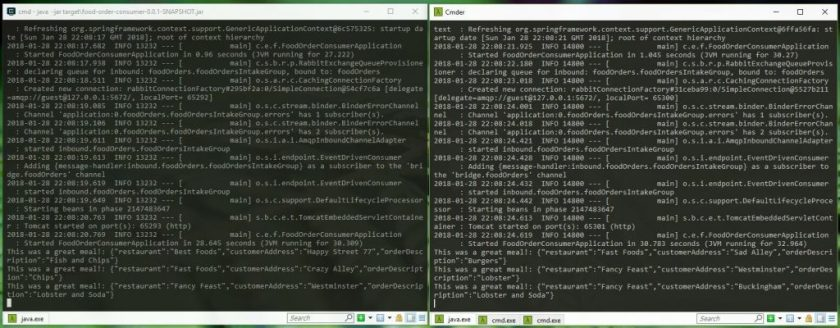

---
title: "Setting up RabbitMQ with Spring Cloud Stream"
date: 2018-01-28T00:00:00Z
draft: false
description: "Setting up RabbitMQ with Spring Cloud Stream step by step. By the end you will see persistent queue together with publisher and consumers subscribed."
categories: ["Choreography", "Microservices", "Spring Cloud"]
cover:
  image: "images/rabbit-spring-cloud-1024x254.jpg"
  alt: "Setting up RabbitMQ with Spring Cloud Stream"
aliases:
  - "/2018/01/28/setting-up-rabbitmq-with-spring-cloud-stream/"
  - "/setting-up-rabbitmq-with-spring-cloud-stream/"
ShowToc: true
TocOpen: false
---Message queues are very important and useful tools that you can utilize for your Microservices oriented architecture. Many developers are hesitant using them with the fear that they may add too much complexity and learning curve to the understanding of their system. I will show you how to make use of RabbitMQ and Spring Cloud Stream to get some basic messaging routes set-up with a very little effort!


### Why use RabbitMQ

RabbitMQ is an immensely popular message broker. In fact, [the official website](https://www.rabbitmq.com/) claims that this is the most popular open source message broker out there! This makes it a great candidate to be the message broker for your system. Popularity is not good enough reason for using something (but it usually brings plenty of benefits such as community and support), so rest assured- RabbitMQ has much more to offer than its fame. It is very easy to use (you will see) and it can reliably handle 20,000 messages per second with the largest documented deployment – the Instagram, doing more than 1,000,000 messages per second!

Why I didn’t choose Kafka for this blog post? Kafka is an amazing technology. It can handle truly large data. If you are doing more than 100,000 messages per second- go for Kafka! Then, your use case is probably so advanced that you may not need this blog post. If you don’t need so much of raw power and you deal with more standard microservices deployment- I believe you will like what RabbitMQ has to offer- and the simplicity of setup. Feel free to check Kafka afterward- nothing wrong with knowing your options!

### Getting RabbitMQ

It is quite easy to set-up RabbitMQ on your machine. You can follow the official [download and installation](https://www.rabbitmq.com/download.html) guide when dealing with serious deployment. Here I want to show you how to get RabbitMQ locally in a really easy way. If you do not already have a Docker installed- [get it from the official website.](https://store.docker.com/search?type=edition&offering=community)If you are not sure why you would want a docker installed on your machine, read [my blog post](http://e4developer.com/2018/01/18/microservices-toolbox-docker/) on the topic.

Assuming you already have Docker on your machine, the official docker hub repository for RabbitMQ is [here](https://hub.docker.com/_/rabbitmq/). It contains plenty of useful information about running and setting up RabbitMQ with Docker. For now you won’t be needing all that as we are starting with just a single command:

`docker run -d --hostname my-rabbit --name some-rabbit -p 15672:15672  -p 5672:5672 rabbitmq:3-management`

This will get the official image with management console added. It will also expose ports 15672 – for the management console and 5672 – for the connection to the RabbitMQ. That means you can inspect the management console going to `http://localhost:15672`, the default password and username being `guest/guest`. Once you go to that URL and you login, you should see:



Congratulations! You have installed and are running RabbitMQ on your machine with Docker.

### Using RabbitMQ with Spring Cloud Stream

The example I will show you will be a *Food Orders Processing Application*. The idea is very simple: you have a service that you place a food order with and then you have one or more services that *consume*that order:



We already have a working RabbitMQ and we won’t have to do anything special in order to use it. It is available on `http://localhost:5672`, accepting connections with username/password `guest/guest`. I assume here at least basic understanding of what Spring Boot is if you need a reminder- [check this blog post](http://e4developer.com/2018/01/16/microservices-toolbox-spring-boot/). Let’s build the consumers service first:

### Building Food Order Consumer

It may seem strange to build the consumer first, but there is logic to it. When we build consumer we will create durable Queues in RabbitMQ on their startup. We want that queue up-front so no messages get lost. The consumer is also a bit simpler. The only dependency you need for your Spring Boot project is `spring-cloud-starter-stream-rabbit`.  With this dependency added, we can build our Consumer:

```

package com.e4developer.foodorderconsumer;

import org.springframework.boot.SpringApplication;
import org.springframework.boot.autoconfigure.SpringBootApplication;
import org.springframework.cloud.stream.annotation.EnableBinding;
import org.springframework.cloud.stream.annotation.StreamListener;
import org.springframework.cloud.stream.messaging.Sink;

@EnableBinding(Sink.class)
@SpringBootApplication
public class FoodOrderConsumerApplication {

	public static void main(String[] args) {
		SpringApplication.run(FoodOrderConsumerApplication.class, args);
	}

	@StreamListener(target = Sink.INPUT)
	public void processCheapMeals(String meal){
		System.out.println("This was a great meal!: "+meal);
	}
}

```

All we need to do here is to bind ourselves to the `Sink.class`. What is that? Well, this is the Spring Cloud Stream component that enables us to read messages. If we were going to also be sending messages then we would need `Processor.class`. So how does the Sink know where to read the message from? This is all in the properties file:

```

#random for multiple instances
server.port=0
spring.rabbitmq.host=localhost
spring.rabbitmq.port=5672
spring.rabbitmq.username=guest
spring.rabbitmq.password=guest

spring.cloud.stream.bindings.input.destination=foodOrders
spring.cloud.stream.bindings.input.group=foodOrdersIntakeGroup

```

You can see that the RabbitMQ connection details are configured here. We also have `server.port` set to 0- this auto-assigns the value and makes it easy to start multiple servers. The first interesting property is: `spring.cloud.stream.bindings.input.destination`– this is the information from which *topic* (I am using this term loosely here- it is actually called *Exchange* in RabbitMQ) this messages should come from. The second property: `spring.cloud.stream.bindings.input.group` is the name of the *input group*– this is the name of the queue that will be created and subscribed to the *exchange*in order to get the messages. Without this set, each consumer will be started on its separate, unique queue, that by default is not durable. This is not usually what we want, although it may be useful for some sort of health-monitoring service.

I will run couple of these Consumers now, if you want to follow you can clone [my github project](https://github.com/bjedrzejewski/food-order-consumer/tree/rabbit-with-stream). Once these are started you should see the `Exchange` and `IntakeGroup` created automatically:




I hope you can see the same (as you should with RabbitMQ running). Time to build the publisher and then we can see it all in action!

### Building Food Order Publisher

Here, we want just two capabilities. Controller that can receive `FoodOrder` and some mechanism for publishing this onto a Queue. Let’s start with the basics. I will create a `FoodOrder` Class that we will expect to receive as a JSON from the controller:

```

package com.e4developer.foodorderpublisher;

import com.fasterxml.jackson.annotation.JsonIgnoreProperties;

@JsonIgnoreProperties(ignoreUnknown = true)
public class FoodOrder {

    private String restaurant;
    private String customerAddress;
    private String orderDescription;

    public FoodOrder(){

    }

    public FoodOrder(String restaurant, String customerAddress, String orderDescription) {
        this.restaurant = restaurant;
        this.customerAddress = customerAddress;
        this.orderDescription = orderDescription;
    }

    public void setRestaurant(String restaurant) {
        this.restaurant = restaurant;
    }

    public void setCustomerAddress(String customerAddress) {
        this.customerAddress = customerAddress;
    }

    public void setOrderDescription(String orderDescription) {
        this.orderDescription = orderDescription;
    }

    public String getRestaurant() {
        return restaurant;
    }

    public String getCustomerAddress() {
        return customerAddress;
    }

    public String getOrderDescription() {
        return orderDescription;
    }

    @Override
    public String toString() {
        return "FoodOrder{" +
                "restaurant='" + restaurant + '\'' +
                ", customerAddress='" + customerAddress + '\'' +
                ", orderDescription='" + orderDescription + '\'' +
                '}';
    }
}

```

This is quite simple, providing an empty constructor and setters with getters to make an automatic construction with Jackson simple. I also added `toString()` method so that we can do some pretty-printing in the Controller. The next step is to define `FoodOrderSource`. This will simply be an interface that defines ways of obtaining the `MessageChannel` object needed to send the message. The code is as follows:

```

package com.e4developer.foodorderpublisher;

import org.springframework.cloud.stream.annotation.Output;
import org.springframework.messaging.MessageChannel;

public interface FoodOrderSource {

    @Output("foodOrdersChannel")
    MessageChannel foodOrders();

}

```

In order to use that in a controller we will need `FoodOrderPublisher`  with a correct binding defined:

```

package com.e4developer.foodorderpublisher;

import org.springframework.cloud.stream.annotation.EnableBinding;

@EnableBinding(FoodOrderSource.class)
public class FoodOrderPublisher {
}

```

With all that ready, we can define a simple controller that will make use of these classes and publish the message upon receiving the `FoodOrder`:

```

package com.e4developer.foodorderpublisher;

import org.springframework.beans.factory.annotation.Autowired;
import org.springframework.integration.support.MessageBuilder;
import org.springframework.web.bind.annotation.RequestBody;
import org.springframework.web.bind.annotation.RequestMapping;
import org.springframework.web.bind.annotation.ResponseBody;
import org.springframework.web.bind.annotation.RestController;

@RestController
public class FoodOrderController {

    @Autowired
    FoodOrderSource foodOrderSource;

    @RequestMapping("/order")
    @ResponseBody
    public String orderFood(@RequestBody FoodOrder foodOrder){
        foodOrderSource.foodOrders().send(MessageBuilder.withPayload(foodOrder).build());
        System.out.println(foodOrder.toString());
        return "food ordered!";
    }
}

```

This is all great, but how do these classes know what queue to talk to? Once again we can look at the .properties file in order to get the answer:

```

server.port=8080
spring.rabbitmq.host=localhost
spring.rabbitmq.port=5672
spring.rabbitmq.username=guest
spring.rabbitmq.password=guest

spring.cloud.stream.bindings.foodOrdersChannel.destination=foodOrders
spring.cloud.stream.default.contentType=application/json

```

You can get all that code from [my GitHub project](https://github.com/bjedrzejewski/food-order-publisher/tree/rabbit-with-stream). With this, all defined we will be ready to start this application and send some POST request with different food orders!

### Seeing it all in Action!

To see it all working, let’s start by running Postman (or any other client that lets you send different post messages) and send some `FoodOrders` !



As you can see these are being consumed by the `FoodOrderPublisher` and published on the queue via the Exchange:



Messages are also being uniquely processed by different consumers- the same message does not get processed twice!



### Summary

What you have seen here is the basics behind Spring Cloud Stream integration with RabbitMQ. After following the steps here and understanding what is happening, you should have no problems getting this up and running on your machine. This is not a production ready code, as when dealing with asynchronous processing you need to worry about a few extra things- what happens when your messages are broken (or your consumer code is broken), how do you handle all the errors and monitoring etc. This is all important, but you need to start somewhere! Being able to easily run this on your machine should give you this place to start and confidence to experiment and go further!
