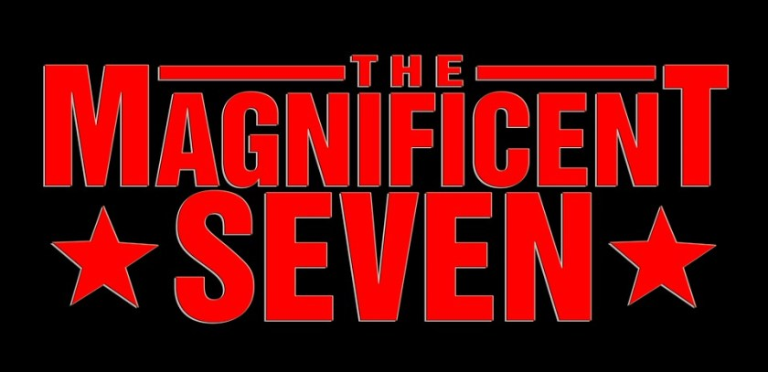

---
title: "Seven Essential Skills for Microservices Developers"
date: 2018-01-25T00:00:00Z
draft: false
description: "Discussing seven most important skills to become proficient microservices developer. Architecture Knowledge, Domain Modelling, Devops and more…"
categories: ["Career", "Microservices"]
cover:
  image: "images/mag-seven.jpg"
  alt: "Seven Essential Skills for Microservices Developers"
aliases:
  - "/2018/01/25/seven-essential-skills-for-microservices-developers/"
  - "/seven-essential-skills-for-microservices-developers/"
ShowToc: true
TocOpen: false
---Microservices are gaining popularity and more developers end up working with them. If you are a developer who is going to work with microservices architecture, or an employer who is looking to hire someone- what are the most important skills for microservices developer to posses? Read on to find out.

As with any emerging technologies and trends, there is some learning to be done to master it. It is the nature of our jobs as developers- to stay up to date with the latest and greatest patterns and architectures. So, what can you start doing now to get good at these microservices? Who should you look for to join your microservices oriented team? Here I gathered seven essential skills that will help any developer feel at home with microservices:

### Architecture Knowledge

It is essential to familiarize yourself with common microservices pattern. I recommend checking my [Spring Cloud Introduction](http://e4developer.com/2018/01/22/spring-cloud-blueprint-for-successful-microservices/) as just by reading about what Spring Clouds has to offer and learning its modules, you are going to have much better understanding of how things should be structured. If you don’t know about standard patterns, you will attempt to solve problems already solved and you will be unlikely to chose the best solution.

I also highly recommend grabbing a copy of *Building Microservices* by Sam Newman [which I reviewed](http://e4developer.com/2018/01/24/starting-with-microservices-read-building-microservices/) just before writing this blog post. By reading this you will be sure to be aware of the pattern and best practices, albeit in a framework-free way.

The combination of knowing one Microservices framework like Spring Cloud and good book knowledge from *Building Microservices* will set you for a great start in the Microservices world.

### Domain Modelling

Even if you understand your architecture and patterns perfectly it is still not that easy to be very successful with Microservices. Splitting responsibilities between different parts of the system can get very difficult very quickly. You need to be good at domain modelling and understanding how to assign responsibility. One trick that I can recommend is drawing more. [Drawing with your team](http://e4developer.com/2018/01/13/helping-your-team-draw-together/) and other people involved in the project is a great tool for fostering shared understanding of the domain.

Being good at linking your domain and design is a universally useful skill for a software developer. If you want to get much deeper in this subject, you may want to check out Domain Driven Design. You can find a great explanation of what DDD really is in this[Stack Overflow Answer](https://stackoverflow.com/a/1222488/1611957) (of all the places!). There are many books and articles on that subject that you can check out as well!

### Devops and Containers

The idea behind successful microservices is to work in DevOps way. For the purpose of this article that means taking the ownership of the service all the way from writing the code for deploying in production. Even if you are not going to be the one deploying it, you should have some idea how this deployment will look like. There is no hiding, you will have to become somewhat familiar with Containers, Docker, Kubernetes etc. The good news is that you can get Docker on your machine and it is a [very useful tool](http://e4developer.com/2018/01/18/microservices-toolbox-docker/)!

So beyond containers, what will you have to know? Queues, messaging, databases, some cloud (AWS, Azure)… Wow, it seems like a lot! Don’t worry, if you are working in a DevOps team, there are likely to be some experienced colleagues there that can assist you. No one becomes expert overnight, but learning some of these technologies may be new to you if you were not exposed to the operation side of things. The good news is- these can be fun, challenging and useful!

If there is just one book I would recommend you to check out to be more confident about your knowledge of DevOps mindset and skill set it would be DevOps Handbook based on the very entertaining Phoenix Project.

### Security

As you may imagine, securing many things is more difficult than securing a single thing. With microservices security concerns are much more at the front of everybody’s mind than they were when everyone was working with monoliths. What specific security things should you learn? I really recommend looking at common Single Sign-On (SSO) implementations, especially at the OAuth2 related tech. [Spring Cloud Security](https://cloud.spring.io/spring-cloud-security/) specifically can teach you some best practices and give you good ideas about implementing secure microservices.

What other security concerns are there when dealing with distributed architecture? Securing data at rest, securing configuration- microservices have their own configs and data. These are places where security can often be compromised.

To quote one rule from *Sam Newman’s* book that I think is extremely important:

> Don’t invent your own security protocols.

Follow the best practices from established frameworks and you should be fine!

### Testing

One thing that can be extremely deficient in your productivity and success is having services that constantly fail and don’t fulfil their contracts. I have noticed, that because microservices are smaller and look less serious or businesslike than large monolithic applications, some developers neglect the testing.

Please, don’t do it! Microservices offer ample opportunities for creating well tested and robust solution, so don’t pass on it, just because it is not trivial or unit tests don’t seem to be the answer. So what kind of tests should you be thinking about? Well here is my proposition:

- Unit tests (yes, these are still important!)
- Service / API test – you want to test your endpoints as thoroughly as possible
- End to End test of the integrated system (continuous integration can be a great help here)

### Continuous Integration

As I mentioned in the point before, an end to end testing is important. With a microservices system, to be sure that everything is working correctly, you should see the microservices interact together correctly. You can only go so far when testing such complex systems in isolation. The best way to deal with this problem is to set-up continuous integration. Whenever you merge your code to master (and I hope [you are doing pull requests](http://e4developer.com/2018/01/15/helping-your-team-start-using-pull-request/)!) you should be automatically deploying to an integration environment where different tests are run (and teammates can engage in some exploratory testing).

So, no more excuses and manual deployment, this is the time to setup and learn Jenkins/TeamCity or whatever tool for CI you use and make the most of it! This point is partially an extension of the DevOps skill, but important enough to merit its own mention!

### Teamwork

Last but not least, you really need to embrace teamwork and learn about working with people. When writing a small part of a very large system it is easier to isolate yourself and live in your own bubble. No such chance here! Multiple integrating systems and DevOps culture mean that you will have to interact with people a lot!

There is also interesting insight into system design called “*Conway’s Law*“:

> Any organization that designs a system (defined broadly) will produce a design whose structure is a copy of the organization’s communication structure.

This emphasizes that great cooperation across the board is a prerequisite for great microservices. How can you have good communication between microservices when it is lacking between people?

### Summary

Microservices as a trend bring a lot of change to the daily lives of software developers! Skills that were considered niche/special until recent, became an expectation and a requirement. There is a new way of working- DevOps; that is likely to cause an even greater shakeup in the way we see developers job than Agile did! I think this is the time of great opportunity for all of us, members of the software development community to learn much more and be more effective than ever! Don’t be afraid of this change- be excited!
