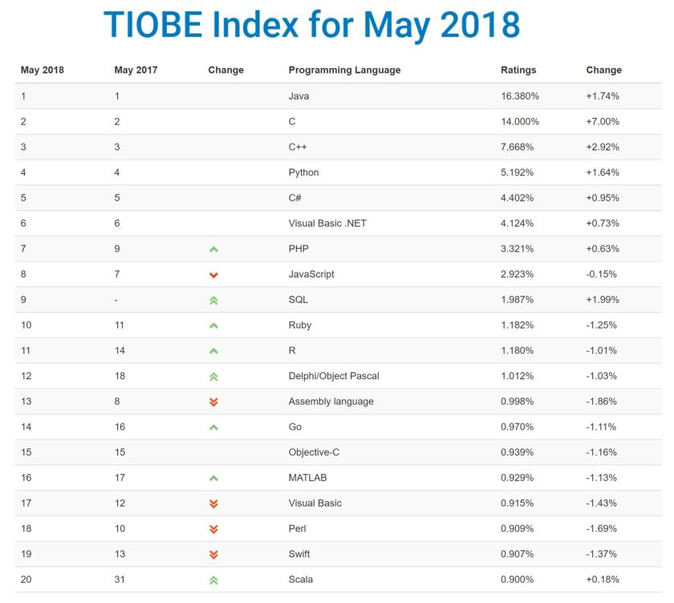

# Should I Learn Java in 2018


Should I learn Java? This is a question that just keeps coming up. If you are just starting out as a developer, if you already work as a Front End Developer or even if you are from the .NET background, many people wonder if learning Java is the right career/personal development move. Let’s see how useful learning Java is in 2018.

When I first started using Java, around 2007, it had a very mixed reputation. On one hand, it was a reasonably new and modern language, but on the other, it was infamous for its bad performance (not fully deserved in my opinion) and verbosity (when contrasted with, back then, very popular Python).

Now, more than 10 years later, the question becomes interesting for multiple reasons. Let me list the key concerns that I hear most often:

- Java is old and is going out of fashion.
- There are much better JVM languages like Scala, Clojure, and Kotlin.
- I am a Frontend Developer, isn’t NodeJS more practical?
- Java is unpleasant to work with.
- Java is too slow/consumes too much memory.
- Why should I learn Java over  X, Y, Z instead?

I am sure there may be more questions and concerns out there, so let me know in the comments. I may edit the article or answer you directly.

Let’s look at these concerns and questions one by one!

## Concern 1: Java is old and is going out of fashion

Java was released in 1995 (according to its Wikipedia page), so it may already be older than some of its users. Is that old? This is subjective, older than many languages that’s for sure! Is that a problem? Well, that’s ageism! Surely age alone is not an argument so let’s look at the other part of this statement.

Is Java really going out of fashion? [TIOBE Index](https://www.tiobe.com/tiobe-index/) tracks the popularity of programming languages. Here is the current top 20 as of 2018:



Not only is Java the number one most popular language according to TIOBE, but it is actually gaining in popularity! Sure, there are other languages gaining popularity faster and moving up the list, but saying that Java is going out of fashion is just untrue.

## Concern 2: There are much better JVM languages like Scala, Clojure, and Kotlin

This is an interesting point, especially with Kotlin rapidly gaining popularity. If you are new to JVM should you even bother with Java or should you go straight to (let’s say) Kotlin?

I would argue that knowing Java is essential if you want to be a career developer on the JVM. Of course, you can learn any language in isolation, but you may be missing some context. Plenty of these languages rely on Java libraries and you will most likely not avoid at least reading Java.

I actually consider it a major benefit of knowing Java- it gives you a foundation. JVM is such a rich platform with languages like Groovy, Scala, Clojure, Kotlin- nearly all of them having some inspiration or relationship with Java (beyond the JVM).

I would encourage everyone to explore other languages on JVM- this is often where the innovation in Java is coming from. I would not hold it as a reason to avoid learning Java though! Learning Java will give you a headstart in any of these languages and it is really a worthy investment!

## Concern 3: I am a Frontend Developer, isn’t NodeJS more practical?

This can be generalized to any Frontend Developers wondering if learning a serverside language like Java would be of use.

NodeJS is extremely practical and popular. You can build services quickly and effectively. However, Java is more established on the server side and can be really easy to work with as well.

This question can be really only answered when looking at your personal situation. Would you prefer staying mainly Frontend Developer forever or would you ever want to go for a deeper dive on the server side? I would argue that it may be beneficial to at least learn how to read Java.

There is a lot of Java serverside code written out there already. Even if you are not planning on writing more yourself, you will limit yourself by not being able to understand the language.

This concern has some merit as if you already are working on NodeJS using JavaScript (or TypeScript) on both the client and the server- you would need a good reason to start using Java. Is it a worthy investment for the future? This is for you to answer.

## Concern 4: Java is unpleasant to work with

Java Enterprise Edition became quite infamous for its use of XML for bean configuration… That stained Java reputation as a nasty language to write code in for years to come. This is no longer true.

I have written about [The Rise of Java Microframeworks](https://www.e4developer.com/2018/06/02/the-rise-of-java-microframeworks/) recently. These days writing a Java service can be incredibly trivial. Let’s look at “Hello World” written in [Spark Java](http://sparkjava.com/):

```

import static spark.Spark.*;

public class HelloWorld {
    public static void main(String[] args) {
        get("/hello", (req, res) -> "Hello World");
    }
}

```

Is that really unpleasant? Quite the opposite I would say! Java is fun! With Spring Boot it even somehow became fun in the enterprise!

Another thing that Java enjoys is an incredible amount of high-quality tools, support and online material that makes solving most problems very simple.

## Concern 5: Java is too slow/consumes too much memory

Java runs on JVM, so it used to be plagued with slower startup times. You will not win with C written program that does something comparable to a bash utility when you need to start JVM. You may struggle to win on speed with super small and super light, native applications. Is that the reason not to use Java? For those specific cases probably, yes.

What can you use Java for then? Is it actually fast these days?

- Java is used heavily in the Big Data space for example with tools such as Apache Hadoop actually written in Java.
- The largest banks and financial enterprises in the world run Java to power their backends.
- Java is actually used in High-Frequency Trading applications when it can rival C++ in performance in some cases.
- Java is used on Android devices heavily.
- Java is big in the embedded space.
- Many more.

If you want to write video games- Java also may not be the best choice for you. I think in reality this is more to do with the JVM availability than the *“performance”* worries that people have.

## Why should I learn Java over  X, Y, Z instead?

Java is an amazing language. Being the most popular language in the world at the moment, it is one of the core skills for software development.

You don’t have to learn Java instead another language. For most people being a programmer (hobby or professional) is something that lasts more than a few months. Don’t limit yourself to learning only Java. Not learning Java will cut you out from the massive and dynamic community.

Java is also evolving faster than ever with the release cycle changed to two major releases a year. This is exciting. It already brought us great things such as the use of [*var* for type inference](https://dzone.com/articles/java-10-lets-play-with-var) from Java 10 onwards*.*There is more to come.

## Should I Learn Java?

Yes, you should learn Java. It is the most popular language in the world today for a reason. It is reasonably simple, modern, fast and it is evolving. There is an abundance of libraries helping you write amazing code and easy access to help and materials online.

If you were on the fence, I hope that you are not anymore- go learn Java!
