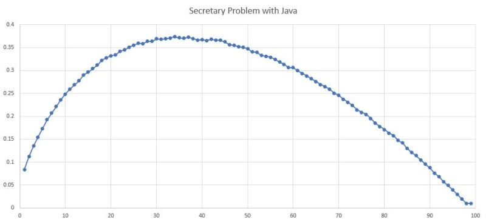

---
title: "Simulating the Secretary Problem with Java"
date: 2018-09-09T00:00:00Z
draft: false
description: "You might have noticed that I like reading books. I have recently read “Algorithms to Live By: The Computer Science of Human Decisions” which absolutely…"
categories: ["Algorithms", "Books", "Java"]
cover:
  image: "images/simulating-secreatary-problem.jpg"
  alt: "Simulating the Secretary Problem with Java"
aliases:
  - "/2018/09/09/simulating-the-secretary-problem-with-java/"
ShowToc: true
TocOpen: false
---You might have noticed that I like reading books. I have recently read *“Algorithms to Live By: The Computer Science of Human Decisions”*which absolutely fascinated me! The book mentions a famous [optimal stopping (Wikipedia)](https://en.wikipedia.org/wiki/Optimal_stopping) problem called Secretary Problem. In this blog post, I will explain it and then we will have some fun simulating it with Java. Let’s see if we can find *a solution* by brute force!

## Secretary Problem Defined

Imagine that you need to hire a secretary. Imagine now that you have 100 candidates that you are going to interview. Because you are a perfect interviewer, you can compare every single person against everyone else that you have seen so far. After the interview, you have to either hire the person or reject. If you reject, you can’t change your mind. You win if you have managed to hire the best candidate out of the whole lot.

[Wikipedia defines the problem](https://en.wikipedia.org/wiki/Secretary_problem#Formulation) more formally:

- *There is a single position to fill.*
- *There are n applicants for the position, and the value of n is known.*
- *The applicants, if seen altogether, can be ranked from best to worst unambiguously.*
- *The applicants are interviewed sequentially in random order, with each order being equally likely.*
- *Immediately after an interview, the interviewed applicant is either accepted or rejected, and the decision is irrevocable.*
- *The decision to accept or reject an applicant can be based only on the*
- *relative ranks of the applicants interviewed so far.*
- *The objective of the general solution is to have the highest probability of selecting the best applicant of the whole group. This is the same as maximizing the expected payoff, with payoff defined to be one for the best applicant and zero otherwise.*

Why is this fascinating? Because it is not trivial and not too dissimilar from other decisions we make in life! Buying a house, finding a life-partner, staying in your career… All of these can be viewed as *optimal stopping* problems, or even as a variation of *the Secretary Problem*.

## Simulating the Secretary Problem with Java

I decided to have some fun and model the situation in Java. I will start by creating a *SecretaryProblem* class:

```

package com.e4developer.secretary;

import java.util.Random;

public class SecretaryProblem {

    private double[] candidates;
    private double best = Double.MIN_VALUE;
    private final Random random;

    private SecretaryProblem(Random random){
        this.random = random;
    }

    /**
     * Generating random secretary problem based on a given size
     * @param size
     * @return
     */
    static SecretaryProblem generate(int size, Random random){
        SecretaryProblem sp = new SecretaryProblem(random);
        sp.candidates = new double[size];
        for(int i = 0; i < size; i++){
            double v = sp.random.nextDouble();
            if(sp.best < v)
                sp.best = v;
            sp.candidates[i] = v;
        }
        return sp;
    }

    public double[] getCandidates() {
        return candidates;
    }

    public double getBest() {
        return best;
    }
}

```

Now, I know that the optimal solution to this is to keep interviewing candidates, skipping everyone and at some point make a decision that we are ready to commit. Once we are ready, we will hire the next person that is better than everyone seen so far. This is implemented in my *SecretaryProblemSolver* class:

```

package com.e4developer.secretary;

public final class SecretaryProblemSolver {

    private SecretaryProblemSolver(){}

    /**
     * Solving the secretary problem by committing to the best so far
     * after specified hire point
     * @param sp
     * @param hirePoint
     * @return
     */
    public static boolean simpleSolve(SecretaryProblem sp, int hirePoint){
        double bestSoFar = Double.MIN_VALUE;
        for(int i = 0; i < sp.getCandidates().length; i++){
            if(sp.getCandidates()[i] > bestSoFar) {
                bestSoFar = sp.getCandidates()[i];
                if(i > hirePoint)
                    return bestSoFar == sp.getBest();
            }
        }
        return sp.getCandidates()[sp.getCandidates().length-1] == sp.getBest();
    }
}

```

To finish the attempt at finding the solution, I wire-up the code in the *Main* class:

```

package com.e4developer.secretary;

import java.util.Random;

public class Main {

    public static void main(String[] arg){
        System.out.println("Welcome to the secretary problem");

        final int problemSize = 100;
        final double sampleSize = 100000;
        final Random random = new Random(7);

        for(int i = 1; i < problemSize; i++){
            double success = 0;
            for(int j = 1; j < sampleSize; j++){
                SecretaryProblem sp = SecretaryProblem.generate(problemSize, random);
                boolean solved = SecretaryProblemSolver.simpleSolve(sp, i);
                if(solved)
                    success++;
            }
            System.out.println(i+", "+success/sampleSize);
        }
    }
}

```

## Secretary Problem with Java – the results

After tunning the code for 100 different *commit-point*, I came up with the following success rates:



I have found that **committing after the 37th candidate works best** and gives us about a **37% chance of finding the best candidate**!

## What does the math say?

Secretary problem is solved and well understood. We know that we should always commit after seeing about 37% of candidates and that this would give us about a 37% chance of success! Great to see that our little Java brute-force confirms that (it means we did it right).

Why 37%? Well… *1/e* equals about 0.367879. Why is this the magical stopping point? If you have stomach for some hardcore mathematics, I [refer you to Wikipedia here](https://en.wikipedia.org/wiki/Secretary_problem#1/e-law_of_best_choice)!

It is worth noting that this ~37% rule for a stopping point and the rate of success holds for any sizes of the candidate pool- be it 100 or 1000000!

The really fascinating thing is that our adventure with the secretary problem does not have to end here. We can easily modify the problem and look at how this impacts the solution and resulting curve. Modelling can often reveal insights that can take longer to discover with a strictly mathematical approach.

## Summary

I hope you enjoyed this little write up on the Secretary Problem. I am planning to return to it in the future and see how we can model modified versions of the problem.

In the meantime, if you like problems like that, I recommend you to check out *“Algorithms to Live By: The Computer Science of Human Decisions”* which is so far my favourite book I read this year! I will definitely be borrowing more from it and this is not the last attempt at modelling that you will see on this blog.

Till the next time!
