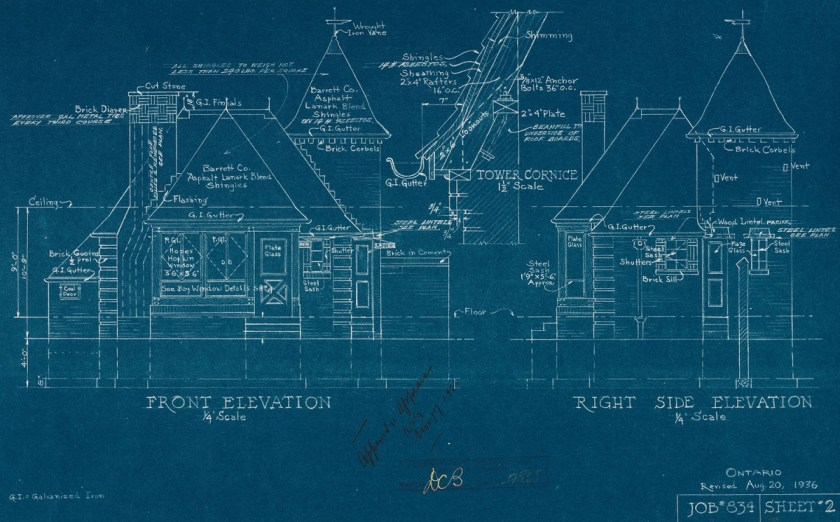

---
title: "Spring Cloud - Blueprint for Successful Microservices"
date: 2018-01-22T00:00:00Z
draft: false
description: "Introducing Spring Cloud and its different parts. Learn what you can do with Spring Cloud and why it helps you succeed with microservices architecture."
categories: ["Architecture", "Microservices", "Spring Cloud"]
cover:
  image: "images/spring-cloud-logo.png"
  alt: "Spring Cloud - Blueprint for Successful Microservices"
aliases:
  - "/2018/01/22/spring-cloud-blueprint-for-successful-microservices/"
ShowToc: true
TocOpen: false
---If you are interested in building Microservices in the JVM ecosystem- you have to check out Spring Cloud. Spring Cloud is a project which goal is to make Microservices architecture and patterns simple and practical to use. Spring Boot provides opinionated way of making a Microservice, Spring Cloud gives you an opinionated framework for getting your architecture around them.

### The Scope of Spring Cloud

Spring Cloud is a large project that is difficult to talk about as a whole. It is easier to look at individual components and see what they bring to the table. One great thing about Spring Cloud is that you are free to mix and match the components. You may for example want to use Spring Cloud Config server and nothing else. You can even use that with non-Java based microservices. Here are the parts of Spring Cloud with brief descriptions of what they do:

- **Spring Cloud Config –**Git or local file based configuration server. It provides support for encryption, refreshing of configuration and seamless integration with any Spring Boot based application. JSON and other endpoints are supported.
- **Spring Cloud Netflix –**Battle tested Netflix components including Service Discovery (Eureka), Circuit Breaker (Hystrix), Intelligent Routing (Zuul) and Client Side Load Balancing (Ribbon).
- **Spring Cloud Consul –**Consul integration for Spring Boot apps. It provides Service Discovery, Distributed Configuration and Control Bus.
- **Spring Cloud Security –**OAuth2 security for Spring Boot, providing single sign on, token relay and token exchange. It also enables declarative model which can be implemented to secure your services in more fine-grained fashion.
- **Spring Cloud Sleuth –**Distributed tracing, latency, logs. It borrows heavily from Dapper, Zipkin and HTrace. Your go-to tool for debugging and investigating performance of your services.
- **Spring Cloud Stream –**Framework for building message driven microservices. If you heard about orchestration, this is the place to start. It enables you to seamlessly integrate Kafka, RabbitMQ and other message brokers into your system.
- **Spring Cloud Task –**Enables development and running of short lived microservices. This is how you can implement the ‘serverless computing’ model with Spring Cloud. Think AWS lambdas.
- **Spring Cloud Dataflow –** Toolkit for data integration and real-time data processing pipelines. It can work closely with Spring Cloud Stream or Spring Cloud Task.
- **Spring Cloud Zookeeper –**Apache Zookeeper integration for Spring Boot apps. It helps with problems like Service Discovery and Distributed Configuration.
- **Spring Cloud for AWS –**Makes integration with Amazon Web Services easier. The idea is to build the application around the hosted services without having to care about infrastructure or maintenance. It connects Messaging and Caching Spring APIs with AWS.
- **Spring Cloud Spinnaker –**It makes deploying Spinnaker easily. This is for Multi-Cloud configuration mainly.
- **Spring Cloud Contract –**This is umbrella project that helps implementing Consumer Driven Contracts in Spring Cloud.

### The idea of a microservice architecture blueprint

I find the Spring Cloud proposition very tempting. What I think is still lacking in microservices environment is set of standard best practices, tools and frameworks that are guaranteed to work together and are maintained together. The sort of **microservices blueprint for success**. Well, I should not say that this is lacking, as I believe Spring Cloud is that blueprint for success in microservices. Of course, I am not being naive here- there are multiple prerequisites for microservices pattern to succeed, but at least with Spring Cloud, you have the technical choices nailed down. To drive the point home, the big advantages for going with Spring Cloud are:

- **Proven solutions**– large parts of the framework come from places like Netflix where they were pushed to their limits and battle tested
- **They are tested and work well together-** Going the Spring Cloud route, you are going the standard route
- **Good community behind these projects**– you can get help and find plenty of resources explaining how to do things
- **Spring Boot is already a massive success**– these technologies are going to work well with Spring Boot
- **Scope and quality of the components**– you are well covered here with most microservices problems solved in beautiful ways
- **Opinionated framework**– there are conscious design decisions made by the framework that steer you in the right direction

With all these benefits I believe that Spring Cloud will do for microservices architecture what Spring Boot did for *the microservice* itself. Standardize it, make it better and more pleasant to work with than ever… Also it will become more and more popular.

### So why is not everyone using it already?

If Spring Cloud is so amazing, why is not everyone using it already? I think it boils down to a few reasons:

- Many places that claim ‘microservices’ usage are not really using microservices. They are running what I would call decomposed monoliths making a lot of these capabilities unnecessary.
- Developers are often not empowered to make architectural decisions. Even though Spring Cloud is popular, people making decisions on what to use may still have biases towards more ‘enterprise’ offerings.
- Spring Cloud can be mixed and matched with other technologies. The fact that the whole project is not using Spring Cloud, does not mean that there is no trace of it there.
- It is still relatively new (2015) and more people are adopting it every year.

### Summary

Spring Cloud is a vast and impressive project. If you are interested in microservices development, you should be aware of what it has to offer. With a very active community and maintainers, it will only become more useful and popular. See what Spring Cloud has to offer next time you are faced with a microservices dilemma.
