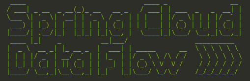
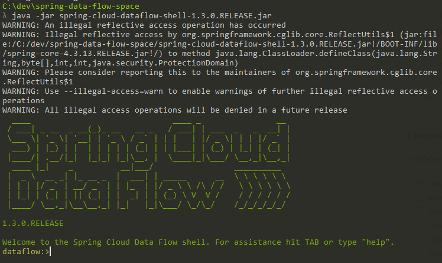
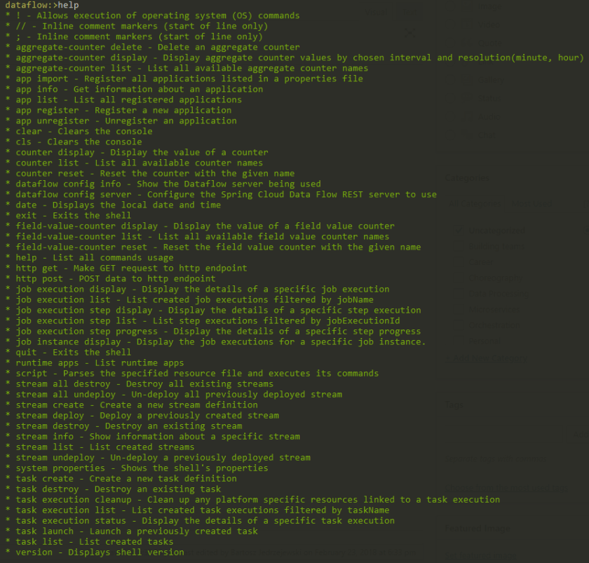
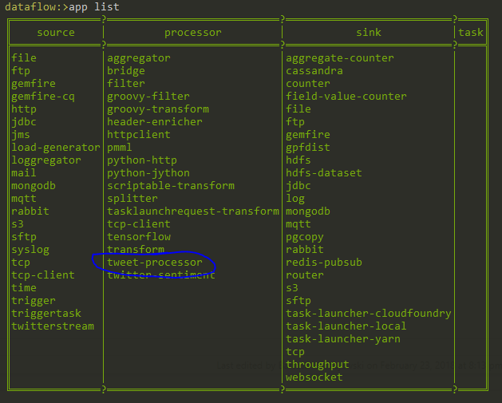
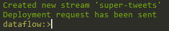
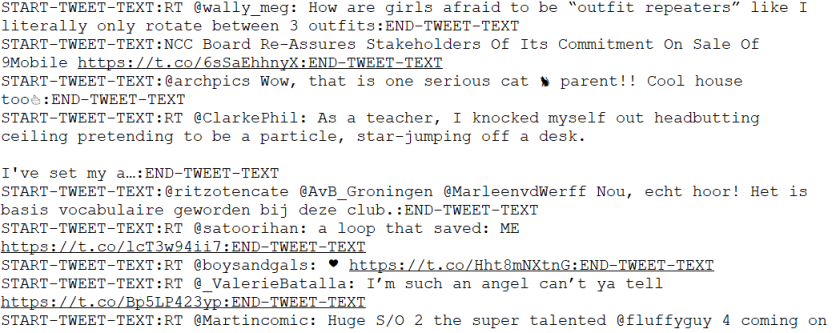

---
title: "Spring Cloud Data Flow - Making Custom Apps and Using Shell"
date: 2018-02-23T00:00:00Z
draft: false
description: "Learn how to use Spring Cloud Data Flow Shell and how to create custom Apps. Create a Stream Processor, register it and make it part of a new Stream."
categories: ["Orchestration", "Spring Cloud", "Spring Cloud Data Flow"]
cover:
  image: "images/Spring-Cloud-Data-Flow-Shell.png"
  alt: "Spring Cloud Data Flow - Making Custom Apps and Using Shell"
aliases:
  - "/2018/02/23/spring-cloud-data-flow-making-custom-apps-and-shell/"
ShowToc: true
TocOpen: false
---

Last week I wrote about getting Started with [Spring Cloud Data Flow](). This week I want to show you a few more things that you can do with this amazing platform. In this article I will show you how to make your own Apps that can be part of Data Flow Streams and how to use the Data Flow Shell to control the platform.

I assume here that you know how to get you Data Flow up and running and you are familiar with the basics of the platform. If not- don’t worry! Check out my [Getting Started with Spring Cloud Data Flow]() article to learn the basics.

### Introducing Spring Cloud Data Flow Shell

As you know, to control Data Flow you can use the graphical Dashboard available as part of the platform. Sometimes, this is not the most efficient way of working. You can download Shell application as well:

`wget https://repo.spring.io/release/org/springframework/cloud/spring-cloud-dataflow-shell/1.3.1.RELEASE/spring-cloud-dataflow-shell-1.3.1.RELEASE.jar`

I would go as far as saying that you should download the Shell if you are serious about working with the Data Flow. Once you have it on your machine it can be run like any other jar from the command line:

`java -jar spring-cloud-dataflow-shell-1.3.1.RELEASE.jar`

If it started successfully you should see the following screen:



What can you do with the Shell? Most of the things that you can do with the Graphical Dashboard, but often faster and more reliably. You don’t get the *graphical* analytics for obvious reasons. To see what sort of command you have at your disposal you can type `help`:



Lets now build a custom application before we start playing with the Shell. We will use the Shell later to register that App and build a new Stream.

### Building Custom App for Spring Cloud Data Flow

Building Apps for Spring Cloud Data Flow is very simple. If you are familiar with Spring Cloud Stream, you already know how to do it! A quick reminder- there are three types of Apps that you can create:

- **Source** – These are the available sources of data. You start your streaming pipelines from them.
- **Processor** – These take data and send them further in the processing pipeline. They sit in the middle.
- **Sink** – They are the endpoints for the streams. This is where the data ends in the end.

These three concepts are understood by Spring Cloud Stream as well.

I want to create a simple Stream that takes sample of Tweets from Twitter, extracts just the text and saves that all to a file. [Spring Cloud Data Flow Starters](https://cloud.spring.io/spring-cloud-stream-app-starters/) already give me the Twitter *Source* and a File *Sink*. That means that I need to write a *Processor* that would extract just the text from each individual tweet, mark the start and the end and send that to the *Sink*.

Lets start with the POM file. We need the standard Spring Cloud Stream dependencies. Since the POM is not too large I will show it here in its entirety (if you would like to just copy paste):

```

<?xml version="1.0" encoding="UTF-8"?>
<project xmlns="http://maven.apache.org/POM/4.0.0" xmlns:xsi="http://www.w3.org/2001/XMLSchema-instance"
	xsi:schemaLocation="http://maven.apache.org/POM/4.0.0 http://maven.apache.org/xsd/maven-4.0.0.xsd">
	<modelVersion>4.0.0</modelVersion>

	<groupId>com.e4developer</groupId>
	<artifactId>tweet-processor</artifactId>
	<version>0.0.1-SNAPSHOT</version>
	<packaging>jar</packaging>

	<name>tweet-processor</name>
	<description>Demo project for Spring Boot</description>

	<parent>
		<groupId>org.springframework.boot</groupId>
		<artifactId>spring-boot-starter-parent</artifactId>
		<version>1.5.10.RELEASE</version>
		<relativePath/> 
	</parent>

	<properties>
		<project.build.sourceEncoding>UTF-8</project.build.sourceEncoding>
		<project.reporting.outputEncoding>UTF-8</project.reporting.outputEncoding>
		<java.version>1.8</java.version>
		<spring-cloud.version>Edgware.SR2</spring-cloud.version>
	</properties>

	<dependencies>
		<dependency>
			<groupId>org.springframework.boot</groupId>
			<artifactId>spring-boot-starter-actuator</artifactId>
		</dependency>
		<dependency>
			<groupId>org.springframework.cloud</groupId>
			<artifactId>spring-cloud-starter-stream-rabbit</artifactId>
		</dependency>

		<dependency>
			<groupId>org.springframework.boot</groupId>
			<artifactId>spring-boot-starter-test</artifactId>
			<scope>test</scope>
		</dependency>
		<dependency>
			<groupId>org.springframework.cloud</groupId>
			<artifactId>spring-cloud-stream-test-support</artifactId>
			<scope>test</scope>
		</dependency>
	</dependencies>

	<dependencyManagement>
		<dependencies>
			<dependency>
				<groupId>org.springframework.cloud</groupId>
				<artifactId>spring-cloud-dependencies</artifactId>
				<version>${spring-cloud.version}</version>
				<type>pom</type>
				<scope>import</scope>
			</dependency>
		</dependencies>
	</dependencyManagement>

	<build>
		<plugins>
			<plugin>
				<groupId>org.springframework.boot</groupId>
				<artifactId>spring-boot-maven-plugin</artifactId>
			</plugin>
		</plugins>
	</build>


</project>

```

And now the only file you actually have to edit manually in order to build this custom App. If you are using a good IDE that POM can be generated by an integrated [Spring Initializr](https://start.spring.io/). The `TweetProcessorApplication` in its entirety:

```

package com.e4developer.tweetprocessor;

import com.fasterxml.jackson.core.type.TypeReference;
import com.fasterxml.jackson.databind.ObjectMapper;
import org.springframework.boot.SpringApplication;
import org.springframework.boot.autoconfigure.SpringBootApplication;
import org.springframework.cloud.stream.annotation.EnableBinding;
import org.springframework.cloud.stream.annotation.StreamListener;
import org.springframework.cloud.stream.messaging.Processor;
import org.springframework.cloud.stream.messaging.Sink;
import org.springframework.messaging.handler.annotation.SendTo;

import java.util.Map;

@EnableBinding(Processor.class)
@SpringBootApplication
public class TweetProcessorApplication {

	public static void main(String[] args) {
		SpringApplication.run(TweetProcessorApplication.class, args);
	}

	@StreamListener(target = Sink.INPUT)
	@SendTo(Processor.OUTPUT)
	public String extractUrls(String tweet) throws Exception {
		ObjectMapper mapper = new ObjectMapper();
		Map<String, Object> tweetMap = mapper.readValue(tweet, new TypeReference<Map<String,Object>>(){});
		return "START-TWEET-TEXT:"+tweetMap.get("text")+":END-TWEET-TEXT";
	}
}

```

You can notice the key annotation: `@EnableBinding(Processor.class)`that marks this application as a *Processor*. The other interesting are the `@StreamListener(target = Sink.INPUT)` and `@SendTo(Processor.OUTPUT)`annotations. You may wonder- which *INPUT* and *OUTPUT* does this actually link to? Is there any need to configure anything? Great news! There is no configuration whatsoever needed here. **This is all for Data Flow to be configured when the App is used as part of a Stream.**

I made this App [available on GitHub](https://github.com/bjedrzejewski/tweet-processor/tree/custom-task) if you want to clone it.

### Adding Custom App to a Data Flow Stream

Now that we have the simple `TweetProcessorApp` it is time to add it to the Data Flow. The first thing we will do is install it into our local Maven repository. You are probably familiar with Maven, but just in case: go the project directory and run the command:

`mvn install`

If this ends with SUCCESS, then you have the app available in your local Maven repository.

To install the App you need to know its maven coordinates. In this case the project is defined in the POM as follows:

```

	<groupId>com.e4developer</groupId>
	<artifactId>tweet-processor</artifactId>
	<version>0.0.1-SNAPSHOT</version>
	<packaging>jar</packaging>

```

Making the Maven URI look like that: `maven://com.e4developer:tweet-processor:0.0.1-SNAPSHOT`. With that knowledge, lets open the Data Flow Shell once again and type:

`dataflow:>app register --name tweet-processor --type processor --uri maven://com.e4developer:tweet-processor:0.0.1-SNAPSHOT`

This will register the app under the name tweet-processor. You should see the message: *“Successfully registered application ‘processor:tweet-processor'”*, but lets just be double sure here and play a bit more with the Shell itself. Type into the shell:

`app list`

to see all the registered apps, and among them the `tweet-processor`:



Now it is time to create that Stream. This is going to be quite a large command. When using `twitterstream` App from the starter apps you need to provide it with different keys from your twitter account. To get yourself one check out the [Twitter Application Management page](https://apps.twitter.com/).

To create and deploy a Stream from the Shell you need the following command:

`stream create STREAM_NAME --definition  "STREAM_DEFINITION" --deploy "true"`

The definition of the Stream we described (Read tweets -> get the text -> save to a file) follows:

`twitterstream --access-token-secret=SECRET --access-token=SECRET --consumer-secret=SECRET --consumer-key=SECRET --stream-type=sample | tweet-processor | file --directory=c:\scdf`

Of course for this to actually work you need to replace the SECRET with relevant secrets that you can get from your Twitter Application Page.

By combining the definition and deployment command we get:

`stream create super-tweets --definition "twitterstream --access-token-secret=SECRET --access-token=SECRET --consumer-secret=SECRET --consumer-key=SECRET --stream-type=sample | tweet-processor | file --directory=c:\scdf" --deploy "true"`

Once this gets written into the Shell we should see:



And the Stream should be deployed and working! You can see all these crazy Tweet messages being saved in `c:\scdf`:



### Summary

What you have read here is quite simple, but very important. Defining custom Apps lays at the core of what Spring Cloud Data Flow can be used for. Using Shell for working with the platform can be incredibly useful. With this knowledge you will be able to start doing some very powerful things with Data Flow. In the future articles I will look at more complex Streams and the built Analytics that you get with the Spring Cloud Data Flow.
