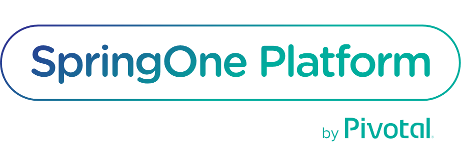

---
title: "Spring Cloud Data Flow - Use Cases"
date: 2018-02-28T00:00:00Z
draft: false
description: "Spring Cloud Data Flow can be used for many things- orchestrating event streams, batch processing, data analytics and more. In this article I look at that and examples of different companies using Spring Cloud Data Flow in production."
categories: ["Architecture", "Orchestration", "Spring Cloud", "Spring Cloud Data Flow"]
cover:
  image: "images/s1p-logo.png"
  alt: "Spring Cloud Data Flow - Use Cases"
aliases:
  - "/2018/02/28/spring-cloud-data-flow-use-cases/"
ShowToc: true
TocOpen: false
---

I have recently spent quite a lot of time playing with Spring Cloud Data Flow (SCDF). It is an amazing platform that can be used for many things. Talking about it with some of my colleagues I realized that not everyone knows what are the common use cases. Thinking about it further I realized that I don’t know the full scope of capabilities and business problems that it can solve! In this article I look at different uses for Spring Cloud Data Flow based on what the platform offers and actual stories from companies using it in production. The examples come from [Spring One Platform 2017](https://springoneplatform.io/2017) conference.

Before going into use cases lets just make sure that we understand what Spring Cloud Data Flow is. Taken from the official website:

> Spring Cloud Data Flow is a toolkit for building data integration and real-time data processing pipelines.
>
> Pipelines consist of [Spring Boot](https://projects.spring.io/spring-boot/) apps, built using the [Spring Cloud Stream](https://cloud.spring.io/spring-cloud-stream/) or [Spring Cloud Task](https://cloud.spring.io/spring-cloud-task/) microservice frameworks. This makes Spring Cloud Data Flow suitable for a range of data processing use cases, from import/export to event streaming and predictive analytics.

Really, I could not be more concise and precise here. If you are curious about familiarizing yourself more with the Data Flow I wrote a [Getting Started article]() on this blog. With the basics established, we can look at what such a powerful platform can be used for.

## What can Spring Cloud Data Flow be used for?

Lets explore the core things that can be done with Spring Cloud Data Flow

- **ETL processing between file systems and databases** – Being a platform for orchestration, building *Extract, Transform, Load*(ETL) processes is one of the core strength of Spring Cloud Data Flow. These ETL’s can be made real-time with streaming or as a batch processes. GUI designer makes designing the workflows easy and enjoyable.
- **Building real time data analytics –**Because it is so easy to create and configure the pipelines, Data Flow can be used for building real time analytics. There are multiple good example uses of twitter analytics.
- **Integrating data oriented microservices** – Moving data between microservices is made easier with the platform. Microservices are supposed to own their own data, but that does not mean, that the data does not have to be moved. This can be seen as a sub-case of the ETL use case.
- **Event streaming** – If you want to use messaging in your system, but you want to have only explicit flows (as opposed to the choreographed approach), Spring Cloud Data Flow is the tool that you were looking for.

## What are different companies using Spring Cloud Data Flow for?

This section focuses on documented use cases from real world production deployments of Spring Cloud Data Flow. All the talks and videos here are from the [SpringOne Platform 2017 by Pivotal](https://springoneplatform.io/2017). Big thanks to [Pivotal](https://pivotal.io/) for making them [available on YouTube](https://www.youtube.com/watch?v=_uB5bBsMZIk&list=PLAdzTan_eSPQ2uPeB0bByiIUMLVAhrPHL)!

##### CoreLogic – Batch processing of risk calculations

Batch processing is a perfect candidate for modernization with Spring Cloud Data Flow. CoreLogic gave an excellent presentation about their journey with the platform that concluded with new feature delivered to production in much faster time than it was possible before:

##### Health Care Service Corporation – Large Scale ETL processing

HCSC is making use of Spring Cloud Streams for processing vasts amounts of data in a Cloud native environment. They also gave a great presentation at SpringOne Platform, although they don’t mention Spring Cloud Data Flow there. Given that Spring Cloud Stream is a core component of the Data Flow I still think this is a very informative presentation, and definitely worth watching when talking about Data Flow use cases:

##### Charles Schwab – Processing Trade Events

At SpringOne Platform, Charles Shwab gave a presentation explaining that they use Spring Cloud Data Flow for processing their trade events in real time. You can watch the presentation here, although it focuses mostly on tracing with Sleuth and Zipkin (interesting in its own rights) in the context of asynchronous processing:

##### BONUS: Liberty Mutual – Deconstructing monolith with Domain Driven Design

This presentation is about much more than Spring Cloud Stream, but if you are thinking to make use of Domain Driven Design, deconstructing monoliths or event sourcing, it is an amazing watch:

## Summary

Spring Cloud Data Flow is a tool that has many uses cases- orchestrating event streams, batch processing, data analytics and more. What is reassuring is that despite being a relatively new product it is being adopted all over the world by world class organisations. With an extensive production-use it becomes a viable choice as a data integration tool for modern companies. I am absolutely sure that in the coming months and years we will see more fascinating use cases of the platform as it gains popularity. **If you are using Spring Cloud Data Flow in production already- let us know in the comments!**
