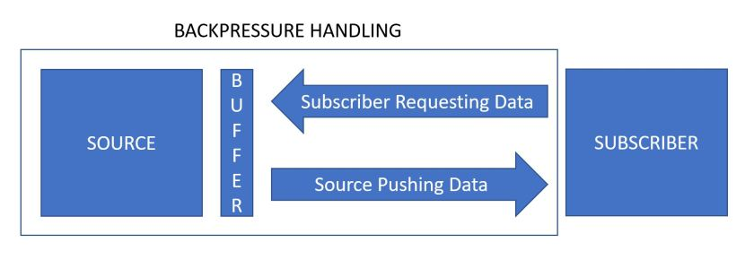

---
title: "Spring’s WebFlux / Reactor Parallelism and Backpressure"
date: 2018-04-28T00:00:00Z
draft: false
description: "Spring Boot 2.0 (and Spring 5) introduced WebFlux as a way to build reactive Microservices. WebFlux is built using Reactor, which introduces completely new…"
categories: ["Microservices", "Reactive", "Spring Boot"]
cover:
  image: "images/pressure.jpg"
  alt: "Spring’s WebFlux / Reactor Parallelism and Backpressure"
aliases:
  - "/2018/04/28/springs-webflux-reactor-parallelism-and-backpressure/"
  - "/springs-webflux-reactor-parallelism-and-backpressure/"
ShowToc: true
TocOpen: false
---Spring Boot 2.0 (and Spring 5) introduced WebFlux as a way to build reactive Microservices. WebFlux is built using Reactor, which introduces completely new ideas to Spring Boot parallelism. Backpressure, Schedulers, and Parallel Flux are a few concepts that we will look at closer in order to understand how to make the most of our reactive services.

I have recently written articles on [Getting Started with WebFlux]() and [Concurrency in Spring Boot](). One thing that I did not explore enough in these articles were the concurrency implications of building a WebFlux based reactive microservice.

If you are completely new to WebFlux I recommend reading the previously mentioned articles. If you have the basic ideas down- let’s see how we can make the best use of concurrency in this framework!

### What is Backpressure?

WebFlux is based on Reactor, which is a [reactive-stream](http://www.reactive-streams.org/) implementation. One of the main selling points of reactive-streams is handling of the backpressure. But what is backpressure?

Backpressure is a way of dealing with a data stream that may be too large at times to be reliably processed. The goal is to feed the data to subscribers at the rate at which they can reliably deal with that data. The unprocessed data can be buffered (or we could choose different strategy), hence the pressure analogy! Think of a water pressure and a firefighter’s hose as in the featured picture. Firefighter only lets as much *water* out as she can deal with.

Let’s get more technical. The idea behind reactive streams is to enable the pull-push hybrid approach to data streams. A subscriber can request a specific amount of data, while the source can push that data in a configured way. If the data stream is too large, the data waiting for processing is handled by a buffering strategy. The illustration of that can be seen in the picture below:



Enough theory, let’s see how these ideas translate to Reactor and WebFlux.

### How to limit the number of items being processed?

One of the main ways of dealing with backpressure is implementing a custom `BaseSubscriber` that deals with requesting data as necessary. The basic idea looks like this:

```

public class BackpressureReadySubscriber<T> extends BaseSubscriber<T> {

    public void hookOnSubscribe(Subscription subscription) {
        //requested the first item on subscribe
        request(1);
    }

    public void hookOnNext(T value) {
        //process value
        //processing...
        //once processed, request a next one
        //you can implement specific logic to slow down processing here
        request(1);
    }
}

```

And then, you can `subscribe` to a `source` as per usual:

```

BackpressureReadySubscriber<String> bSubcriber = new BackpressureReadySubscriber<>();
Flux<String> source = stringbasedSource();
source.subscribe(bSubcriber);


```

When manually creating a subscriber, make sure to request enough data so that your `Flux` does not get stuck. You want to have at least one `request()`being called from the `hookOnNext()` method.

### What about the parallelism?

What happens when you request more data to be processed? Can you have more data processed asynchronously? Even if you attempt to get more data being processed in parallel by calling `request()` from your custom `BaseSubscriber` it won’t work unless you are using a `ParallelFlux`.

The good news is- getting a `ParallelFlux` is simple! All you need to do is to call the `parallel()` method on the standard `Flux` as in the example below:

```

Flux.range(1, 1000)
        .parallel(8)
        .runOn(Schedulers.parallel())
        .subscribe(i -> System.out.println(i));

```

Calling the `parallel()` method may not be enough for parallelism if you don’t have enough threads to allocate your workload to.  This is nicely explained in the [Reactor reference documentation](https://projectreactor.io/docs/core/release/reference/docs/index.html):

> To obtain a ParallelFlux, you can use the parallel() operator on any Flux. By itself, this method does not parallelize the work. Rather, it divides the workload into “rails” (by default, as many rails as there are CPU cores).

So how can we enable for this parallelized work to be executed in parallel? One thing that you may notice in the code above is the use of `.runOn(Schedulers.parallel())`…

### How to deal with threads – introducing Schedulers

Threads always were the core tool for dealing with multi-threading in JVM. Even when dealing with a modern framework such as Reactor, there is no escape from the reality that the work has to happen on some specified thread.

Reactor gives you the power to choose which threads to allocate to specific tasks so that you run an optimal amount of threads for your server. **Schedulers** are a concept from Reactor that lets you specify with which thread pool will a task be executed.

To give you an idea of things at your disposal let’s look at available Schedulers:

- `Schedulers.immediate()` – the current thread
- `Schedulers.single()` – a single reusable thread. This will re-use the same single thread until the Scheduler is disposed of.
- `Schedulers.newSingle()` – a single, dedicated thread.
- `Schedulers.elastic()` – creates new worker pool as needed and reuses the idle ones. Idle threads (default 60s) are disposed of.
- `Schedulers.parallel()` – you can create a specific number of threads for that Scheduler. It defaults to your CPU cores.

As you can see, you have plenty of flexibility in deciding how you will allocate your work across different Schedulers. With this flexibility comes a requirement of understanding these concepts. You need to make sure that all developers working with the code know about your scheduling strategies to get the most out of reactive services.

### What about the overflow?

The standard way of dealing with overflow in your backpressure is to buffer that data. Normally, you expect your processing power to eventually be fast enough to deal with whatever comes its way.

What happens if this is not the case? If you are dealing with a stream that can consistently overwhelm your consumers? If you try to buffer it, that buffer will grow forever resulting in a foreseeable `OutOfMemoryError`.

Don’t worry! Reactor has you covered. If you are dealing with one of those tricky cases, you may `create` your own Flux, choosing a viable overflow strategy. Creating Flux and details of that deserves its own article, so I will simply refer you to the [Reactor Flux reference documentation](https://projectreactor.io/docs/core/release/reference/#producing).

What overflow strategies are at your disposal? Here is the list:

- `IGNORE` – Ignores downstream requests and pushes the data anyway. That may result in `IllegalStateException` so think twice before using it!
- `ERROR` – throws `IllegalStateException` if the downstream can’t keep up.
- `DROP` – drops the signal if the downstream can’t receive it.
- `LATEST` – only allows the latest signal from upstream.
- `BUFFER` – the default – buffers all signal until you run out of memory.

If you are interested in dealing with streams potentially too large to process (think massive analytics, twitter stream) you may look into `DROP` and `LATEST` to still build a service that works.

### Hot and Cold publishers

The last topic worth looking into when exploring Reactor parallelism is the idea of Hot and Cold publishers.

Most of the publishers that you see in these examples are **cold publishers.** Cold means, that the data will be generated a new with each subscription. In this case- subscription generates data. As Reactor says: *nothing happens until you subscribe*.

In contrast to that, **hot publishers**do not depend on subscribers. They can publish data all the time not caring if any subscriber is there. In hot publishers, subscribers will only see the data published after they subscribed. This is not true for cold publishers, where all the data is available (or created on subscription).

It is important to be aware of these two ideas, as they can massively impact the load that you are forecasting on your subscribers. Creating hot subscribers is explained in the [Hot vs Cold section](https://projectreactor.io/docs/core/release/reference/#reactor.hotCold) of the reference documentation.

Most of the streams you will create will by default be of the cold kind.

### Summary

There is a lot of ground to cover here. In order to be confident that you understood how threading, parallelism and backpressure all work together in WebFlux / Reactor make sure you understand:

- What is backpressure
- How to limit the number of data requested
- How to limit to deal with buffer/overflow
- What role parallelism plays
- What are Schedulers
- What are Hot and Cold publishers

If you understand these concepts well, you are well on your way to mastering handling backpressure in reactive microservices!
