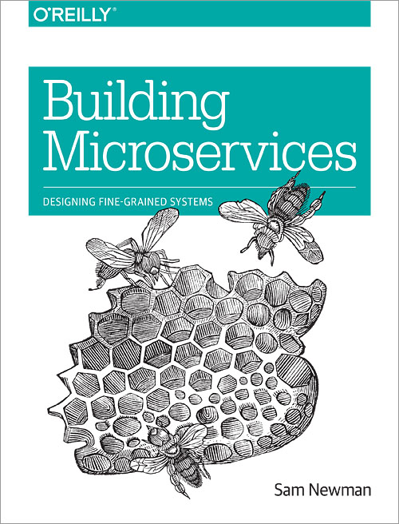

---
title: "Starting with Microservices: Read “Building Microservices”"
date: 2018-01-24T00:00:00Z
draft: false
description: "Review of Building Microservices by Sam Newman. Explanation what makes a good introductory book to microservices and why you should read this one."
categories: ["Architecture", "Books", "Microservices"]
cover:
  image: "images/building-microservices.jpg"
  alt: "Starting with Microservices: Read “Building Microservices”"
aliases:
  - "/2018/01/24/starting-with-microservices-read-building-microservices/"
ShowToc: true
TocOpen: false
---

A lot of people want to start working with Microservices and don’t quite know where to start. I remember being there- finding that my next project is going to use microservices architecture and I should get familiar with it. Of course, I heard about microservices before and I have read some blog posts, but I felt that my knowledge had major gaps. If you are in this situation- worry no more! Just get yourself a copy of *“Building Microservices”* by Sam Newman and read it! Continue to find out more why I think this book has you covered.

### Criteria for a good Microservices Introduction book

The first book you read about microservices should be language agnostic. I don’t recommend picking up something that tells you how to get your *NodeJS microservices* to rule the world or how *Kafka Streaming* will forever change the way you build your *choreography*. You will end up spending too much time focusing on technical details and not enough appreciating the intent behind the patterns and solutions.

- **Criteria One – Language Agnostic**

Another thing that is a must is a broad coverage. It can be very dangerous to go into microservices with a limited idea of what is out there. As they say- if all you have is a hammer, everything looks like a nail… If all you have is a *REST API* then everything looks like a case for *orchestration.*

- **Criteria Two – The book should provide broad coverage of microservices topics**

The final thing that would be good if the book was not too wordy. If this is your starting book, you don’t need amazingly deep insight into these patterns- that will come as you start using them and seeing them in the real world. You want a clear and concise explanation that will motivate you to learn more.

- **Criteria Three – The book should be concise and easy to read**

### Building Microservices by Sam Newman – Review

The first thing you notice about the book is how small it is. Given that it is only 280 pages and of a rather small format makes it quite small. Don’t be fooled by that, the book is packed full of information. This is the main impression that I was left after reading it- a marvel of how much is out there to learn and understand. If you are relatively new to microservices, this is an absolute treasure trove of knowledge and best practices.

Sam Newman does not focus on specific languages. What he does though is he takes a lot of examples from projects that he has worked on which makes this book ring very true for experienced developers. This approach makes the book relevant to developers coming from multiple backgrounds. Examples and real experience from the author give credibility to his opinions and advice.

The thing that I am most impressed with is the breath that is being covered here. Just by looking at the Table of Contents we can see Chapters such as:

- What About Service-Oriented Architecture?
- No Silver Bullet
- Building a Team
- How to Model Services
- Implementing Asynchronous Event-Based Collaboration
- Authentication and Authorization
- Implementing Service Tests
- Many many more…

This is nowhere near the full scope of the book (that you can check out on the [official website](http://shop.oreilly.com/product/0636920033158.do)). The scope is very impressive and the fact that it is all packaged within the 280 pages leaves no space for waffle.

My favorite chapter was the one of Integration where we have a lot of crucial patterns discussed in an informed way. Too often you hear people saying- always use choreography (services reading and publishing to queues) instead of orchestration (services calling each other). There is a preference for one over the other, but real life rarely is that simple. This chapter makes strong cases for best practices (choreography) while explaining other approaches and how to make them work. There are some opinions on code reuse that I have wrote my own take on (as in the [blog post I published on Scott Logic website](http://blog.scottlogic.com/2016/06/13/code-reuse-in-microservices-architecture.html))- code reuse is still a hot topic when discussing microservices with others. Reading multiple sources and your own experience is what gives the best understanding of the issues. *Building Microservices*gives you a good starting point in nearly all microservice related topics!

One thing to be aware of is that this is an introduction book. It will make you aware of the breadth of the topic and teach you a lot, but it will not make you an expert in microservices design and architecture. I believe this misunderstanding made some people rate it a bit lower on Amazon. I don’t think it is reasonable to ask anyone to make you an expert in microservices in 280 pages, so I don’t see it as a drawback.

Overall, this is the best book that I know of for someone who wants to get started in microservices. It fulfills my criteria for a good microservices introduction and I highly recommend it.
