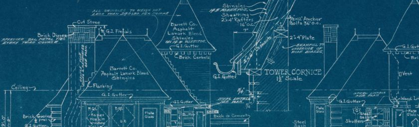

---
title: "Technical Architects - the role, the job and the value"
date: 2018-06-30T00:00:00Z
draft: false
description: "Technical Architect is a job that many people understand differently. Some people argue Technical Architects should only design systems, staying hands-off…"
categories: ["Architecture", "Building teams", "Career"]
cover:
  image: "images/nice-architecture.jpg"
  alt: "Technical Architects - the role, the job and the value"
aliases:
  - "/2018/06/30/technical-architects-the-role-the-job-and-the-value/"
ShowToc: true
TocOpen: false
---Technical Architect is a job that many people understand differently. Some people argue Technical Architects should only design systems, staying hands-off, while others would see them as being deeply involved in the development of systems. In here I will explore the role of Technical Architects, the job itself and the value they bring.

## The Role of a Technical Architect

All systems have technical architectures. Sometimes this architecture is decided and designed, other times- it happens by chance.

**On trivial projects, it may be perfectly ok for the architecture to just *“happen”***. If it takes two weeks to deliver the whole project, maybe it is ok to just roughly agree what needs building and that’s that!

**The idea of using just enough architecture** is clearly explained and reason in “*Design It! From Programmer to Software Architect” –* a *book* by Michael Keeling. I very much agree with this sentiment.

To keep this article on the topic, from now on, I will discuss a situation when the **project is of considerable complexity and the architecture is not an obvious choice**.

### Discovering technical architecture

As already discussed, all systems have some technical architecture. The problem is that this **architecture is often unknown to the team**! One of the tasks of architects is *discovering* this architecture.

**By discovering, I mean analysing and documenting** it in diagrams, designs or other artifacts that would enable a meaningful discussion about design.

This discovery part can include uncovering assumptions and dependencies that not everyone may be aware of. Before you can decide how to move forward in the future, you should know where you are at the present!

### Designing Software Systems

I agree with Robert C. Martin (Uncle Bob), that *designing* and *architecting*are the same thing. Yes, the word *architecture* is often used when talking about the larger scale, but software has fractal-like nature. The closer we look the more layers of abstractions we see.

**How do you decide which technical decisions are worthy of architects attention? These are the decisions, that have lasting effects.** Things that are difficult to change in the future.

One of the proposed ways to evaluate good architecture is the ease of maintaining the system. **The fewer developers you need to support and further develop new features, the better architecture you have.** This is, of course, subject to the system being fit for purpose.

We are not going to discuss system design in more details here, as numerous books were written on the topic and it may take a lifetime to master!

### Developers acting as architects

This section is titled **The Role of a Technical Architect**, as often, people who practice technical architecture have different job titles. This is perfectly ok! **The best teams have multiple people who can perform technical architecture**. It is absolutely crucial for developers to be aware of architecture and have some design skills.

While it is great to have multiple developers designing the system, **there is often a need for a dedicated technical architect**…

## The Job of a Technical Architect

When working on complex, enterprise-level systems, you often come across dedicated technical architects. The importance of the role and the value it brings is so high, that more and more you can see technical architects working on small to medium size systems as well. **Why is dedicated role useful, when developers can create designs as well?**

### Guardians of the architecture

Technical Architects are responsible for the technical architecture. It sounds trivial, but it is a key part of the job. There is a benefit in having a dedicated person make sure that the architecture that is being created is a good one.

**The architecture will be created regardless if anyone is paying any attention.** Technical architects should make key decisions, influence when necessary and stop any major architectural debt being created.

I will quote Robert C. Martin here:

> “The only way to go fast, is to go well.”

### Where technology meets business

Interfacing with business stakeholders and understanding a big picture is crucial to successful software delivery. In the ideal world, the whole team would be involved. Everyone would understand the big picture and the business team was always easy to interact with.

The reality of delivering complex software projects is often very different. The business challenges may be far more intricate for every single developer to have a deep understanding and business stakeholders may be spread across the globe. In that case, **you need someone to connect the dots and represent the technical team**.

**When the Technical Architect role starts to be more focused on solving business challenges, it is often called Solution Architect.** I don’t think there is a general agreement on the exact distinction between the two, but it is worth to be aware of it.

### A particular set of skills

When technical architecture is a large part of the project, not only it takes more effort to discover it and design it, it also gets more difficult. **While many developers make good architects, there is value in experience**.

Technical Architects who design and document systems constantly often produce **high-quality diagrams, documentation and make good design decisions** faster. A good technical architect is an amazing asset to the project that can make everyone life easier.

## The Value of a Technical Architect

Technical Architects are often well paid. A quick look at salary data shows that **architects on average get paid 30% more than developers in London**. Is that justified? One argument is that architects are often more experienced, hence the increased compensation.

I would like to make a value argument here as well…

### Delivering value that scales with the system

The value that most software developers deliver is based on the software they write. Fair enough. Often, this is an incredibly high value and good software developers are paid very well.

The value that Lead Developers / Technical Leads bring usually scale with the team. A good team with a good Lead Developer can become even better. That would make a good argument for Lead Developers to be worth a bit more than competent developers who don’t lead teams.

**The value of Technical Architect scales with the system.** The bigger, more expensive system, the bigger value can be derived from good architecture.

Imagine a system that costs £5,000,000 to deliver (not that uncommon in the enterprise). Let’s modestly argue that a good architecture could make the delivery 20% quicker… The system suddenly only costs £1,000,000 less! I know I am grossly oversimplifying, but at the same time, it is not far off the reality.

**Good architecture can make or break software projects. Software projects can often make or break entire companies!**

To make sure I am understood well- good technical architecture is also a result of a good development team and many other factors. Good technical architecture can make or break projects. T**echnical Architects have the ultimate responsibility for one of the most value impacting factors of the project**. Technical Architects are positioned to create or save an immense value.

## Summary

Technical Architects can be immensely valuable. Technical architecture is not only created by architects, however, architects bear responsibility for this architecture.

If you would like to learn more about technical architecture I wholeheartedly recommend:

- *“Clean Architecture”* – by Robert C. Martin
- *“Design It! From Programmer to Software Architect” –* by Michael Keeling
