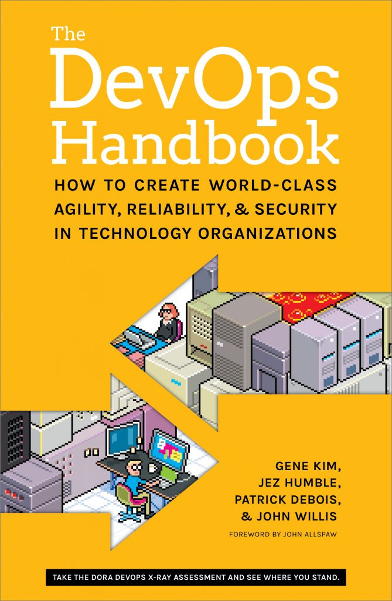

# The business case for Microservices

Microservices have won major following from technology enthusiasts all over the world. A couple weeks ago I was giving an introduction to Spring Cloud at one of [Scott Logic](http://www.scottlogic.com) breakfast technical talks (techie brekkies). All the developers in the room were interested and could see number of benefits and challenges with this, still rather new, approach. At the end of the session, during the question time I was asked by one of the business people in the room- *“So, what is the business case for this, what business problem does it solve?”*. It is easy to provide a few answers about scalability and maintainability of microservices, but I don’t think that speaks clearly to our business people. In this article I will look deeper into the business benefits provided by investing into microservices architecture.

Before going right into benefits and the business case, a word of caution. Microservices can be done wrong, IT projects often fail. If anything, microservices can be more complicated than the more traditional approaches. In this article I will not be examining this problem too much, and assume that after due diligence, microservices approach was suggested as a viable option by the engineers. So, given that you can chose microservices and they are recommended as a reasonable approach, what benefits for business do you get by choosing this new approach?

### Microservices architecture is build around the open source proposition

The first and quite a big benefit is that this is all free! Most microservices frameworks (like Spring Cloud for example) are build around Open Source platforms and ideology. I don’t think I need to go on explaining here why Open Source is great for everyone, including businesses. Moreover, this is not the kind of Open Source that nobody maintains and there is no Enterprise Support available if there is a need for it. Companies like Pivotal (creators of [Spring Cloud](http://projects.spring.io/spring-cloud/)) or Lightbend (responsible for [Lagom](https://www.lightbend.com/lagom-framework)) provide Enterprise grade support for their product. There are many others if you chose different frameworks/platforms.

I am sure that no one enjoys paying huge amount of money for complicated application servers and databases that are supposed to make all our problems disappear. The great news is that you really don’t need that anymore. Microservices are not only build on Open Source, but they are also proven at an enterprise and Internet scale.

If you actually have budget to spend some money regardless, it is better to utilize it into hiring more people instead or investing in training your own workforce. Microservices are still quite new and not everyone has knowledge or experience in this area. If you already have microservices ready people, you could invest in development tools or more modern workstations instead- now you have the options!

### Microservices enable business to better utilize infrastructure and save money

This business benefit is also all about money… But there is more to it than most people realize at first. There is of course a lot of money to be saved from not spending money on servers that sit idle all the time, only being utilized to their maximum for 10% of running time or less. With microservices being much more light-weight and scaling usually being much easier, there is no need to provision so much power up-front. As the service is seeing more use- more instances can be created. Simple as that.

When dealing with traditional monoliths, there is another problem- often this rapid scalability is not available. Here, the loss of money can be even greater! Imagine your software has a sudden spike in demand and you not only can’t deal with all this extra business (and extra profit), but potentially your whole solution stops performing. Here, a product/marketing success may turn into business disaster with even the basic levels of service not available. Instead of doubling the profit, you stand at a risk of losing everything and ending up with a tarnished reputation.

This automatic scalability often depends on having cloud-deployment capabilities. If you are not deployed on the cloud and can’t rapidly provision new hardware, you may still benefit from it. Because of the way microservices fraction the whole system, you could identify the underutilized parts of the system and scale them down, freeing the capacity for the service under stress.

### Microservices help to achieve the agility that is a goal for so many organizations

When talking here about agility I mean more than simply running the agile development process (although this is a part of it). For many organizations, being able to dynamically respond to changes in the marketplace and implement ideas faster than competition is absolutely crucial for their  long term survival. Lets have a look how microservices help foster these two types of agility:

- **Development Agility**: Running development teams in an agile fashion is good for business, no questions about that. It is also incredibly hard to have any sort of development agility when 80 people work on the same software component. This is how it often looks when dealing with monoliths. Sure, it can work, but how wasteful can it be! We have all seen smaller teams achieve feats that were impossible to achieve by teams multiple time the size. It is enough to look at multiple startups that regularly disrupt different businesses with their new products. How can you have the best of both worlds? Assuming that you can actually afford amazing 80 people to work on your project- split them into smaller teams (lets say 10 teams of 8 people) and give them full responsibility of implementing their own service (or services). If you can manage this well (and it is not that easy!) you may have the power of multiple startups working in harmony with a strong business behind them. It seems that nothing should be impossible with this setup!
- **Product Agility**: Innovating and introducing new products and offerings is key to a long term success in business. I have seen multiple companies built around a large product that is getting older, larger and more difficult to change every year. It can be extremely dangerous for a company to find themselves in such position. With microservices you leave yourself a way out. Changing a *1,000,000+ lines of code sized* monolith can become near impossible. Changing a microservice that has well defined contracts- now, this is something that can be done! With microservices it is easier to continue changing and innovating, as the coupling between your services is genuinely low. From the strategic perspective for a company, this should be an important point.

### Microservices help to recruit and retain talent

Companies are built by people. Usually, the more motivated, talented and experienced your people are- the better the business outcomes. Of course there are other factors at play, but a great company that loses all good people often ends up in troubles and a troubled company that has amazing staff, usually lives to fight another day. Why would you not want the best people you can get? Here are the reasons why microservices attract good engineers:

- Independent services mean that developers often have a real impact and responsibility with the work they produce
- They are usually making use of a modern technology that is pleasant to work with
- The code produced is often cleaner and easier to work with
- Devops culture is a great and rewarding way of working- it usually comes with microservices
- Other industry leaders are already doing this and good people attract more good people
- There is always more to learn- this is a very active space that is already good and mature and is only getting better

Beyond these points, if you are going to introduce microservices, make sure that your working-culture is devops oriented. Without the devops culture, which I understand by teams being responsible for the service all the way from source-code to production deployment, you may find it difficult to succeed. The independence and responsibility are not really optional here, they are a requirement for high performing microservices teams. To really understand what I am talking about here, have a look at [The Devops Handbook](http://itrevolution.com/devops-handbook).

In short, if you are recruiting people and you mention that your company is doing microservices, prepare for a lot of interest. Also, be ready to answer some technical questions as the curiosity of your candidates spike!

### Some of the largest companies out there use them, they are likely the future

The last important point here is that this is not a proof of concept. By going with microservices, you are going in the direction the industry leaders are taking- Netflix, Ebay, Amazon- to name just a few. Some of the world most successful companies are going this way. Super successful startups, and established brands alike. By choosing microservices you are not embarking on a lonely journey, but rather join the group of industry leaders pushing further how fast and how well products and services can be build and maintained.

This is a sensible choice, but more than that- it is a future proof choice. If different technologies emerge and new trends in Software Architecture become the norm, you are in a position to take advantage of them. As mentioned earlier, with microservices you leave yourself an option to always change. This is a rare opportunity for a company to both chose something that is modern, but also proved all over the world on different scales.

### Summary

Be under no illusion- implementing microservices may not be easy. This article does not claim that. Software development is never easy in the real world. What this article is trying to do is to showcase why businesses should take a good look at microservices when considering where they want to go strategically. We are still in relatively early days, but microservices are already mainstream. Not everyone is reaping the benefits of this new paradigm. If you are given a chance to steer your company in this direction, if you have people ready to embark on the challenge- the rewards are great.
