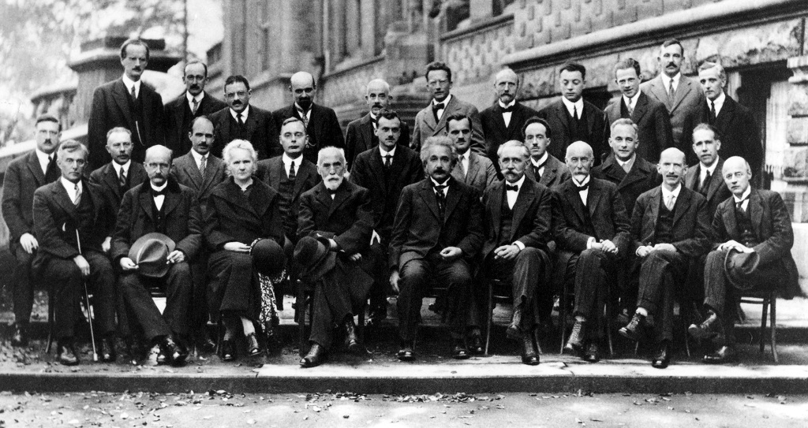
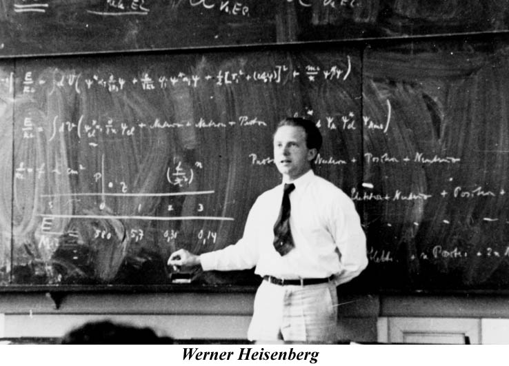
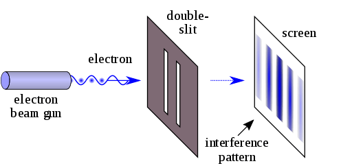

# The Physics of the Agile Methodology

There are numerous articles out there talking about agile teams and how being agile will change your life/project. I agree with what [Agile Manifesto](http://agilemanifesto.org/) proposes, but overall, I think that agile movement lacks scientific approach. In this article, I will apply my understanding of physics to *“prove”* and explain some of the *agile phenomena*.

Before you get angry and start telling me that I am abusing here either physics and agile- take a deep breath and remember:

> If I had no sense of humor, I would long ago have committed suicide.
>
> Mahatma Gandhi

Okay, wow, that one landed a bit heavy. All I am trying to say here, not everything I write is 100% serious.

Without further disclaimers, let’s look at different laws of physics and how they apply to agile!

## The law of conservation of energy

Also known as the first law of the thermodynamics:

> The law of conservation of energy states that the total energy of an isolated system is constant; energy can be transformed from one form to another, but can be neither created nor destroyed.
>
> [Wikipedia](https://en.wikipedia.org/wiki/First_law_of_thermodynamics)

I think this is fairly obvious. Your team has a limited amount of energy. You can spend it in a few ways:

- Creating software features that users want
- Creating software features that nobody wants
- Creating bugs
- Useful meetings
- Pointless meetings
- Wasting time on the Intenet (although there is an argument to be made that this is a way of bringing energy into the system)

As you can see, the first law of thermodynamics clearly states that you need to direct your efforts wisely, as you have limited energy. Quotes such as:

> “Working software over comprehensive documentation”
>
> <http://agilemanifesto.org/>

show that Agile methodology is aware of this limited energy in the system.

Let’s see what other laws of physics work perfectly (I am really annoying physicists here) in the agile context…

## Newton’s Third Law of Motion

> Law III: To every action there is always opposed an equal reaction: or the mutual actions of two bodies upon each other are always equal, and directed to contrary parts.
>
> Isaac Newton

Prepare for some profound comparison and bending physics law in such a non-physics context that it makes me uncomfortable.

I like to think of this as the “The Law of the effort of introducing Agile methods”. I would rephrase it as follows:

> The action required to introduce the agile is proportional to the difference between the team’s working practices and Agile practices. The resistance from the team is proportional to the action required.
>
> Bartosz Jedrzejewski

The less agile the team is, the more you need to push. The more you push, the more resistance you will encounter. Get ready. Don’t expect an easy ride- it’s proven by physics after all…

## Uncertainty principle

Why not? After all, quantum physics applies to a very small (atomic and subatomic scales) and to *Agile software development teams*… I am sure I have seen it in a paper somewhere!

The uncertainty principle is often misunderstood and misrepresented. In the common language the spirit of the law can be represented as:

> In quantum physics you can’t know the exact speed and position of a particle. The more you know one, the less you know the other. There is a limit to that precision. This is a fundamental law of nature and nothing to do with the instrument used to observe that particle.
>
> Bartosz Jedrzejewski explanation of the Uncertainty Principle

If you want to go deeper on the actual law, [Wikipedia is your friend](https://en.wikipedia.org/wiki/Uncertainty_principle).

Ok, with that out of the way, how does it relate to Agile?

We need to translate the concepts a little bit, as physical speed and physical position of the Agile team usually does not matter… Unless you are outsourcing your development, but that’s a topic for another blog post!

We will translate the concepts as follows:

- **Physical location = The amount of work left to do in the project**
- **Physical speed = The real speed at which the development can happen**

The Agile uncertainty principle states that:

> If you define the whole project upfront, you will know nothing about the true speed of delivery. If you focus on maximum delivery speed, you will not know the scope of what will be delivered in the end.
>
> Bartosz Jedrzejewski and his gross misrepresentation of Uncertainty Principle in the light of Agile development

Turn our that the uncertainty principle is the **Waterfall vs Agile argument** scientifically presented. I bet that Heisenberg did not expect that!

## The wave theory of light (and Agile)

If you think that Quantum Physics can’t possibly have more to do with Agile, you would be wrong.

I am talking here specifically about the phenomena shown in the [Double-slit experiment](https://en.wikipedia.org/wiki/Double-slit_experiment). You know, the experiment that shown that electron can literally be in two places at the same time.

Okay, this one is a bit physics heavy, but hear me out. I am sure you have seen a similar conversation:

- Person 1: Is it done?
- Person 2: Yes!
- Person 1: Is it *done done*?
- Person 2: No!
- Person 1: So is it done then?
- Person 2: Not *done done*, but done…

You might have been arguing here that the problem is the existence of different levels of done. In reality, there could be two separate reports produced for two separate audiences, one treating the item as done, the other not. I wonder if they also create interference patterns?…

As you can see, it is common in Agile for multiple realities to exist at the same time and different things have different (contradicting) state in these realities… That brings me to the last, but possibly my favourite physics-agile parallel.

## The many-worlds interpretation is an interpretation of quantum mechanics (and Agile)

This is an interpretation of quantum mechanics that states something along the lines:

> …all possible alternate histories and futures are real, each representing an actual “world” (or “universe”).
>
> [Wikipedia](https://en.wikipedia.org/wiki/Many-worlds_interpretation)

This is not completely insane, as this is just one interpretation of what wavefunction collapse is. Of course, it also translates to Agile!

…Maybe not quite an infinite number of parallel universes, but certainly a vast number of universes existing all at once:

- Development team feeling that the project is successful
- Security claiming that everyone is doomed
- Project management unhappy, claiming no work is being done
- Company directors happy with how agile the company became
- And testers complaining about the waterfall approach getting even worse

I am really just scratching the surface here. It is possible that the whole event plays out and everyone remembers is differently- as a success, failure, agile, not-agile etc.

Here I may break away from these physics rants and actually end with a super lofty quote from Crucial Conversations (good book):

> “The pool of shared meaning is the birthplace of synergy”
>
> Kerry Patterson, Crucial Conversations

**I don’t believe the many-worlds interpretation of quantum mechanics** (Sheldon Cooper would be disappointed with me here). I also don’t believe it has a place in Agile development.

If you see people starting to believe it and happily live within their bubbles, try to bring some common understanding and maybe together you can go back at working towards the same goal.

[I recommend the Phoenix Project](https://www.e4developer.com/2018/03/24/the-phoenix-project-a-key-to-understanding-devops/) as a good book that explores this journey towards common understanding and working together.

## Summary

Maybe Agile is not exactly like physics. This is not the point here. By these semi-serious comparisons, I wanted to bring your attention to common problems with Agile development and building better software. Laws of physics can’t be changed, the way people work- can.

Bonus “physics” points if you recognise the main photo!
