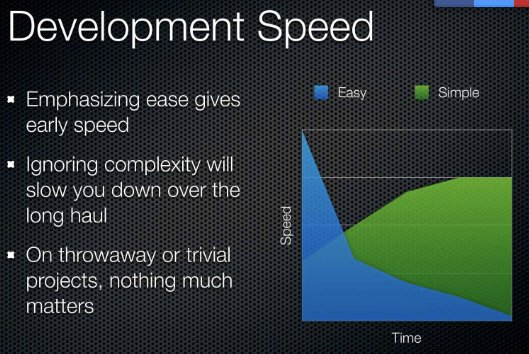
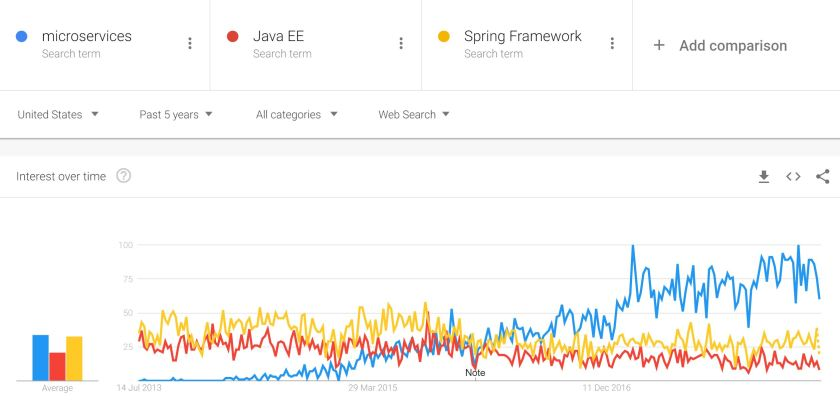

---
title: "The Quest for Simplicity in Java Microservices"
date: 2018-07-08T00:00:00Z
draft: false
description: "There is great value in simplicity. When things are simple, they are easier to understand, easier to extend and easier to modify. They are better."
categories: ["Architecture", "Microservices", "Spring Boot"]
cover:
  image: "images/quest.jpg"
  alt: "The Quest for Simplicity in Java Microservices"
aliases:
  - "/2018/07/08/the-quest-for-simplicity-in-java-microservices/"
ShowToc: true
TocOpen: false
---

There is great value in simplicity. When things are simple, they are easier to understand, easier to extend and easier to modify. They are better. Simplicity is the ultimate compliment you can give to an architecture or a framework. In this article, I look at how four different frameworks- [Spring Boot](https://spring.io/projects/spring-boot), [Javalin](https://javalin.io/), [Vert.x](https://vertx.io/) and [Micronaut](http://micronaut.io/); approach this quest for simplicity.

## Simple does not mean easy

One of my inspirations for this article was a great presentation by Rich Hickey titles [Simple Made Easy](https://www.infoq.com/presentations/Simple-Made-Easy).

This is the slides from this presentation that really highlights the difference between simple and easy:

Simple can be easy, but it is not the same thing. Simple is the opposite of Complex, Easy is the opposite of Difficult.

I will not repeat the whole presentation here (I really recommend you [watch it yourself](https://www.infoq.com/presentations/Simple-Made-Easy)), but to emphasize the points:

- Simplicity is the goal, we want things to not be complex
- Being easy is beneficial, but if it comes with hidden complexity, it can be very dangerous

Let’s take a look at the history of Simplicity and Complexity in Java frameworks.

## Enterprise Java, Spring – Complex and Difficult

Before moving to the microservices frameworks, let’s look at where we started.

Before microservices, we had two leading approaches for larger serverside applications written in Java: Enterprise Java and the Spring Framework:

At the risk of upsetting quite a few people, I consider both frameworks **difficult** and **complex**.

Sure, you can make Spring or JavaEE *“easy”* for yourself by understanding them very well and learning how to use them, but that does not eliminate the underlying complexity.

It seems that I am not the only one who thought these were the problems, as JavaEE (currently Jakarta EE) community is busy working on [MicroProfile](https://microprofile.io/) and Spring enthusiasts will be quick to point me to the [Spring Boot](https://spring.io/projects/spring-boot) project.

I will not focus on MicroProfile here, as it is still relatively new and the transition of Java EE to Jakarta EE is underway. If you are curious, I recommend checking [Jakarta EE](https://jakarta.ee/) official site, [MicroProfile official site](https://microprofile.io/) and their [GitHub repository](https://github.com/eclipse/microprofile).

## The easy and robust Spring Boot

Who does not love Spring Boot? Ok, it is the Internet, so I am sure that quite a few of you don’t! Anyway, Spring Boot was a game changer in the enterprise world. Writing services became really simple.

Spring Boot also provides simplicity by partitioning the vast Spring ecosystem into small composable parts. Autoconfiguration is the magic that removed huge complexity from service developers.

Do you ever wonder how autoconfiguration works? Have a [look at the source code](https://github.com/spring-projects/spring-boot/tree/v2.0.3.RELEASE/spring-boot-project/spring-boot-autoconfigure/src/main/java/org/springframework/boot/autoconfigure) from 2.0.3.RELEASE. It is very complex, but it is managed entirely by the framework team. They decided to absorb the complexity and did a great job at it!

What about the Spring Framework itself? It can be quite complex, but it also extremely robust. The choice is really down to the developer- what do you include, and what do you stay away from.

I see the **Spring Boot approach to simplicity** as:

- **Development is very easy to start with**
- **The vast complexity of autoconfiguration is handled by the framework team**
- **The inherent complexity of the framework**
- **The framework complexity can be simplified by relying only on the key parts of it**

When dealing with very difficult problems, this approach proved itself to be successful. Let’s look at the other frameworks.

## Simplifying things with Micronaut

Micronaut is much younger than Spring Boot. At the time of writing, we are at the version 1.0.0.M1, so there is plenty of scope for change.

Micronaut describes itself as:

> A modern, JVM-based, full-stack framework for building modular, easily testable microservice applications.

It bears multiple similarities to Spring Boot. We have:

- Dependency Injection
- Defaults and Autoconfiguration
- Multiple cloud-native capabilities build in

You can clearly see the lessons from Spring Boot and Grails (the lead of Micronaut is Graeme Rocher – creator of Grails). What makes Micronaut interesting then? Once again, referring to the Micronaut documentation:

- Fast startup time
- Reduced memory footprint
- **Minimal use of reflection**
- **Minimal use of proxies**
- Easy Unit Testing

I would add myself- it is written from scratch with **simplicity in mind**. The question is- as the framework matures, will it become simply too similar to Spring Boot to matter, or will it manage to preserve its differences.

The fact that it is a new project is its greatest asset as well as the greatest risk. Sure it does not depend on arguably heavy and complex Spring, but at the same time- Spring is robust, popular and working well.

I see the **Micronaut approach to simplicity** as:

- **Development is very easy to start with**
- **Attempting to build a simpler solution than Spring Boot while still providing defaults and autoconfiguration**
- **The framework supporting it is built from scratch for Micronaut**
- **Micronaut is new, so the future is still being decided**

I really like Micronaut, as it provides a competition for Spring Boot. It attempts a very similar approach, but more streamlined and written with microservices in mind from the start.

What do you do if you want to achieve the ultimate simplicity?

## The Simple and Easy Javalin…

If you want to make your microservices really simple, you should look at [microframeworks](). Or should you? Let’s look at Javalin as an example of the microframework family.

So, what makes Javalin so simple? It is only about 2,000 lines of source code. It is truly a microframework. With such a streamlined code-base you can achieve real simplicity. If you have any difficulties, the source code is simple enough to understand and fix.

What is the price of such simplicity? Javalin does not provide as much as Spring Boot does. You don’t have projects like *Javalin Data* ([my Spring Data introduction]()) or Javalin Data Flow ([my Spring Cloud Data flow into]()).  You don’t even have dependency injection!

Is being so lightweight problematic? This is an interesting question. These days, with Kubernetes, Service Mesh and other microservices technologies, there is less requirement for complexity in the service itself. I have written about [the rise of microframeworks](), as I believe that we are just witnessing the beginning of this trend!

I see the **Javalin approach to simplicity** as:

- **Minimalistic code base**
- **Very simple interaction with the service**
- **Minimal viable set of features for microservice**
- ***“Do it yourself”* approach**

Can you combine the simplicity and style of the Javalin approach with a more fully featured framework? Sure you can! We will finish this showcase looking at Vert.X.

## Chasing simplicity in Vert.X

[Vert.X](https://vertx.io/) is the second most popular framework from the ones mentioned here (after Spring Boot). It is not targeted only at microservices (neither is Spring Boot) and it describes itself as:

> Eclipse Vert.x is a tool-kit for building reactive applications on the JVM.

The reactive/functional approach has simplicity as its core. It has simplicity, but not easiness. It takes some time to understand and perhaps shift our approach from the non-functional world.

Javalin seems to me like an easy way to dip your toes into this style and Vert.X offers more mature enterprise offering. Both are great and definitely onto something. Even Spring Boot is trying to make this reactive/functional model somewhat viable.

If you want to see how writing a Simple REST service looks like in Vert.X, there is a good [example available on GitHub](https://github.com/vert-x3/vertx-examples/blob/3.4.2/web-examples/src/main/java/io/vertx/example/web/rest/SimpleREST.java).

I see the **Vert.X approach to simplicity** as:

- **Framework built completely around the reactive/functional model**
- **Providing a list of features that can compete with more traditional enterprise offerings**
- **Sacrificing easiness of getting into for a simplicity at its core**
- **Splitting the framework into numerous composable pieces**

If you are not afraid of some initial difficulty in order to work with something simple at its core, Vert.X is an interesting option!

## Summary

There are many microservices frameworks and approaches available. More than I can review here. Each of them strives to make development simple and easy. There are trade-offs between these approaches and different trade-offs will appeal to different audiences.

I hope this article gave you a different way of looking at frameworks and development approaches and perhaps motivated you to try something that is difficult, but simple!
