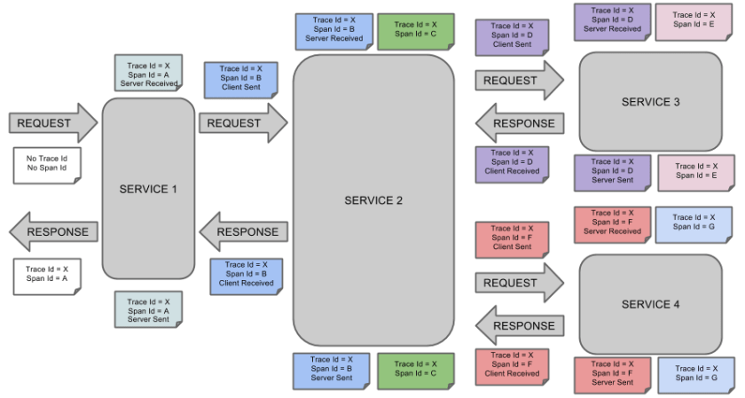
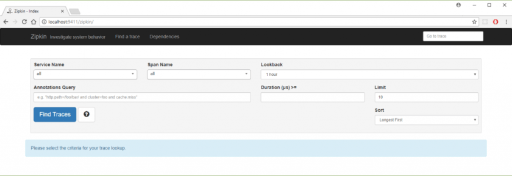
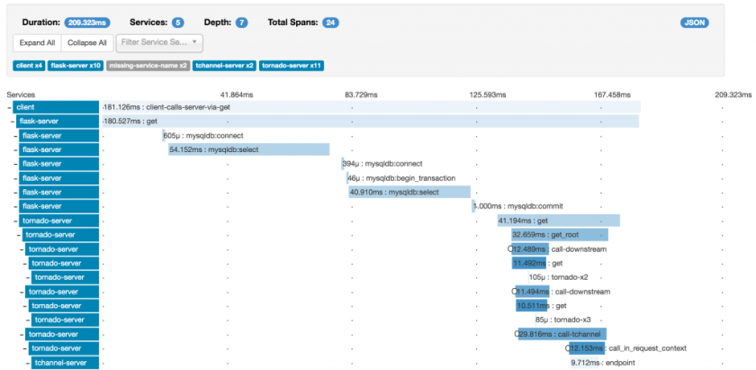
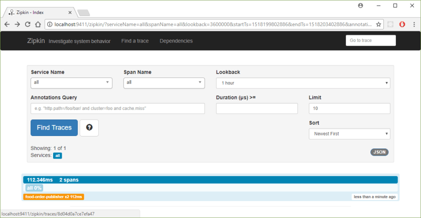
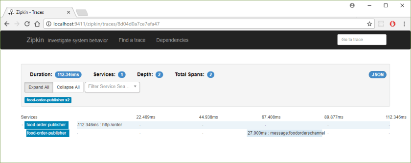
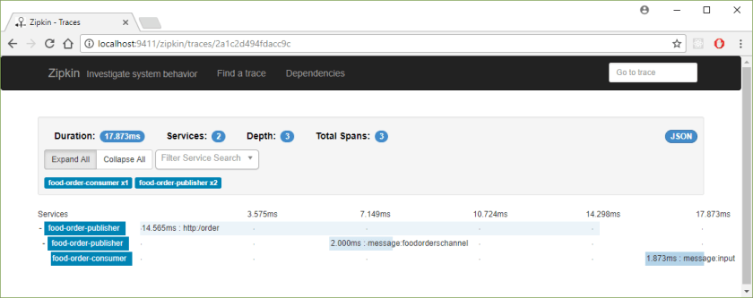
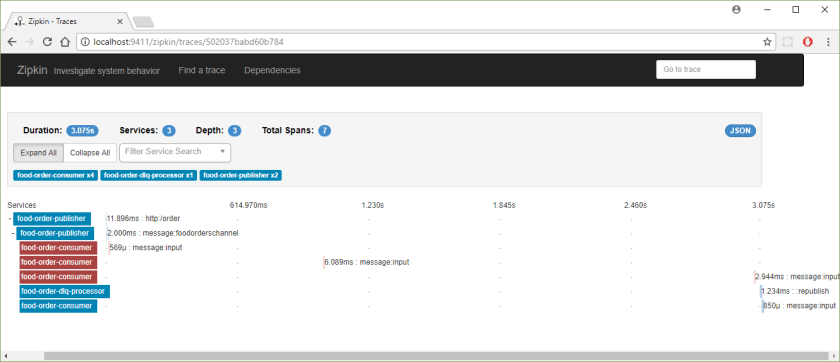
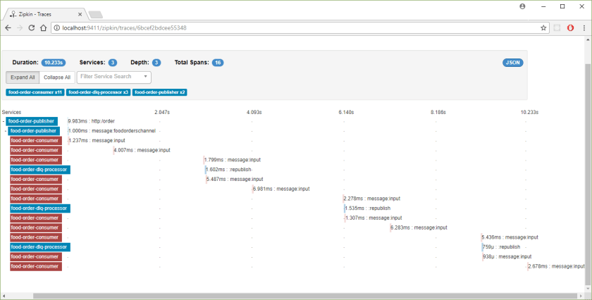
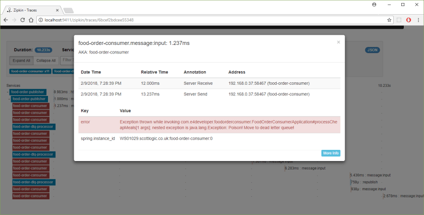

---
title: "Tracing messages in Choreography with Sleuth and Zipkin"
date: 2018-02-09T00:00:00Z
draft: false
description: "Tracing your logs in Choreography with Spring Cloud Sleuth and Zipkin. See how you can map the flow of messages and investigate errors quickly."
categories: ["Choreography", "Microservices", "Spring Cloud"]
cover:
  image: "images/zipkin-cloud.png"
  alt: "Tracing messages in Choreography with Sleuth and Zipkin"
aliases:
  - "/2018/02/09/tracing-messages-in-choreography-with-sleuth-and-zipkin/"
ShowToc: true
TocOpen: false
---

One of the challenges in building distributed system is having a good visibility of what is happening inside them. This challenge is only magnified when dealing with choreography- microservices, loosely coupled, communicating via messaging. In this article you will see how Sleuth and Zipkin help to solve that problem.

One of the most important requirements for production ready microservices is being able to correlate logs. What does that mean? Having some sort of id, that will link logs from different services together. Of course you don’t want to link everything- you want to focus on a single request/process that is happening in the system. This was often done with MDC (Mapped Diagnostic Context) in slf4j. There is nothing wrong in using these technologies directly, but here I want to show you something better…

### Meet Spring Cloud Sleuth

[Spring Cloud Sleuth](https://cloud.spring.io/spring-cloud-sleuth/) is a project designed to make tracing requests in microservices easy. It succeeds spectacularly in that goal. If you are using Spring Boot (and you should!) enabling Sleuth only requires adding a single dependency:

```

<dependency>
	<groupId>org.springframework.cloud</groupId>
	<artifactId>spring-cloud-starter-sleuth</artifactId>
</dependency>

```

After adding this dependency, requests to your microservices will be traced. To see more of that tracing, you need to add the following to your application config:

`logging.level.org.springframework.cloud.sleuth=DEBUG`

After enabling that, you should start seeing some new, interesting logs in your services:

```

2018-02-08 22:30:16.431 DEBUG [food-order-publisher,,,] 12572 --- [nio-8080-exec-7] o.s.c.sleuth.instrument.web.TraceFilter : Received a request to uri [/order] that should not be sampled [false]
2018-02-08 22:30:16.454 DEBUG [food-order-publisher,888114b702f9c3aa,888114b702f9c3aa,true] 12572 --- [nio-8080-exec-7] o.s.c.sleuth.instrument.web.TraceFilter : No parent span present - creating a new span
2018-02-08 22:30:16.456 DEBUG [food-order-publisher,888114b702f9c3aa,888114b702f9c3aa,true] 12572 --- [nio-8080-exec-7] o.s.c.s.i.web.TraceHandlerInterceptor : Handling span [Trace: 888114b702f9c3aa, Span: 888114b702f9c3aa, Parent: null, exportable:true]
2018-02-08 22:30:16.457 DEBUG [food-order-publisher,888114b702f9c3aa,888114b702f9c3aa,true] 12572 --- [nio-8080-exec-7] o.s.c.s.i.web.TraceHandlerInterceptor : Adding a method tag with value [orderFood] to a span [Trace: 888114b702f9c3aa, Span: 888114b702f9c3aa, Parent: null, exportable:true]

```

I am using here https://github.com/bjedrzejewski/food-order-publisher project as an example. If you are interested how messaging works and in Spring Cloud Stream, check [my earlier post about it](http://e4developer.com/2018/01/28/setting-up-rabbitmq-with-spring-cloud-stream/). There is [another blog post that explains error handling](http://e4developer.com/2018/02/05/handling-bad-messages-with-rabbitmq-and-spring-cloud-stream/) used in the code that we will use here. Now, assuming you have the basics, lets look closer at the log that is being created:

`[food-order-publisher,888114b702f9c3aa,888114b702f9c3aa,true]`

What you are seeing there, are the respective parameters:

- **appname** – the name of the application that logged the span
- **traceId** – the id of the latency graph that contains the span
- **spanId** – the id of a specific operation
- **exportable** – whether the log should be exported to Zipkin or not (more about Zipkin later)

Here, the traceId is the same as spanId, because this is the beginning of a trace:

```

2018-02-08 22:30:16.454 DEBUG [food-order-publisher,888114b702f9c3aa,888114b702f9c3aa,true] 12572 --- [nio-8080-exec-7] o.s.c.sleuth.instrument.web.TraceFilter : No parent span present - creating a new span

```

You can think of traceId as sort of a parent of spanId. I could have not describe it better than [the official documentation](http://cloud.spring.io/spring-cloud-static/spring-cloud-sleuth/1.3.2.RELEASE/single/spring-cloud-sleuth.html) does with the following picture:



As you can see in that picture above, traceId always stay the same for the whole time, while spanId creates the sort of black-box. It runs from request to response.

These traceId and spanId propagate through REST calls automatically. You really don’t need to do anything special and you will see the same traceId across multiple Spring Boot servers- as long as they have Spring Cloud Sleuth of course. They are also automatically created for number of different interactions, including interacting with data sources and messages.

Just with that, you suddenly have a power to trace your logs expertly. If you add Logstash, Elastic, Kibana- you can then easily filter by traceId and build up a holistic view of the system. It is incredible how much you get with Sleuth with such a little effort. But wait, there is more…

### Meet Zipkin

[Zipkin](https://zipkin.io/) is a project whose main use for us is to visualize these traces that you have collected with Sleuth. Zipkin Server used to be part of a Spring Cloud (done by annotation placed on a Spring Boot), but currently is a standalone project. Since I am quite a big fan of docker, I recommend you running Zipkin server with the following command (provieded you have a Docker installed):

`docker run -d -p 9411:9411 --name zipkin openzipkin/zipkin`

It runs by default on the port 9411, but this can be changed by passing different environment variables. If you are not keen on docker, you can run Zipkin Server in multiple different ways as listed by their [official Quickstart](https://zipkin.io/pages/quickstart.html). After starting Zipkin server and visiting port 9411 on your localhost you should see something like that:



To make use of this brand new Zipkin Server, we need to tell Spring Boot to actually use it. To do this, you can replace Sleuth dependency with Zipkin dependency (Zipkin includes Sleuth), pasting the following into your pom file:

```

<dependency>
	<groupId>org.springframework.cloud</groupId>
	<artifactId>spring-cloud-starter-zipkin</artifactId>
</dependency>

```

You need to tell your services how to connect to the Zipkin Server and this is done with the fairly self-explanatory set of properties:

`spring.zipkin.service.name=food-order-consumer`  
`spring.zipkin.sender.type=web`  
`spring.zipkin.baseUrl=http://localhost:9411`  
`spring.sleuth.sampler.percentage=1.0`

Here the sender type is set to `web` as we want to report data to Zipkin via HTTP calls rather than a message queue (RabbitMQ for example is another option). `sampler.percentage` defines how many traces with be sent to Zipkin. Default is 0.1 which means 10%, here for the demo purposes I decided for 1.0- 100%.

Example output from working Zipkin should look something like that:



### Sleuth, Zipkin and Spring Cloud Stream working together – Example

After discussing this technologies, I will show you how seamlessly they are working together. For this demonstration I will use the code that I created for the previous two blog post on Spring Cloud Stream ([starting with Spring Cloud Stream](http://e4developer.com/2018/01/28/setting-up-rabbitmq-with-spring-cloud-stream/) and [dead letter queue in Spring Cloud Stream](http://e4developer.com/2018/02/05/handling-bad-messages-with-rabbitmq-and-spring-cloud-stream/)). The finished code for the three projects used can be found on my github in these three repositories:

- [food-order-publisher](https://github.com/bjedrzejewski/food-order-publisher/tree/zipkin-example) – dealing with publishing messages
- [food-order-consumer](https://github.com/bjedrzejewski/food-order-consumer/tree/zipkin-example) – dealing with consuming messages
- [food-order-dlq-processor](https://github.com/bjedrzejewski/food-order-dlq-processor/tree/zipkin-example) – dealing with the dead letter queue – exceptions

### Step 1: Adding Sleuth and Zipkin to the Message Publisher

This is very simple here. All that is needed is adding the properties and relevant dependency as discussed earlier:

```

<dependency>
	<groupId>org.springframework.cloud</groupId>
	<artifactId>spring-cloud-starter-zipkin</artifactId>
</dependency>

```

`spring.zipkin.service.name=food-order-publisher`  
`spring.zipkin.sender.type=web`  
`spring.zipkin.baseUrl=http://localhost:9411`  
`spring.sleuth.sampler.percentage=1.0`

When making REST call to the service that publishes message on the queue I can see now everything being tracked by Zipkin:




### Step 2: Adding Sleuth and Zipkin to the Message Consumer

This follows the same pattern, I need to add the same maven dependency and set the properties correctly:

`spring.zipkin.service.name=food-order-consumer`  
`spring.zipkin.sender.type=web`  
`spring.zipkin.baseUrl=http://localhost:9411`  
`spring.sleuth.sampler.percentage=1.0`

When making a REST call to the publisher, now I should be able to see the interaction between the two services:



### Step 3: Adding Sleuth and Zipkin to the DLQ Handler

This is where it gets a little difficult. My DLQ handler does not use Spring Cloud for handling the messages, but rather it has its own RabbitMQ connection. In order to get that connected into the span I have to add the Zipkin maven dependency and the standard set of properties:

`spring.zipkin.service.name=food-order-dlq-processor`  
`spring.zipkin.sender.type=web`  
`spring.zipkin.baseUrl=http://localhost:9411`  
`spring.sleuth.sampler.percentage=1.0`

And I need to manually join the existing Span:

```

@Autowired
Tracer tracer;

@RabbitListener(queues = DLQ)
public void rePublish(Message failedMessage) {
HeaderBasedMessagingExtractor headerBasedMessagingExtractor = new HeaderBasedMessagingExtractor();
MySpanTextMap entries = new MySpanTextMap(failedMessage.getMessageProperties().getHeaders());
Span span = headerBasedMessagingExtractor.joinTrace(entries);
Span mySpan = tracer.createSpan(":rePublish", span);

failedMessage = attemptToRepair(failedMessage);

Integer retriesHeader = (Integer) failedMessage.getMessageProperties().getHeaders().get(X_RETRIES_HEADER);
if (retriesHeader == null) {
retriesHeader = Integer.valueOf(0);
}
if (retriesHeader < 3) {
failedMessage.getMessageProperties().getHeaders().put(X_RETRIES_HEADER, retriesHeader + 1);
this.rabbitTemplate.send(ORIGINAL_QUEUE, failedMessage);
}
else {
System.out.println("Writing to databse: "+failedMessage.toString());
//we can write to a database or move to a parking lot queue
}
tracer.close(mySpan);
}

```

The whole file can be seen [here](https://github.com/bjedrzejewski/food-order-dlq-processor/blob/zipkin-example/src/main/java/com/e4developer/foodorderdlqprocessor/FoodOrderDlqProcessorApplication.java). This is a temporary workaround. I wanted to demonstrate the ability to arbitrarily add to the Span, as this may be not the only occasion when you may need to do this. The crucial parts here are:

```

//Manually extracting the Span properties from the message and using
//HeaderBasedMessagingExtractor&nbsp; from Spring to create the Span
//(this could be done manually)
HeaderBasedMessagingExtractor headerBasedMessagingExtractor = new HeaderBasedMessagingExtractor();
MySpanTextMap entries = new MySpanTextMap(failedMessage.getMessageProperties().getHeaders());
Span span = headerBasedMessagingExtractor.joinTrace(entries);

//using the manually created Span to add it to the tracer
Span mySpan = tracer.createSpan(":rePublish", span);

//closing the Span
tracer.close(mySpan);

```

To do it in a cleaner fashion you should make use of Spring Aspect Oriented Programming (AOP) capabilities, but this is beyond the scope of this blog post. If you want to know the details I recommend reading the [Customisation](http://cloud.spring.io/spring-cloud-static/spring-cloud-sleuth/1.3.2.RELEASE/single/spring-cloud-sleuth.html#_customizations) chapter of the official documentation that explains it in more details. People involved in the Sleuth and Zipkin projects are actively working on adding new automated tracing to these projects. There is a good chance that by the time you read it, if you use the latest versions of the respective libraries, you won’t have to do it manually.

Lets make a few calls that will fail directly and make use of the DLQ handler. You will see how much easier to understand the flow is when you have a good visualization.




You can even get the details of the Exceptions by clicking on the spans:



As you can see this is a truly useful tool when investigating Exceptions and understanding different flows in your choreography.

### Summary and what to do next

I consider Sleuth an invaluable addition to any serious microservices built around the Spring Cloud project. You don’t need to use Zipkin, but with the ease of integration I don’t see why you wouldn’t want to! Once you have your tracing figured out, it is very important to be able to easily search through your logs. To deal with this I recommend getting familiar with the ELK stack- Elastic Search, Logstash and Kibana. Together with Sleuth and Zipkin they give you the ultimate insight into your logs and microservices communication!
