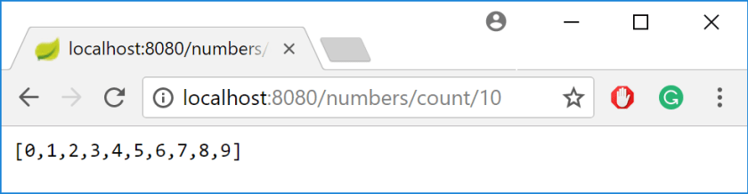
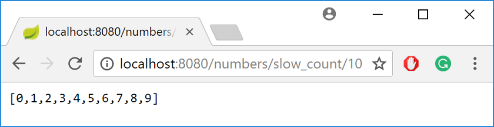
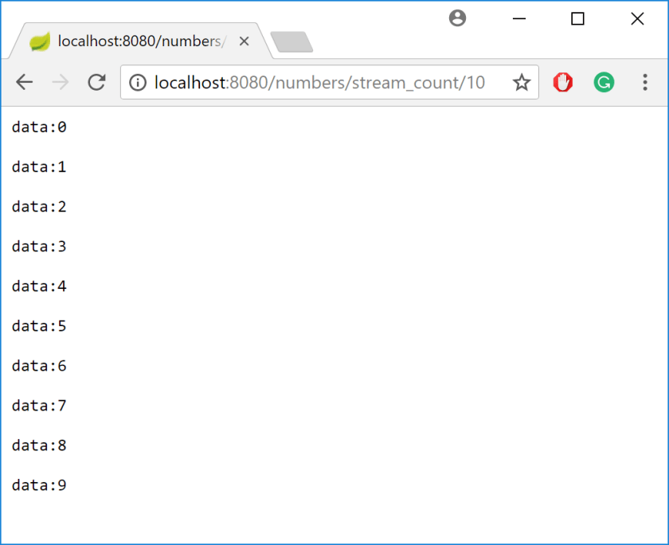
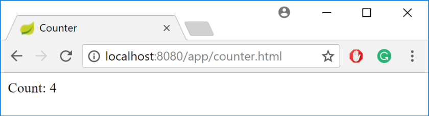

---
title: "WebFlux and servicing client requests - how does it work?"
date: 2018-04-14T00:00:00Z
draft: false
description: "I have previously written about Getting Reactive with Spring Boot 2.0 and Reactor, where I have given an introduction to reactive programming in Spring Boot."
categories: ["Microservices", "Reactive", "Spring Boot"]
cover:
  image: "images/simple-flux.png"
  alt: "WebFlux and servicing client requests - how does it work?"
aliases:
  - "/2018/04/14/webflux-and-servicing-client-requests-how-does-it-work/"
  - "/webflux-and-servicing-client-requests-how-does-it-work/"
ShowToc: true
TocOpen: false
---I have previously written about [Getting Reactive with Spring Boot 2.0 and Reactor](), where I have given an introduction to reactive programming in Spring Boot. In this article, I will further explore WebFlux and the ways it impacts servicing client requests- what happens when you return a Flux<>?

### Simple Flux<Integer>

When you write a Controller that returns a list of numbers from your function, you get a list of numbers when you call it. How does it work when you return a Flux like that?:

```

@RestController
@RequestMapping("/numbers")
public class NumbersController {

    @GetMapping(path = "/count/{number}")
    public Flux<Integer> countToNumber(
            @PathVariable("number") int number) {
        return Flux.range(0, number);
    }
}

```

The good news- it works the same as if you were returning a list of numbers. For these *static*types of Flux, where no long-running processing happens and no explicit `FluxSink` manipulation is performed it is pretty straightforward:



### Dynamic Flux<Integer>

What to expect when we are dealing with more dynamic Flux<Integer>? One where there is a slow running process, based on let’s say, counting up by one every second?

```

public class SlowCounter {

    private SlowCounter(){}

    static void count(FluxSink<Integer> sink, int number) {
        SlowCounterRunnable runnable = new SlowCounterRunnable(sink, number);
        Thread t = new Thread(runnable);
        t.start();
    }

    public static class SlowCounterRunnable implements Runnable {

        FluxSink<Integer> sink;
        int number;

        public SlowCounterRunnable(FluxSink<Integer> sink, int number) {
            this.sink = sink;
            this.number = number;
        }

        public void run() {
            int count = 0;
            while (count < number) {
                try {
                    Thread.sleep(1000);
                } catch (InterruptedException e) {
                    e.printStackTrace();
                }
                sink.next(count);
                count++;
            }
            //Only on complete() is the result sent to the browser
            sink.complete();
        }
    }
}

```

With the attached Controller:

```

@GetMapping(path = "/slow_count/{number}")
public Flux<Integer> slowCountToNumber(
        @PathVariable("number") int number) {
    Flux<Integer> dynamicFlux = Flux.create(sink -> {
        SlowCounter.count(sink, number);
    });
    return dynamicFlux;
}

```

It turns out that we are still dealing with pretty standard HTTP call. One the `sink.complete()` is called, the list is returned in pretty much the same fashion:



It is great that it works so simply- you can start using reactive programming on your server without impacting clients.

What if you want to be more dynamic with your communication? After we have just introduced all this reactivity…

### Server-Sent Events (SSE) based Flux<Integer>

One way to enable a more active channel of communication between your WebFlux service and a client is to make use of Server-Sent Events.

If you have not heard of them, they are a way for a web-app to subscribe to a stream of updates generated by a server. If you want a more thorough introduction, there is one titled [Stream Updates with Server-Sent Events  published on html5rocks](https://www.html5rocks.com/en/tutorials/eventsource/basics/).

How do you enable SSE in WebFlux? By adding a simple annotation to your controllers method:

```

@GetMapping(path = "/stream_count/{number}", produces=MediaType.TEXT_EVENT_STREAM_VALUE)
public Flux<Integer> streamCountToNumber(
        @PathVariable("number") int number) {
    Flux<Integer> dynamicFlux = Flux.create(sink -> {
        SlowCounter.count(sink, number);
    });
    return dynamicFlux;
}

```

`produces=MediaType.TEXT_EVENT_STREAM_VALUE` is what enables Spring to turn your method into a source of Server-Sent Events.

How does that look in the browser?



This is much more interesting with the endpoint working very differently than it in the other cases.

### Making use of the SSE based Flux<Integer>

I have written a simple `<label>` that I want o update as the new events are coming in:

```

Count: <label id="count"></label>

```

This can be easily done by creating the following (jQuery) based JavaScript:

```

function createCountSource() {
    var source = new EventSource("http://localhost:8080/numbers/stream_count/10");
    source.addEventListener('message', function (e) {
        var body = JSON.parse(e.data);
        $("#count").text(body);
        // You can close the re-connection attempt
        // if(body === 5)
        //     source.close();
    }, false);

    return source;
}

$(document).ready(function () {
    source = createCountSource();
});

```

As you can see, all you need to do is to subscribe to the newly created `EventSource` and then react as the events are coming in.

The only issue with this code is that the client will automatically try to reconnect after processing all the events. This will result in re-counting the 0-9 numbers.

If you want to avoid that behavior, you need to call `source.close()` at an appropriate moment. That, unfortunately, is not handled very clearly by the server. The other option is using SSE based approach where you want the connection open for the length of the user’s visit on a page.



### Word of warning for the Server-Sent Events

Even though Server-Sent Events are not very new, there is not yet full browser support for them… Well… **All the major browsers support it except Internet Explorer and Edge**. This is quite disappointing as with Edge I was starting to expect Microsoft to step up the game.

The other warning comes with the fact that their use is still not common. With that comes less solid support from libraries and less information on the best practices and patterns. I think this will change, but know what you are getting into.

### What about WebSockets

One exciting way to build Client-Server communication is using WebSockets. I consciously did not include it in this article, as it is quite different from standard HTTP verb based communication.

Rest assured that [WebFlux supports WebSockets](https://docs.spring.io/spring/docs/current/spring-framework-reference/web-reactive.html#webflux-websocket). Because of the major differences, I decided that I will tackle it in a separate blog post.

### Conclusion

Basic usage of WebFlux and Flux<> itself is very simple. Your application clients should not see any difference. This enables a smooth transition of multiple applications towards the reactive style.

While Server-Sent Events become more interesting when coupled with Flux<> they are still not as popular or widely supported. If you know what you are doing and you are targetting a known platform, they can be very useful.

You can find the [example source-code on my GitHub](https://github.com/bjedrzejewski/webflux-counting-service)
