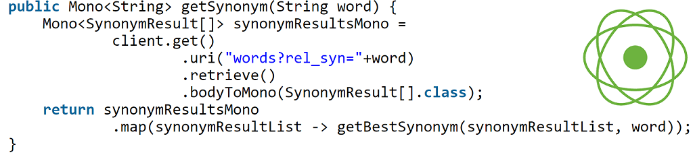

# WebFlux in practice – asynchronous service with WebClient



Building reactive microservices with WebFlux is fun and easy. In this article, I will show you how to build a reactive “synonyms” service. Making asynchronous API calls with WebClient is likely the most common scenario for a real-life reactive microservice.

## Synonyms service – the idea

I want to build a service that will return a synonym for a given word. Based on that I would like this service to translate a sentence into another one made completely out of synonyms. For example, I will have: *Java is a good language*become *Coffee is a right speech*. It is somewhat entertaining and a nice example!

This particular scenario is well suited for the reactive approach as I will end up making an API call for every single word in that sentence. I will use <https://www.datamuse.com/api/> that is a free, word-based API.

With multiple API calls, that do not block each other, I hope to achieve better efficiency and cleaner code by using WebFlux.

## Dependencies

I will be using WebFlux and `2.0.2.RELEASE` release of Spring Boot. In order to get WebFlux you just need to add the following dependency to the pom:

```

<dependency>
    <groupId>org.springframework.boot</groupId>
    <artifactId>spring-boot-starter-webflux</artifactId>
</dependency>

```

Make sure not to include the *spring-boot-starter-web* as this will clash with WebFlux. If this is all completely new to you I recommend reading first [Getting Reactive with Spring Boot 2.0 and Reactor](https://www.e4developer.com/2018/04/11/getting-reactive-with-spring-boot-2-0-and-reactor/).

These are all the dependencies that you need. Pretty simple right?

## Building the Controller

The Controller will be pretty standard. I will have two endpoints- one dedicated to getting a single word synonyms only, and another for sentences.

```

@RestController
@RequestMapping("/synonyms")
public class SynonymsController {

    @Autowired
    private SynonymsService synonymsService;

    @PostMapping(path = "/word")
    public Mono<String> wordSynonym(@RequestBody String word) {
        return synonymsService.getSynonym(word);
    }

    @PostMapping(path = "/sentence")
    public Mono<String> sentenceSynonym(@RequestBody String sentence) {
        return synonymsService.getSynonymSentence(sentence);
    }
}

```

You can see the autowired *SynonymsService.*This is where the actual logic happens.

## Building the Synonyms Service

First I define the *WebClient* to connect to the API.

```

private WebClient client = WebClient.create("https://api.datamuse.com/");

```

Based on that I can build a method that retrieves a single word synonym.

```

public Mono<String> getSynonym(String word) {
    Mono<SynonymResult[]> synonymResultsMono =
            client.get()
                    .uri("words?rel_syn="+word)
                    .retrieve()
                    .bodyToMono(SynonymResult[].class);
    return synonymResultsMono
            .map(synonymResultList -> getBestSynonym(synonymResultList, word));
}

```

I have created a *SynonymResult* class to make processing results simpler. Jackson does the conversion automatically here.

```

public class SynonymResult {
    private String word;
    private int score;

    public String getWord() {
        return word;
    }

    public int getScore() {
        return score;
    }
}

```

Because there are multiple candidate synonyms returned by the API, I will only choose those that are also single-words, do not contain the original word and have a high score associated.

```

public String getBestSynonym(SynonymResult[] synonymResultList, String word){
    int topScore = 0;
    String topWord = word;
    for(SynonymResult result : synonymResultList){
        if(result.getScore() > topScore 
                && !result.getWord().contains(word) 
                && !result.getWord().contains(" ") ){
            topScore = result.getScore();
            topWord = result.getWord();
        }
    }
    return topWord;
}

```

The last thing to do is connecting the multiple *Mono<String>* to create a reactive sentence processing. This can be done with the *.zipWith* method.

```

public Mono<String> getSynonymSentence(String sentence) {
    String[] split = sentence.split(" ");
    Mono<String> synSentence = Mono.just("");
    for(String word : split){
        synSentence = synSentence.zipWith(getSynonym(word), (w1, w2) -> w1 + " " +w2);
    }
    return synSentence;
}

```

The resulting service is fully reactive and asynchronous. All the API calls happen at once and the response is assembled in an orderly fashion.

## Trying out the service

It is time to try out the service. Some of the sentences are translated in a nonsensical way, while others are rather entertaining! Here is a good selection:

- Java is a good language -> Cofee is a right speech
- I like to sleep -> One care to rest
- To be or not to be -> To work or not to work (this is disturbing)
- You must be the change you wish to see in the world -> You have work the shift you bid to look fashionable the man (what?)
- The person who reads too much and uses his brain too little will fall into lazy habits of thinking -> The soul who reads besides often and uses his head besides mean leave light into idle habits of thought (ok, we reached the limits here…)

As you can see the translation is not perfect, but you get the point! You can do a similar service based on <https://www.datamuse.com/api/>. They also offer words that:

- Rhyme
- Are homophones (sound-alike words)
- Popular adjectives that accompany the word
- Many more!

If you want to clone my project, it is [available on GitHub](https://github.com/bjedrzejewski/synonyms-service).

## Conclusion

Writing reactive services is easier than it seems. There is some semantics to be learned about using Mono and Flux, but that should not be a major obstacle to success. Now it is your turn to make your next service a reactive one.
