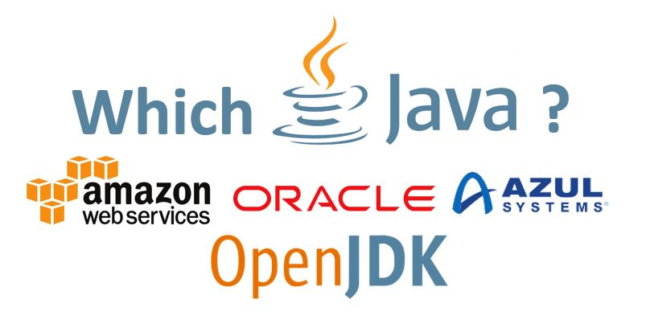

# Which Java JDK should I use? Which provide free LTS?

With Oracle stopping free updates for Java 8 and effectively only maintaining free updates with the latest Java release (12 at the time of writing) a natural question arises… Which JDK should I use? This is a short article providing answers, depending on your circumstances.

Let’s look at different scenarios that you may be facing:

## You are using Java 8 and want to keep Long Term Support (LTS) for free

In this case, you should use [Amazon Correto](https://aws.amazon.com/corretto/) OpenJDK 8 distribution. Amazon Correto is a free JDK distribution that will provide you with free long term support:

> *Long-term support (LTS) for Corretto includes performance enhancements and security updates for Corretto 8 until at least June 2023 at no cost.*
>
> *[Corretto FAQ](https://aws.amazon.com/corretto/faqs/)*

Alternatively, Azul provides [another JDK 8 distribution called Zulu](https://www.azul.com/downloads/zulu/). This also comes with LTS. It is worth checking to see, as they also provide support plans if you may wish to transfer from free to paid Java…

It is worth knowing that [OpenJDK](https://openjdk.java.net/) is also an option and there are projects keeping it up to date.

## You want to use the latest LTS version of Java (11 currently) for free

Once again, I recommend going with [Amazon Correto](https://aws.amazon.com/corretto/) or alternatively [Azul Zulu](https://www.azul.com/downloads/zulu/).

## You are using Java and want pay for Long Term Support (LTS)

If for some reason you want to pay for support, you have two popular options: Oracle or Azul. If you are willing to pay for your Java you will be better off doing some additional research making sure that the support terms suit you. This is beyond the scope of this article.

It is worth noting that Azul Zulu also provides LTS support for versions that are not under LTS from Oracle.

## You are Azure or AWS consumer already

For those that are already Amazon or Microsoft Cloud consumers, there is additional support provided for respectively Correto and Azulu Zulu.

If you have AWS Support Plan, *“you can reach out for assistance with Corretto through your plan.”*This is clarified in [Corretto FAQ](https://aws.amazon.com/corretto/faqs/).

If you are developing Java software on Azure, you can use Azul Zulu Enterprise for free. Quote from the release:

> “Java developers on Microsoft Azure and Azure Stack can build and run production Java applications using Azul Systems Zulu Enterprise builds of OpenJDK without incurring additional support costs”
>
> [link to the press release](https://www.azul.com/press_release/free-java-production-support-for-microsoft-azure-azure-stack)

## You want to use the latest Java available

In this case, you can freely choose between Oracle, OpenJDK and Azul Zulu. All these latest versions are free, but if you go with Oracle or OpenJDK you may need to keep upgrading to the new Java versions to keep receiving security patches.

## Summary

You don’t need to pay to use any version of Java, as there are plenty of supported distributions available. Make sure that you are using the right one and keep coding!
