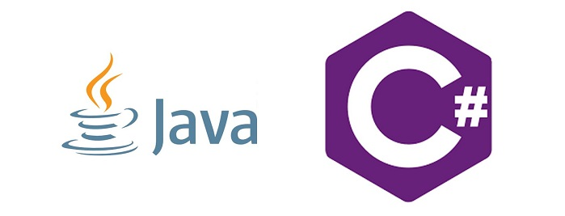
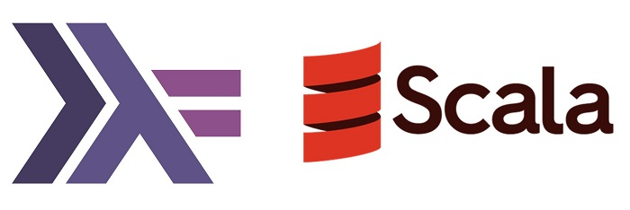
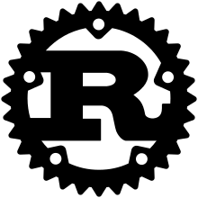

---
title: "You should learn multiple programming languages"
date: 2019-06-16T00:00:00Z
draft: false
description: "The first language I used to write a small program was Pascal. Since then I have worked professionally with Java, JavaScript, Groovy and a few more. Currently…"
categories: ["Career", "Java", "Personal"]
cover:
  image: "images/learn-languages.jpg"
  alt: "You should learn multiple programming languages"
aliases:
  - /you-should-learn-multiple-programming-languages/
  - "/2019/06/16/you-should-learn-multiple-programming-languages/"
ShowToc: true
TocOpen: false
---The first language I used to write a small program was Pascal. Since then I have worked professionally with Java, JavaScript, Groovy and a few more. Currently, I am learning a bit of Go in my spare time. In this blog post, I want to encourage you to learn a new language as well and provide you with a few ideas.

## The more you know the easier it gets

First of all, I have noticed that the more languages you already know, the easier it is to learn new ones. I guess like with everything, you start seeing familiar patterns and solutions and in general- things start to make sense much quicker.

Numerous languages are also very similar. For example, if you already know Java, learning Groovy is very simple. Knowing many languages may come useful when you suddenly have to start learning a new one for your job.

## Mastering a language

You don’t have to master every language you come to work with. Sometimes you need to know just enough to be productive.

I have recently worked on a small IoT project where Python made the most sense, as all the libraries and examples I had were using Python. If you are already a programmer learning Python enough to write a [Flask server](http://flask.pocoo.org/) can be done in a weekend and it is quite fun!

Beside my advice to try many languages, it is genuinely useful to also master a language or two. If your full-time employment revolves around writing Java, you really should know it in and out. Even all that stuff about nested classes and concurrency. You owe it to your employer (or clients) and yourself!

## Java vs C#

Speaking of Java, I have realised that I used to go into arguments about the superiority of Java vs C# or the other way round. The best solution to that problem is to learn both if you already know one.

With Java and C#, you can see subtle (or not so subtle) differences with how things are done. Learning about LINQ or Spring Boot can be a very interesting experience for people from either camp.

I have been looking to refresh my C# knowledge (the last large program I wrote was for my master thesis) as it is used in games development with Unity.

Make sure that something like Java vs C# argument never closes doors for you to exciting technologies, be it game development or big data!

## JavaScript and the brand new world

If moving between Java and C# is a rather gently jump, then going into JavaScript development with Node.js is a whole new level!

These days there is so much JavaScript code being written and used, that as a developer you really should look into it. There is a good chance that you will either write or read some JavaScript in the near future… it is also really interesting!

Despite its many flaws (or strengths as some would argue!) JavaScript is an insanely popular language, that is appearing everywhere. Frontends, microservices, even serverless development or voice assistants like Alexa have some of their core libraries written mainly for JavaScript.

If you want to learn something super practical, definitely get literate with JavaScript, Node.js and the NPM ecosystem.

## Did someone say RaspberryPi… or Serverless or Machine learning? Python is here.

Python is currently the fastest growing “mainstream” language. This is at least according to the [TIOBE index](https://www.tiobe.com/tiobe-index/). There is quite a renaissance in the language at the moment.

The Python recent rise in popularity can be attributed to many factors:

- Data scientists love affair with Python
- Serverless architectures having a good fit and support
- Python being overall a great language
- Maybe even IoT
- Mysterious workings of the universe

I am using Python for controlling my RaspberryPi and having great fun with it. It is very clean, pretty and expressive language. If you are looking for something pleasant to write in- give it a try.

## The functional world of Scala and Haskell

Ok, so you really want to try something new? The functional programming promises much cleaner code, fewer bugs and better programming experience.

To be honest, I sometimes wish days had more hours, as I never managed to get into functional programming deep enough in the “real world”. I used Haskell at university and it was nothing like I ever programmed with before or after.

If you want to approach functional programming with practicality in mind, possibly even replacing Java, you should seriously look at Scala. This is a truly functional programming language used in the industry.

If you are looking for an academic approach to functional programming and want to learn more about the science of it, Haskell is probably best-suited language for that. If you disagree, I would be happy to read your opinion in the comments.

## DevOps fueled Go

We talked about quite a few languages, but what is the one language everyone involved in DevOps is talking about? It is Go!

Docker, Terraform, Istio, Kubernetes… Do I need to go on? All of these technologies rely on Go. There is no other language out there who comes even close to popularity in the DevOps world.

I believe the reasons for this are:

- Go is super fast compared to everything other than C/C++/Rust
- Go is very easy to learn
- Go makes it easy to work with networking and system
- Go has a nice multi-threading support

If you are serious about infrastructures, containers etc. Go is the language to learn.

## The future with Rust

Guess what is the most loved language out there, year by year? Well… if you read the headers here, you probably guessed- according to yearly developers survey by StackOverflow ([2019 here](https://insights.stackoverflow.com/survey/2019), Python is second!) it is Rust!

Rust is an incredibly fast system programming language, that can compete with C/C++ on speed… While being very modern and pleasant to work with! I have not gone much beyond “hello world” with my Rust knowledge, but getting the basics down is high on my “to do” list for 2019.

## What about everything else?

I did not mention here learning C++, PHP, SQL or Swift. Does that mean that you should not learn them? Of course not! If you are interested to learn a different language or have a good reason to, you absolutely should.

I wanted to show you how many good reasons are there for getting familiar with different languages. The reality is that once you learned one, you know you can learn anything! Just motivate yourself and enjoy the journey!
